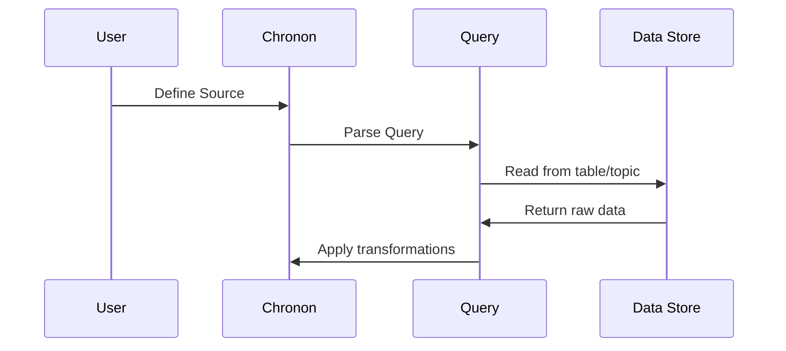

# Chapter 1: Source

## Why Do We Need Sources?

Imagine you're building a recommendation system for an e-commerce website. Your data lives in many places:
- User profiles in a database that gets updated when users change their settings
- Purchase events streaming through Kafka as customers buy products
- Product catalog snapshots stored in daily Hive tables

How do you tell your feature engineering system where to find this data? That's where **Sources** come in!

## What is a Source?

Think of a Source as a **universal adapter** that plugs into your data, no matter where it lives. Just like a universal phone charger can work with different outlets, a Source can connect to:
- 📊 Batch tables (like Hive or BigQuery)
- 🌊 Streaming topics (like Kafka or PubSub)
- 🔗 Even outputs from other feature pipelines ([Joins](03_join_.md))

Let's start with the simplest example - reading purchase events:

```python
from ai.chronon import Source, EventSource, Query

purchase_source = Source(
    events=EventSource(
        table="data.purchases",
        query=Query(
            selects={"user_id": "user_id", 
                    "amount": "purchase_amount"}
        )
    )
)
```

This tells Chronon: "Hey, read from the `data.purchases` table and grab the `user_id` and `purchase_amount` columns!"

## Key Concepts

### 1. Event vs Entity Sources

Chronon has two main types of data patterns:

**📅 EventSource**: Things that happen at specific times
- Purchase events
- Page views  
- Button clicks

**👤 EntitySource**: Things that exist and change over time
- User profiles
- Product catalogs
- Store inventories

Here's how they differ:

```python
# Events: Things that happen
clicks = Source(
    events=EventSource(
        table="data.clicks",
        query=Query(
            selects={"user_id": "user_id"},
            time_column="click_time"  # When it happened
        )
    )
)
```

```python
# Entities: Things that exist and change
users = Source(
    entities=EntitySource(
        snapshotTable="data.users",  # Daily snapshots
        query=Query(
            selects={"user_id": "user_id",
                    "age": "age"}
        )
    )
)
```

### 2. The Query Component

The Query is like a **recipe** that tells Chronon:
- Which ingredients (columns) to pick
- How to prepare them (transformations)
- What to filter out (conditions)

```python
from ai.chronon.query import Query, selects

# Simple selection
query = Query(
    selects=selects("user_id", "amount")
)
```

```python
# With transformation
query = Query(
    selects={"total": "price * quantity"},
    wheres=["price > 10"]  # Only expensive items
)
```

### 3. Batch vs Streaming

Sources can be:
- **🐌 Batch-only**: Updated daily when new data arrives
- **⚡ Streaming**: Updated in real-time

```python
# Batch-only (no topic)
batch_source = Source(
    events=EventSource(
        table="data.purchases",
        topic=None,  # No streaming
        query=Query(selects=selects("user_id"))
    )
)
```

```python
# Streaming (with topic)
streaming_source = Source(
    events=EventSource(
        table="data.purchases",
        topic="events.purchases",  # Real-time updates!
        query=Query(selects=selects("user_id"))
    )
)
```

## How Sources Work: Under the Hood

When you define a Source, here's what happens:



Let's trace through a real example:

1. **You define a Source**:
```python
source = Source(
    events=EventSource(
        table="data.purchases",
        query=Query(
            selects={"amount": "price * 0.9"},  # 10% discount
            wheres=["price > 100"]
        )
    )
)
```

2. **Chronon parses your Query** (from `query.py`):
```python
# Inside Query creation
api.Query(
    selects={"amount": "price * 0.9"},
    wheres=["price > 100"],
    timeColumn=None  # No time column specified
)
```

3. **The Source object is created** (from `source.py`):
```python
# EventSource wraps everything together
ttypes.Source(
    events=ttypes.EventSource(
        table="data.purchases",
        query=your_query
    )
)
```

4. **When data is processed**, Chronon:
   - Reads from `data.purchases` table
   - Filters rows where `price > 100`
   - Calculates `amount = price * 0.9`
   - Returns the transformed data

## Practical Example: E-commerce Feature Pipeline

Let's build Sources for our recommendation system:

```python
# 1. User purchase events
purchases = Source(
    events=EventSource(
        table="data.purchases",
        topic="events.purchases",
        query=Query(
            selects=selects("user_id", "product_id", "amount"),
            time_column="purchase_time"
        )
    )
)
```

```python
# 2. User profiles (changing over time)
users = Source(
    entities=EntitySource(
        snapshotTable="data.users",
        query=Query(
            selects=selects("user_id", "signup_date", "tier")
        )
    )
)
```

```python
# 3. Product views (batch only)
views = Source(
    events=EventSource(
        table="data.product_views",
        topic=None,  # Batch processing only
        query=Query(
            selects={"user_id": "user_id",
                    "viewed": "1"},  # Count views
            wheres=["view_duration > 5"]  # Quality views
        )
    )
)
```

## Conclusion

Sources are your **data gatekeepers** in Chronon. They:
- 🔌 Connect to your data wherever it lives
- 🎯 Select exactly what you need
- 🔄 Handle both batch and streaming updates
- 🧹 Clean and transform data on the way in

Now that you understand how to connect to your data with Sources, the next step is learning how to aggregate this data into meaningful features. Let's explore how [GroupBy](02_groupby_.md) helps you transform raw events into powerful features!

---

Generated by [AI Codebase Knowledge Builder](https://github.com/The-Pocket/Tutorial-Codebase-Knowledge)