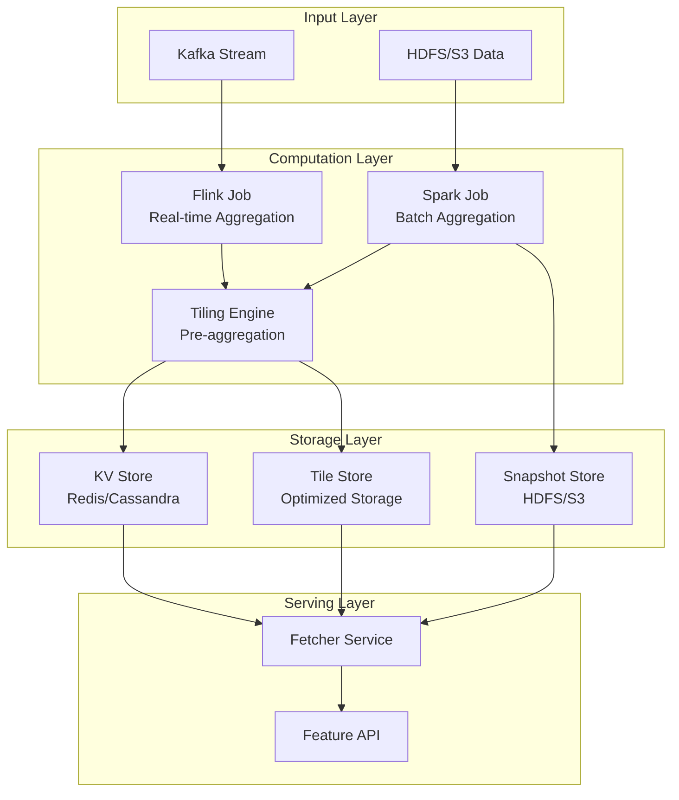

# Chapter 2: GroupBy - The Aggregation Engine

Now that you've learned how to connect to your data with [Sources](01_source_.md), let's dive deep into **GroupBy** - Chronon's powerful aggregation engine that transforms raw events into ML features using both Flink (streaming) and Spark (batch) under the hood!

## Why Do We Need GroupBy?

Remember our e-commerce recommendation system from Chapter 1? We have raw purchase events flowing in:
- User 123 bought a laptop for $1000
- User 456 bought a phone for $500
- User 123 bought a mouse for $30

But what your ML model really needs are **aggregated features** like:
- "How much did user 123 spend in the last 7 days?"
- "How many purchases did user 456 make last month?"
- "What's the average purchase amount for user 123?"

That's where **GroupBy** comes in! It's like having a smart assistant that continuously calculates these statistics for you.

## What is a GroupBy?

Think of GroupBy as a **feature factory** that:
1. Takes raw events from your Source
2. Groups them by keys (like user_id)
3. Calculates statistics over time windows
4. Outputs ready-to-use ML features

It's similar to SQL's GROUP BY, but with superpowers:
- ⏰ It works continuously, not just once
- 🪟 It can calculate over sliding time windows
- ⚡ It can update in real-time

Here's the simplest GroupBy:

```python
from ai.chronon import GroupBy, Source, EventSource
from ai.chronon import Operation, Aggregation

purchase_stats = GroupBy(
    sources=[purchase_source],  # From Chapter 1
    keys=["user_id"],          # Group by user
    aggregations=[
        Aggregation(
            input_column="amount",
            operation=Operation.SUM
        )
    ]
)
```

This calculates the total amount spent by each user - ever!

## Key Concepts

### 1. Keys: What We Group By

Keys determine how to group your data. Just like sorting mail into different boxes:

```python
# Group by single key
keys=["user_id"]  # One statistic per user

# Group by multiple keys  
keys=["user_id", "product_category"]  # Stats per user AND category
```

📮 Think of keys as the labels on your mailboxes - they determine which box each piece of data goes into.

### 2. Aggregations: The Math We Do

Aggregations are the calculations performed on grouped data:

```python
# Count purchases
Aggregation(
    input_column="amount",
    operation=Operation.COUNT
)
```

```python
# Average purchase amount
Aggregation(
    input_column="amount", 
    operation=Operation.AVERAGE
)
```

Common operations:
- `COUNT`: How many?
- `SUM`: Total value
- `AVERAGE`: Mean value
- `MAX`/`MIN`: Highest/lowest
- `LAST`: Most recent value

### 3. Windows: Time Periods

Windows let you calculate features over specific time periods:

```python
# Last 7 days
Aggregation(
    input_column="amount",
    operation=Operation.SUM,
    windows=["7d"]  # "7d" = 7 days
)
```

```python
# Multiple windows at once!
windows=["1d", "7d", "30d"]  # Daily, weekly, monthly
```

🪟 Windows are like looking at your data through different time lenses - zoom in for recent activity, zoom out for long-term trends.

## Building Our First GroupBy

Let's create a complete example for our e-commerce system:

```python
# Step 1: Define the source (from Chapter 1)
purchases = Source(
    events=EventSource(
        table="data.purchases",
        query=Query(
            selects={"user_id": "user_id", 
                    "amount": "amount"},
            time_column="purchase_time"
        )
    )
)
```

```python
# Step 2: Create the GroupBy
from ai.chronon import GroupBy, Aggregation, Operation

user_purchase_stats = GroupBy(
    sources=[purchases],
    keys=["user_id"],
    aggregations=[
        Aggregation(
            input_column="amount",
            operation=Operation.SUM,
            windows=["7d", "30d"]
        )
    ],
    online=True,  # Enable real-time serving
    version=1
)
```

This creates two features per user:
- `amount_sum_7d`: Total spent in last 7 days
- `amount_sum_30d`: Total spent in last 30 days

### Adding More Aggregations

Let's expand our GroupBy with more useful features:

```python
aggregations = [
    # Total spending
    Aggregation(
        input_column="amount",
        operation=Operation.SUM,
        windows=["7d", "30d"]
    ),
    # Number of purchases
    Aggregation(
        input_column="amount",
        operation=Operation.COUNT,
        windows=["7d", "30d"]  
    ),
    # Average purchase size
    Aggregation(
        input_column="amount",
        operation=Operation.AVERAGE,
        windows=["30d"]
    )
]
```

Now each user has features like:
- How much they spend (SUM)
- How often they buy (COUNT)
- Their typical purchase size (AVERAGE)

## How GroupBy Works: Deep Technical Architecture

### High-Level Architecture



### Flink Streaming Aggregation Implementation

```java
// Flink job generated for real-time GroupBy
public class GroupByFlinkJob {
    
    public static void main(String[] args) {
        StreamExecutionEnvironment env = StreamExecutionEnvironment.getExecutionEnvironment();
        
        // Enable event time and watermarks
        env.setStreamTimeCharacteristic(TimeCharacteristic.EventTime);
        
        // Read from Kafka
        FlinkKafkaConsumer<PurchaseEvent> source = new FlinkKafkaConsumer<>(
            "purchases",
            new PurchaseEventSchema(),
            kafkaProperties
        );
        
        DataStream<PurchaseEvent> events = env
            .addSource(source)
            .assignTimestampsAndWatermarks(
                WatermarkStrategy
                    .<PurchaseEvent>forBoundedOutOfOrderness(Duration.ofSeconds(30))
                    .withTimestampAssigner((event, timestamp) -> event.getTimestamp())
            );
        
        // Group by user_id and compute aggregations
        DataStream<UserAggregates> aggregates = events
            .keyBy(PurchaseEvent::getUserId)
            .window(SlidingEventTimeWindows.of(
                Time.days(7),    // Window size
                Time.hours(1)    // Slide interval
            ))
            .aggregate(new IncrementalAggregator())
            .uid("user-7d-aggregation");
        
        // Write to KV store
        aggregates.addSink(new KVStoreSink());
        
        env.execute("Chronon GroupBy - User Purchase Stats");
    }
}

// Incremental aggregator for efficient computation
class IncrementalAggregator implements AggregateFunction<PurchaseEvent, AggState, UserAggregates> {
    
    @Override
    public AggState createAccumulator() {
        return new AggState();
    }
    
    @Override
    public AggState add(PurchaseEvent event, AggState state) {
        // Incremental update - O(1) operation
        state.sum += event.getAmount();
        state.count += 1;
        state.max = Math.max(state.max, event.getAmount());
        state.updateTiles(event);  // Update intermediate tiles
        return state;
    }
    
    @Override
    public UserAggregates getResult(AggState state) {
        return new UserAggregates(
            state.userId,
            state.sum,
            state.count,
            state.sum / state.count,  // Average
            state.max,
            state.getTiles()  // Pre-aggregated tiles for faster queries
        );
    }
    
    @Override
    public AggState merge(AggState a, AggState b) {
        // Merge partial aggregates (for parallel processing)
        a.sum += b.sum;
        a.count += b.count;
        a.max = Math.max(a.max, b.max);
        a.mergeTiles(b.getTiles());
        return a;
    }
}
```

### Spark Batch Aggregation Implementation

```scala
// Spark job for batch GroupBy computation
object GroupBySparkJob {
  
  def main(args: Array[String]): Unit = {
    val spark = SparkSession.builder()
      .appName("Chronon GroupBy - Batch Aggregation")
      .config("spark.sql.adaptive.enabled", "true")
      .getOrCreate()
    
    import spark.implicits._
    
    // Read source data
    val purchases = spark.read
      .parquet("s3://data/purchases/ds=2024-01-15")
      .as[PurchaseEvent]
    
    // Define window specifications
    val windows = Map(
      "7d" -> Window.partitionBy("user_id")
        .orderBy("timestamp")
        .rangeBetween(-7.days.toMillis, 0),
      "30d" -> Window.partitionBy("user_id")
        .orderBy("timestamp")
        .rangeBetween(-30.days.toMillis, 0)
    )
    
    // Compute aggregations for each window
    val aggregatedDF = purchases
      .withColumn("amount_sum_7d", 
        sum("amount").over(windows("7d")))
      .withColumn("amount_count_7d", 
        count("amount").over(windows("7d")))
      .withColumn("amount_avg_7d", 
        avg("amount").over(windows("7d")))
      .withColumn("amount_sum_30d", 
        sum("amount").over(windows("30d")))
      .withColumn("amount_count_30d", 
        count("amount").over(windows("30d")))
    
    // Generate tiles for efficient storage
    val tiledDF = aggregatedDF
      .groupBy("user_id", window($"timestamp", "1 hour"))
      .agg(
        sum("amount").as("hourly_sum"),
        count("amount").as("hourly_count"),
        collect_list(struct("timestamp", "amount")).as("events")
      )
      .withColumn("tile_key", generateTileKey($"user_id", $"window"))
    
    // Write to snapshot store and KV store
    tiledDF.write
      .mode("overwrite")
      .partitionBy("ds")
      .parquet("s3://features/user_purchase_stats/")
    
    // Also update KV store for online serving
    tiledDF.foreachPartition { partition =>
      val kvClient = KVStoreClient.getInstance()
      partition.foreach { row =>
        kvClient.put(
          row.getAs[String]("tile_key"),
          row.getAs[Array[Byte]]("tile_data"),
          ttl = 7.days
        )
      }
    }
  }
}
```

### The Tiling Optimization System

```python
class TilingEngine:
    """
    Pre-aggregation system for efficient feature retrieval
    """
    
    def __init__(self, group_by_config: GroupBy):
        self.config = group_by_config
        self.tile_sizes = self.compute_optimal_tile_sizes()
        
    def compute_optimal_tile_sizes(self) -> List[Duration]:
        """
        Determine optimal tile granularities based on windows
        """
        windows = self.extract_all_windows()
        
        # Common tile sizes that work well
        tile_candidates = [
            Duration.minutes(1),
            Duration.minutes(5),
            Duration.hours(1),
            Duration.days(1)
        ]
        
        # Select tiles that minimize computation
        selected_tiles = []
        for window in windows:
            # Find smallest tile that divides evenly
            for tile in tile_candidates:
                if window.duration % tile.duration == 0:
                    selected_tiles.append(tile)
                    break
        
        return list(set(selected_tiles))
    
    def create_tiles(self, events: List[Event]) -> Dict[str, Tile]:
        """
        Convert raw events into pre-aggregated tiles
        """
        tiles = {}
        
        for tile_size in self.tile_sizes:
            for event in events:
                tile_key = self.get_tile_key(event, tile_size)
                
                if tile_key not in tiles:
                    tiles[tile_key] = Tile(
                        key=tile_key,
                        size=tile_size,
                        aggregates={}
                    )
                
                # Update tile aggregates
                tile = tiles[tile_key]
                tile.update(event)
        
        return tiles
    
    def get_tile_key(self, event: Event, tile_size: Duration) -> str:
        """
        Generate deterministic tile key
        """
        # Round timestamp to tile boundary
        tile_boundary = (event.timestamp // tile_size.millis) * tile_size.millis
        
        return f"{event.entity_id}:{tile_boundary}:{tile_size.name}"
```

### Intermediate Representation (IR) for Aggregations

```python
class AggregationIR:
    """
    Intermediate representation for efficient aggregation computation
    """
    
    @staticmethod
    def get_ir_for_operation(operation: Operation) -> Type[IR]:
        """
        Return the appropriate IR for each operation type
        """
        ir_mapping = {
            Operation.SUM: SumIR,
            Operation.COUNT: CountIR,
            Operation.AVG: AvgIR,
            Operation.MAX: MaxIR,
            Operation.MIN: MinIR,
            Operation.LAST: LastIR,
            Operation.FIRST: FirstIR,
            Operation.LAST_K: LastKIR,
            Operation.APPROX_PERCENTILE: TDigestIR,
            Operation.HISTOGRAM: HistogramIR
        }
        return ir_mapping[operation]

class SumIR:
    """IR for SUM aggregation - single value"""
    def __init__(self):
        self.value = 0
    
    def update(self, new_value):
        self.value += new_value
    
    def merge(self, other):
        self.value += other.value
    
    def finalize(self):
        return self.value

class AvgIR:
    """IR for AVERAGE - needs sum and count"""
    def __init__(self):
        self.sum = 0
        self.count = 0
    
    def update(self, new_value):
        self.sum += new_value
        self.count += 1
    
    def merge(self, other):
        self.sum += other.sum
        self.count += other.count
    
    def finalize(self):
        return self.sum / self.count if self.count > 0 else None

class TDigestIR:
    """IR for approximate percentiles - uses T-Digest algorithm"""
    def __init__(self, compression=100):
        self.tdigest = TDigest(compression)
    
    def update(self, new_value):
        self.tdigest.add(new_value)
    
    def merge(self, other):
        self.tdigest.merge(other.tdigest)
    
    def finalize(self, percentile=0.5):
        return self.tdigest.percentile(percentile)

class LastKIR:
    """IR for LAST_K - circular buffer of last K values"""
    def __init__(self, k=100):
        self.k = k
        self.buffer = CircularBuffer(k)
        self.timestamps = CircularBuffer(k)
    
    def update(self, value, timestamp):
        self.buffer.append(value)
        self.timestamps.append(timestamp)
    
    def merge(self, other):
        # Merge sorted by timestamp
        combined = sorted(
            zip(self.timestamps.items + other.timestamps.items,
                self.buffer.items + other.buffer.items)
        )
        # Keep only last K
        for ts, val in combined[-self.k:]:
            self.buffer.append(val)
            self.timestamps.append(ts)
    
    def finalize(self):
        return list(self.buffer.items)
```

### KV Store Integration

```python
class KVStoreWriter:
    """
    Writes aggregated features to KV store for online serving
    """
    
    def __init__(self, kv_client: KVClient):
        self.kv = kv_client
        self.serializer = FeatureSerializer()
        
    def write_aggregates(self, 
                        entity_id: str,
                        aggregates: Dict[str, Any],
                        timestamp: datetime):
        """
        Write aggregates to KV store with proper indexing
        """
        # Create versioned keys for time-travel queries
        for window_name, value in aggregates.items():
            # Key format: entity:feature:timestamp
            key = f"{entity_id}:{window_name}:{timestamp.isoformat()}"
            
            # Serialize value with metadata
            serialized = self.serializer.serialize({
                "value": value,
                "timestamp": timestamp,
                "window": window_name,
                "entity_id": entity_id
            })
            
            # Write with TTL based on window size
            ttl = self.calculate_ttl(window_name)
            self.kv.set(key, serialized, ttl=ttl)
            
            # Also update "latest" pointer for fast lookup
            latest_key = f"{entity_id}:{window_name}:latest"
            self.kv.set(latest_key, serialized, ttl=ttl)
    
    def calculate_ttl(self, window_name: str) -> int:
        """
        Calculate appropriate TTL based on window size
        """
        window_to_ttl = {
            "1h": 24 * 3600,      # 1 day
            "1d": 7 * 24 * 3600,  # 1 week
            "7d": 30 * 24 * 3600, # 1 month
            "30d": 90 * 24 * 3600 # 3 months
        }
        return window_to_ttl.get(window_name, 7 * 24 * 3600)
```

### Advanced Window Processing

```scala
// Scala implementation of complex window processing
class WindowProcessor {
  
  /**
   * Handles multiple window types efficiently
   */
  def processWindows(events: Dataset[Event], 
                     windows: List[WindowSpec]): DataFrame = {
    
    // Sort once for all windows
    val sortedEvents = events.sortWithinPartitions("entity_id", "timestamp")
    
    // Process each window type
    val windowResults = windows.map { windowSpec =>
      windowSpec.windowType match {
        case WindowType.Sliding =>
          processSlidingWindow(sortedEvents, windowSpec)
          
        case WindowType.Tumbling =>
          processTumblingWindow(sortedEvents, windowSpec)
          
        case WindowType.Session =>
          processSessionWindow(sortedEvents, windowSpec)
          
        case WindowType.Hopping =>
          processHoppingWindow(sortedEvents, windowSpec)
      }
    }
    
    // Combine all window results
    windowResults.reduce(_ join _)
  }
  
  private def processSlidingWindow(events: Dataset[Event],
                                   spec: WindowSpec): DataFrame = {
    // Sliding window with efficient range queries
    val window = Window
      .partitionBy("entity_id")
      .orderBy("timestamp")
      .rangeBetween(-spec.duration.toMillis, 0)
    
    events.withColumn(
      s"${spec.name}_sum",
      sum("value").over(window)
    )
  }
  
  private def processSessionWindow(events: Dataset[Event],
                                   spec: WindowSpec): DataFrame = {
    // Session windows with gap detection
    val sessionized = events
      .withColumn("time_diff", 
        col("timestamp") - lag("timestamp", 1).over(
          Window.partitionBy("entity_id").orderBy("timestamp")
        ))
      .withColumn("session_start",
        when(col("time_diff") > spec.gap.toMillis || col("time_diff").isNull, 1)
        .otherwise(0))
      .withColumn("session_id",
        sum("session_start").over(
          Window.partitionBy("entity_id").orderBy("timestamp")
        ))
    
    // Aggregate within sessions
    sessionized
      .groupBy("entity_id", "session_id")
      .agg(
        sum("value").as(s"${spec.name}_sum"),
        count("value").as(s"${spec.name}_count"),
        max("timestamp") - min("timestamp").as(s"${spec.name}_duration")
      )
  }
}

## Advanced Aggregation Patterns

### Complex Aggregations and Expressions

```python
class AdvancedAggregations:
    """
    Advanced aggregation patterns for complex feature engineering
    """
    
    def create_percentile_features(self):
        """
        Compute percentile-based features
        """
        return GroupBy(
            sources=[transaction_source],
            keys=["merchant_id"],
            aggregations=[
                # Approximate percentiles using T-Digest
                Aggregation(
                    input_column="amount",
                    operation=Operation.APPROX_PERCENTILE,
                    percentiles=[0.25, 0.5, 0.75, 0.95, 0.99],
                    windows=["1d", "7d"],
                    name="amount_percentiles"
                ),
                # Exact percentiles for small datasets
                Aggregation(
                    input_column="amount",
                    operation=Operation.EXACT_PERCENTILE,
                    percentiles=[0.5],
                    windows=["1h"],  # Small window for exact computation
                    name="amount_median_1h"
                )
            ]
        )
    
    def create_derived_features(self):
        """
        Features derived from multiple columns
        """
        return GroupBy(
            sources=[order_source],
            keys=["user_id"],
            aggregations=[
                # Conversion rate: purchases / views
                Aggregation(
                    operation=Operation.EXPRESSION,
                    expression="sum(purchased) / count(*)",
                    windows=["7d"],
                    name="conversion_rate_7d"
                ),
                # Average order value
                Aggregation(
                    operation=Operation.EXPRESSION,
                    expression="sum(amount) / sum(purchased)",
                    windows=["30d"],
                    name="avg_order_value_30d"
                ),
                # Coefficient of variation (volatility)
                Aggregation(
                    operation=Operation.EXPRESSION,
                    expression="stddev(amount) / avg(amount)",
                    windows=["30d"],
                    name="spend_volatility_30d"
                )
            ]
        )
    
    def create_histogram_features(self):
        """
        Distribution-based features
        """
        return GroupBy(
            sources=[user_activity],
            keys=["user_id"],
            aggregations=[
                # Category distribution
                Aggregation(
                    input_column="product_category",
                    operation=Operation.HISTOGRAM,
                    windows=["30d"],
                    name="category_distribution",
                    config={
                        "max_buckets": 100,
                        "normalize": True  # Convert to percentages
                    }
                ),
                # Time-of-day distribution
                Aggregation(
                    input_column="hour_of_day",
                    operation=Operation.HISTOGRAM,
                    windows=["7d"],
                    name="activity_by_hour"
                )
            ]
        )
```

### State Management and Checkpointing

```java
// Flink state management for fault tolerance
public class StatefulGroupByOperator extends KeyedProcessFunction<String, Event, Aggregate> {
    
    // State handles
    private ValueState<AggregateState> aggregateState;
    private ListState<Event> eventBuffer;
    private ValueState<Long> lastWatermark;
    
    @Override
    public void open(Configuration config) {
        // Configure state with TTL
        StateTtlConfig ttlConfig = StateTtlConfig
            .newBuilder(Time.days(7))
            .setUpdateType(StateTtlConfig.UpdateType.OnCreateAndWrite)
            .setStateVisibility(StateTtlConfig.StateVisibility.NeverReturnExpired)
            .cleanupIncrementally(100, true)
            .build();
        
        ValueStateDescriptor<AggregateState> stateDesc = 
            new ValueStateDescriptor<>("aggregate-state", AggregateState.class);
        stateDesc.enableTimeToLive(ttlConfig);
        
        aggregateState = getRuntimeContext().getState(stateDesc);
        
        // Event buffer for late data handling
        eventBuffer = getRuntimeContext().getListState(
            new ListStateDescriptor<>("event-buffer", Event.class)
        );
        
        // Watermark tracking
        lastWatermark = getRuntimeContext().getState(
            new ValueStateDescriptor<>("last-watermark", Long.class)
        );
    }
    
    @Override
    public void processElement(Event event, Context ctx, Collector<Aggregate> out) throws Exception {
        // Get current state
        AggregateState state = aggregateState.value();
        if (state == null) {
            state = new AggregateState(ctx.getCurrentKey());
        }
        
        // Handle late data
        Long watermark = lastWatermark.value();
        if (watermark != null && event.getTimestamp() < watermark - allowedLateness) {
            // Event is too late, send to side output
            ctx.output(lateDataTag, event);
            metrics.counter("late_events").inc();
            return;
        }
        
        // Update aggregations
        state.update(event);
        
        // Register timer for window emission
        long windowEnd = getWindowEnd(event.getTimestamp());
        ctx.timerService().registerEventTimeTimer(windowEnd);
        
        // Save state
        aggregateState.update(state);
        
        // Buffer event for replay if needed
        eventBuffer.add(event);
    }
    
    @Override
    public void onTimer(long timestamp, OnTimerContext ctx, Collector<Aggregate> out) throws Exception {
        AggregateState state = aggregateState.value();
        if (state != null) {
            // Emit aggregate
            out.collect(state.toAggregate());
            
            // Clean up old events from buffer
            cleanupEventBuffer(timestamp);
            
            // Update watermark
            lastWatermark.update(timestamp);
        }
    }
    
    // Enable exactly-once semantics
    @Override
    public void snapshotState(FunctionSnapshotContext context) throws Exception {
        // Checkpoint barrier alignment ensures consistency
        checkpointedState.clear();
        checkpointedState.add(aggregateState.value());
    }
}
```

### Performance Optimizations

```scala
// Spark optimizations for large-scale GroupBy
object GroupByOptimizations {
  
  /**
   * Adaptive partitioning for skewed data
   */
  def optimizeForSkew(df: DataFrame, keys: Seq[String]): DataFrame = {
    // Detect skewed keys
    val keyStats = df.groupBy(keys: _*)
      .count()
      .agg(
        max("count").as("max_count"),
        avg("count").as("avg_count"),
        stddev("count").as("stddev_count")
      )
      .collect()(0)
    
    val skewThreshold = keyStats.getAs[Double]("avg_count") + 
                        2 * keyStats.getAs[Double]("stddev_count")
    
    // Find hot keys
    val hotKeys = df.groupBy(keys: _*)
      .count()
      .filter(col("count") > skewThreshold)
      .select(keys: _*)
      .collect()
      .map(_.toSeq)
      .toSet
    
    // Apply salting to hot keys
    val saltedDF = df.withColumn("salt",
      when(col(keys(0)).isin(hotKeys.toSeq: _*), 
           floor(rand() * 10))
      .otherwise(0)
    )
    
    // Aggregate with salt
    val aggregated = saltedDF
      .groupBy((keys :+ "salt").map(col): _*)
      .agg(/* aggregations */)
    
    // Remove salt and re-aggregate
    aggregated
      .drop("salt")
      .groupBy(keys.map(col): _*)
      .agg(/* merge aggregations */)
  }
  
  /**
   * Memory-efficient processing with spilling
   */
  def processWithSpilling(df: DataFrame): DataFrame = {
    df.repartition(1000)  // Increase partitions
      .sortWithinPartitions("timestamp")  // Sort for efficient windowing
      .mapPartitions { iter =>
        // Use external sorting with spill to disk
        val sorter = new ExternalSorter[Event](
          spillThreshold = 10000,
          spillToDisk = true
        )
        sorter.insertAll(iter)
        sorter.iterator
      }
  }
  
  /**
   * Incremental computation with delta processing
   */
  def incrementalUpdate(
    previousSnapshot: DataFrame,
    newData: DataFrame,
    windows: Seq[Duration]
  ): DataFrame = {
    
    // Find affected time ranges
    val minTime = newData.agg(min("timestamp")).collect()(0).getTimestamp(0)
    val maxTime = newData.agg(max("timestamp")).collect()(0).getTimestamp(0)
    
    // Determine which aggregates need recomputation
    val affectedWindows = windows.filter { window =>
      val windowStart = maxTime - window.toMillis
      windowStart <= maxTime && minTime <= maxTime
    }
    
    // Recompute only affected windows
    val updates = affectedWindows.map { window =>
      computeWindowAggregates(newData, window)
    }
    
    // Merge with previous snapshot
    previousSnapshot
      .join(updates.reduce(_ union _), Seq("key", "window"), "left_outer")
      .select(
        coalesce(col("new_value"), col("old_value")).as("value"),
        col("key"),
        col("window")
      )
  }
}
```

### Monitoring and Observability

```python
class GroupByMonitor:
    """
    Production monitoring for GroupBy operations
    """
    
    def __init__(self, group_by_name: str):
        self.name = group_by_name
        self.metrics = MetricsCollector()
        
    def monitor_streaming_job(self, flink_job: FlinkJob):
        """
        Monitor Flink streaming aggregation
        """
        metrics = {
            # Throughput metrics
            "events_per_second": flink_job.input_rate,
            "aggregates_per_second": flink_job.output_rate,
            
            # Latency metrics
            "event_time_lag": flink_job.event_time_lag_ms,
            "processing_latency": flink_job.processing_latency_ms,
            "end_to_end_latency": flink_job.e2e_latency_ms,
            
            # State metrics
            "state_size_mb": flink_job.state_size / 1024 / 1024,
            "checkpoint_duration": flink_job.checkpoint_duration_ms,
            "checkpoint_size_mb": flink_job.checkpoint_size / 1024 / 1024,
            
            # Resource metrics
            "cpu_usage": flink_job.cpu_usage_percent,
            "memory_usage": flink_job.heap_usage_percent,
            "gc_time_ratio": flink_job.gc_time_ratio,
            
            # Data quality
            "late_events": flink_job.late_events_count,
            "corrupted_events": flink_job.corrupted_events_count
        }
        
        # Record all metrics
        for metric_name, value in metrics.items():
            self.metrics.gauge(f"chronon.groupby.{self.name}.{metric_name}", value)
        
        # Set up alerts
        if metrics["event_time_lag"] > 60000:  # 1 minute
            self.alert("High event time lag", severity="warning")
        
        if metrics["late_events"] > 1000:
            self.alert("Excessive late events", severity="error")
    
    def monitor_batch_job(self, spark_job: SparkJob):
        """
        Monitor Spark batch aggregation
        """
        # Track stage-level metrics
        for stage in spark_job.stages:
            self.metrics.histogram(
                f"chronon.groupby.{self.name}.stage_duration",
                stage.duration_ms,
                tags={"stage_id": stage.id}
            )
            
            # Check for data skew
            skew_ratio = stage.max_task_duration / stage.median_task_duration
            if skew_ratio > 10:
                self.alert(
                    f"Data skew detected in stage {stage.id}",
                    severity="warning",
                    details={"skew_ratio": skew_ratio}
                )
```

### Production Deployment Best Practices

```python
class GroupByDeployment:
    """
    Production deployment patterns for GroupBy
    """
    
    def deploy_with_validation(self, group_by: GroupBy):
        """
        Safe deployment with validation
        """
        # 1. Validate configuration
        validation_errors = self.validate_config(group_by)
        if validation_errors:
            raise ValueError(f"Invalid GroupBy config: {validation_errors}")
        
        # 2. Test with sample data
        test_results = self.run_tests(group_by)
        if not test_results.passed:
            raise ValueError(f"Tests failed: {test_results.failures}")
        
        # 3. Deploy in shadow mode
        shadow_deployment = self.deploy_shadow(group_by)
        shadow_metrics = self.monitor_shadow(shadow_deployment, duration="1h")
        
        # 4. Compare with existing version
        if self.has_existing_version(group_by.name):
            comparison = self.compare_outputs(
                existing=self.get_existing_version(group_by.name),
                new=shadow_deployment
            )
            
            if comparison.divergence > 0.01:  # 1% threshold
                self.alert(f"Output divergence: {comparison.divergence}")
                return False
        
        # 5. Gradual rollout
        self.deploy_canary(group_by, traffic_percent=10)
        time.sleep(3600)  # Monitor for 1 hour
        
        if self.canary_healthy():
            self.deploy_full(group_by)
        else:
            self.rollback()
    
    def validate_config(self, group_by: GroupBy) -> List[str]:
        """
        Validate GroupBy configuration
        """
        errors = []
        
        # Check source compatibility
        for source in group_by.sources:
            if not self.source_exists(source):
                errors.append(f"Source not found: {source}")
        
        # Validate aggregations
        for agg in group_by.aggregations:
            if agg.operation == Operation.EXACT_PERCENTILE:
                max_window = max(agg.windows, key=lambda w: parse_duration(w))
                if parse_duration(max_window) > Duration.days(1):
                    errors.append("EXACT_PERCENTILE not recommended for windows > 1 day")
        
        # Check resource requirements
        estimated_state = self.estimate_state_size(group_by)
        if estimated_state > 100_000_000_000:  # 100GB
            errors.append(f"Estimated state size too large: {estimated_state}")
        
        return errors
```

## Practical Tips and Best Practices

### 1. Choose the Right Aggregation Strategy
```python
# For high cardinality keys (millions of users)
GroupBy(
    aggregations=[
        # Use approximate algorithms
        Aggregation(operation=Operation.APPROX_PERCENTILE),
        Aggregation(operation=Operation.HYPERLOGLOG),  # Distinct count
    ]
)

# For low cardinality keys (hundreds of merchants)
GroupBy(
    aggregations=[
        # Can use exact algorithms
        Aggregation(operation=Operation.EXACT_PERCENTILE),
        Aggregation(operation=Operation.HISTOGRAM),
    ]
)
```

### 2. Optimize Window Selection
```python
# Align windows with business cycles
windows = [
    "1h",   # Real-time monitoring
    "1d",   # Daily reports
    "7d",   # Weekly trends
    "30d",  # Monthly billing
]

# Use tile-friendly windows
tile_aligned_windows = [
    "5m",   # 5 minutes
    "1h",   # 1 hour (12 x 5m tiles)
    "6h",   # 6 hours (6 x 1h tiles)
    "1d",   # 1 day (4 x 6h tiles)
]
```

### 3. Memory and Performance Considerations

| Operation | Memory Usage | Computation Cost | Use When |
|-----------|--------------|------------------|----------|
| SUM, COUNT | O(1) | O(n) | Always safe |
| AVG | O(1) | O(n) | Always safe |
| MIN, MAX | O(1) | O(n) | Always safe |
| LAST_K | O(k) | O(n log k) | k < 1000 |
| HISTOGRAM | O(distinct) | O(n) | Low cardinality |
| EXACT_PERCENTILE | O(n) | O(n log n) | Small windows |
| APPROX_PERCENTILE | O(log n) | O(n) | Large datasets |

## Conclusion

GroupBy is Chronon's **aggregation powerhouse** that transforms raw events into ML features through sophisticated batch and streaming processing. You've learned:

### 🏗️ **Architecture Components**
- **Flink Jobs**: Real-time streaming aggregation with exactly-once semantics
- **Spark Jobs**: Batch processing with adaptive optimization
- **Tiling Engine**: Pre-aggregation for efficient retrieval
- **IR System**: Optimized intermediate representations for each operation

### ⚡ **Performance Features**
- **Incremental Updates**: Only recompute affected windows
- **Skew Handling**: Adaptive partitioning and salting
- **State Management**: Checkpointing and TTL for fault tolerance
- **Memory Optimization**: Spilling and external sorting for large datasets

### 🚀 **Production Capabilities**
- **Monitoring**: Comprehensive metrics and alerting
- **Validation**: Configuration and output validation
- **Deployment**: Shadow mode and gradual rollout
- **Fault Tolerance**: Exactly-once processing and state recovery

GroupBy handles the complex challenge of continuous aggregation at scale, supporting everything from simple counts to complex percentile calculations. With its dual Flink/Spark architecture, it provides both real-time updates and efficient batch processing.

Ready to combine multiple GroupBys into feature vectors? Continue to [Join](03_join_.md) to learn how Chronon assembles these aggregated features with perfect point-in-time correctness!

---

Generated by [AI Codebase Knowledge Builder](https://github.com/The-Pocket/Tutorial-Codebase-Knowledge)