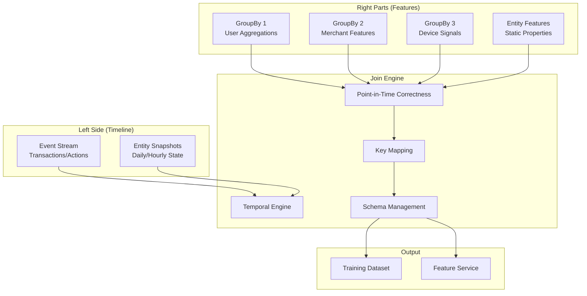
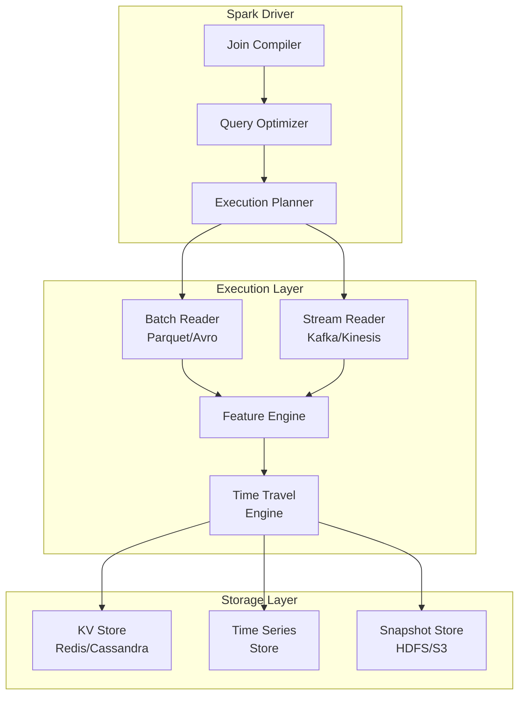

# Chapter 3: Join - The Temporal Feature Orchestrator

Now that you've learned how to aggregate raw events into features with [GroupBy](02_groupby_.md), let's dive deep into **Join** - Chronon's sophisticated system for assembling point-in-time correct feature vectors for ML training and serving!

## Important: Chronon Join vs Stream Processing Joins

Before we dive in, it's crucial to understand that **Chronon's Join is NOT a traditional stream processing join**. Let's clarify the differences:

### Traditional Stream Processing Joins (Flink/Kafka Streams)

```java
// Flink Stream-to-Stream Join
DataStream<Order> orders = ...;
DataStream<Payment> payments = ...;

// Join orders with payments within 5 minute window
orders.join(payments)
    .where(order -> order.orderId)
    .equalTo(payment -> payment.orderId)
    .window(TumblingEventTimeWindows.of(Time.minutes(5)))
    .apply((order, payment) -> new OrderPayment(order, payment));

// Flink Temporal Table (Lookup) Join
TableResult result = tableEnv.executeSql(
    "SELECT o.*, p.amount, u.risk_score " +
    "FROM orders o " +
    "JOIN payments FOR SYSTEM_TIME AS OF o.proc_time AS p " +
    "  ON o.order_id = p.order_id " +
    "JOIN user_profiles FOR SYSTEM_TIME AS OF o.proc_time AS u " +
    "  ON o.user_id = u.user_id"
);
```

### Chronon's Join - ML Feature Assembly

```python
# Chronon Join - Point-in-time feature vector assembly
Join(
    name="fraud_detection_features",
    left=Source(events=EventSource(table="transactions")),  # Timeline driver
    right_parts=[
        JoinPart(group_by=user_spend_7d),      # Pre-aggregated features
        JoinPart(group_by=merchant_risk_30d),   # Time-windowed aggregations
        JoinPart(group_by=device_reputation)    # Snapshot features
    ]
)
```

### Key Differences

| Aspect | Stream Processing Join | Chronon Join |
|--------|------------------------|--------------|
| **Purpose** | Combine streams in real-time | Assemble ML feature vectors |
| **Semantics** | Event correlation within windows | Point-in-time feature retrieval |
| **Left Side** | Stream of events | Timeline driver (events or entities) |
| **Right Side** | Another stream or table | Pre-computed GroupBy aggregations |
| **Output** | Joined events | Feature vectors for ML |
| **Execution** | Continuous streaming | Batch (training) + Online (serving) |
| **Time Handling** | Event/Processing time windows | Historical point-in-time correctness |
| **Storage** | In-memory state | KV stores + snapshots |

### Why Chronon Doesn't Use Flink Joins

```python
class WhyNotFlinkJoins:
    """
    Explaining why Chronon implements its own Join concept
    """
    
    def flink_limitations_for_ml(self):
        """
        Flink joins don't work for ML feature engineering
        """
        limitations = {
            "No Time Travel": """
            Flink joins operate on current state. ML needs historical 
            point-in-time features for training data generation.
            """,
            
            "No Multi-Window Aggregations": """
            Flink joins can't efficiently handle features like:
            - user_spend_1h, user_spend_1d, user_spend_7d, user_spend_30d
            All computed from the same source but different windows.
            """,
            
            "No Backfill Support": """
            Flink is streaming-first. ML needs to generate years of 
            historical training data with correct temporal semantics.
            """,
            
            "Different Storage Needs": """
            Flink: Optimized for low-latency stream processing
            Chronon: Optimized for feature retrieval at any point in time
            """,
            
            "Complex Key Mappings": """
            ML joins often need complex key transformations:
            seller_id -> merchant_id, buyer_id -> user_id
            Not typical in stream processing.
            """
        }
        return limitations

    def chronon_join_architecture(self):
        """
        How Chronon Join is architected differently
        """
        return {
            "Batch Layer": "Spark jobs for historical feature computation",
            "Streaming Layer": "Flink for real-time aggregations (GroupBy)",
            "Serving Layer": "KV stores for online feature retrieval",
            "Orchestration": "Join coordinates across all layers"
        }
```

### When to Use What

```yaml
Use Flink Stream Joins When:
  - Correlating events from multiple streams
  - Building real-time data pipelines
  - Stream enrichment with dimension tables
  - CEP (Complex Event Processing)
  Examples:
    - Join clicks with impressions
    - Enrich orders with user profiles
    - Correlate sensor readings

Use Chronon Join When:
  - Building ML training datasets
  - Serving features for online inference
  - Need point-in-time correctness
  - Require multiple time windows
  Examples:
    - Fraud detection features
    - Recommendation system features
    - Risk scoring features
```

## Stream Processing Join Patterns Deep Dive

### Understanding Different Join Types

```java
// 1. Stream-to-Stream Join (Windowed Join)
public class StreamToStreamJoin {
    /**
     * Join two streams within a time window
     * Use case: Correlate orders with payments
     */
    public DataStream<EnrichedOrder> windowedJoin() {
        DataStream<Order> orders = kafka.consume("orders");
        DataStream<Payment> payments = kafka.consume("payments");
        
        return orders
            .keyBy(Order::getOrderId)
            .intervalJoin(payments.keyBy(Payment::getOrderId))
            .between(Time.minutes(-5), Time.minutes(5))  // ±5 minute window
            .process(new ProcessJoinFunction<Order, Payment, EnrichedOrder>() {
                public void processElement(Order order, Payment payment, 
                                         Context ctx, Collector<EnrichedOrder> out) {
                    out.collect(new EnrichedOrder(order, payment));
                }
            });
    }
}

// 2. Stream-to-Table Join (Lookup/Dimension Join)
public class LookupJoin {
    /**
     * Enrich stream with dimension table
     * Use case: Add user profile to transactions
     */
    public DataStream<EnrichedTransaction> lookupJoin() {
        DataStream<Transaction> transactions = kafka.consume("transactions");
        
        return transactions
            .map(new RichMapFunction<Transaction, EnrichedTransaction>() {
                private transient UserProfileCache userCache;
                
                @Override
                public void open(Configuration params) {
                    userCache = new UserProfileCache();  // Connect to Redis/DB
                }
                
                @Override
                public EnrichedTransaction map(Transaction txn) {
                    UserProfile profile = userCache.lookup(txn.getUserId());
                    return new EnrichedTransaction(txn, profile);
                }
            });
    }
}

// 3. Temporal Table Join (Versioned Join)
TableResult flinkTemporalJoin = tableEnv.executeSql("""
    SELECT 
        t.transaction_id,
        t.amount,
        u.risk_score,
        u.account_age
    FROM transactions t
    JOIN user_profiles FOR SYSTEM_TIME AS OF t.proc_time AS u
        ON t.user_id = u.user_id
""");
```

### How Chronon Join Differs

```python
class ChronJoinVsStreamJoins:
    """
    Fundamental differences in join semantics
    """
    
    def stream_join_limitations(self):
        """
        Why stream joins don't work for ML features
        """
        # Stream-to-Stream Join Problems:
        stream_join_issues = {
            "Window Constraints": """
            Stream joins need both events within a window.
            ML features need ALL historical events, not just recent ones.
            """,
            
            "Single Window": """
            Can only join within ONE time window.
            ML needs multiple windows: 1h, 1d, 7d, 30d simultaneously.
            """,
            
            "No Aggregations": """
            Stream joins correlate events, not aggregations.
            ML needs sum(amount_7d), count(transactions_30d), etc.
            """
        }
        
        # Lookup Join Problems:
        lookup_join_issues = {
            "Current State Only": """
            Lookup joins fetch CURRENT dimension values.
            ML needs HISTORICAL values as of event time.
            """,
            
            "No Time Travel": """
            Can't ask "What was user's risk score on 2023-01-15?"
            ML training needs historical point-in-time accuracy.
            """,
            
            "No Windowed Aggregations": """
            Lookups return static values, not time-windowed aggregates.
            ML needs dynamic windows relative to each event.
            """
        }
        
        return stream_join_issues, lookup_join_issues
    
    def chronon_join_solution(self):
        """
        How Chronon solves these problems
        """
        return {
            "Pre-Aggregation": """
            GroupBys pre-compute all aggregations.
            Join just assembles them at query time.
            """,
            
            "Time-Travel Index": """
            Every feature value is indexed by time.
            Can retrieve exact value at any historical moment.
            """,
            
            "Multi-Window Support": """
            Single Join can include features with different windows.
            Each GroupBy handles its own aggregation logic.
            """,
            
            "Batch + Streaming": """
            Batch: Generate training data with full history.
            Streaming: Serve real-time features for inference.
            """
        }
```

### Comparison: Implementing Fraud Detection

```python
# ❌ Attempting with Flink Joins (Doesn't Work!)
class FlinkApproachProblems:
    """
    Why you can't build ML features with Flink joins
    """
    
    def failed_attempt_1_stream_join(self):
        """
        Try to join transaction with user history
        """
        # PROBLEM: Can't compute user_spend_7d within a join!
        # Flink SQL attempt:
        sql = """
        SELECT 
            t.transaction_id,
            t.amount,
            -- ❌ Can't do this! No access to historical transactions
            SUM(t2.amount) OVER (
                PARTITION BY t.user_id 
                ORDER BY t2.timestamp 
                RANGE BETWEEN INTERVAL '7' DAY PRECEDING AND CURRENT ROW
            ) as user_spend_7d
        FROM transactions t
        -- ❌ Would need to self-join with ALL historical transactions!
        LEFT JOIN transactions t2 ON t.user_id = t2.user_id
        """
        # This would process billions of rows for each transaction!
        
    def failed_attempt_2_lookup_join(self):
        """
        Try to use lookup join for features
        """
        # PROBLEM: Lookup gives current state, not historical!
        sql = """
        SELECT 
            t.transaction_id,
            t.amount,
            u.spend_7d  -- ❌ This is current spend, not as-of transaction time!
        FROM transactions t
        JOIN user_features u ON t.user_id = u.user_id
        """
        # Training data would have future leakage!

# ✅ Chronon Approach (Works!)
class ChronApproach:
    """
    How Chronon solves ML feature engineering
    """
    
    def step_1_define_aggregations(self):
        """
        Pre-compute aggregations with GroupBy
        """
        user_spend_7d = GroupBy(
            sources=[transaction_stream],
            key_columns=["user_id"],
            aggregations=[
                Aggregation(
                    operation=Sum,
                    column="amount",
                    window="7d",
                    name="user_spend_7d"
                )
            ]
        )
        # This runs continuously, updating aggregations
        
    def step_2_assemble_features(self):
        """
        Join assembles pre-computed features
        """
        fraud_features = Join(
            name="fraud_detection_features",
            left=Source(
                events=EventSource(
                    table="transactions",
                    time_column="timestamp"
                )
            ),
            right_parts=[
                JoinPart(group_by=user_spend_7d),
                JoinPart(group_by=user_spend_30d),
                JoinPart(group_by=merchant_risk_score)
            ]
        )
        # Join knows how to fetch the RIGHT historical values!
        
    def step_3_generate_training_data(self):
        """
        Backfill with perfect point-in-time correctness
        """
        # For transaction on 2023-01-15 3:45 PM:
        # - Fetches user_spend_7d from Jan 8 3:45 PM to Jan 15 3:45 PM
        # - NOT from current state
        # - NOT from midnight boundaries
        # Exactly as it would have been at prediction time!
```

## The Fundamental Challenge: Temporal Feature Assembly

Consider building a real-time fraud detection model for a payment platform processing millions of transactions:

### The Problem
- **Transaction at 2024-01-15 15:23:45.123**: User makes a $500 purchase
- **Feature Requirements**: 
  - User's spending in last 24 hours (as of 15:23:45, not midnight!)
  - Merchant's risk score (latest available before transaction)
  - Device reputation (point-in-time accurate)
  - User's account age (as of transaction moment)

### The Complexity
Traditional approaches fail because:
- **Temporal Leakage**: Using future data contaminates training
- **Staleness**: Midnight snapshots miss critical recent changes
- **Inconsistency**: Different features updated at different frequencies
- **Scale**: Billions of events requiring point-in-time features

**Join** solves this by providing a **time-travel engine** that reconstructs exact feature states at any historical moment!

## Join Architecture Deep Dive

### Conceptual Model

Join implements a sophisticated **temporal join engine** that coordinates multiple data sources:



### Technical Implementation

```python
class Join:
    """
    Chronon's temporal feature join system
    """
    def __init__(self, 
                 left: Source,           # Timeline driver
                 right_parts: List[JoinPart],  # Feature sources
                 online: bool = False,   # Enable real-time serving
                 production: bool = False,
                 sample_percent: float = 100.0):
        
        self.left = left
        self.right_parts = right_parts
        self.online = online
        self.production = production
        
        # Validation
        self._validate_temporal_consistency()
        self._validate_key_mappings()
        self._infer_output_schema()
```

### Simple Example

```python
# Basic Join for fraud detection
fraud_features = Join(
    name="fraud_detection_features_v1",
    left=Source(
        events=EventSource(
            table="transactions",
            query=Query(
                selects={
                    "user_id": "user_id",
                    "merchant_id": "merchant_id",
                    "amount": "amount"
                },
                time_column="transaction_time"  # Critical for temporal correctness!
            )
        )
    ),
    right_parts=[
        JoinPart(group_by=user_spend_features),
        JoinPart(group_by=merchant_risk_features),
        JoinPart(group_by=device_reputation_features)
    ],
    online=True,  # Enable real-time serving
    production=True
)
```

## Core Components Deep Dive

### 1. Left Side: The Temporal Spine

The left side is the **temporal spine** that drives feature computation:

```python
class LeftSideTypes:
    """Different ways to drive timeline"""
    
    # 1. Event-driven (most common)
    event_left = Source(
        events=EventSource(
            table="transactions",
            query=Query(
                selects={
                    "user_id": "user_id",
                    "merchant_id": "merchant_id",
                    "amount": "amount"
                },
                time_column="transaction_time",  # Microsecond precision
                start_partition="2023-01-01",
                end_partition="2024-01-01"
            )
        )
    )
    
    # 2. Entity snapshot-driven (for batch scoring)
    entity_left = Source(
        entities=EntitySource(
            snapshotTable="user_snapshots_daily",
            query=Query(
                selects={"user_id": "user_id"},
                time_column="snapshot_date"  # Daily granularity
            )
        )
    )
    
    # 3. Labeled data (for supervised learning)
    labeled_left = Source(
        events=EventSource(
            table="labeled_fraud_cases",
            query=Query(
                selects={
                    "case_id": "case_id",
                    "user_id": "user_id",
                    "label": "is_fraud"
                },
                time_column="detection_time"
            )
        )
    )
```

### 2. Right Parts: Feature Sources

Right parts are wrapped GroupBys with advanced configuration:

```python
class JoinPart:
    """
    Wrapper for GroupBy features in a Join
    """
    def __init__(self,
                 group_by: GroupBy,
                 key_mapping: Dict[str, str] = None,
                 prefix: str = None,
                 suffix: str = None):
        
        self.group_by = group_by
        self.key_mapping = key_mapping or {}
        self.prefix = prefix
        self.suffix = suffix
        
    def map_keys(self, left_keys: Dict[str, Any]) -> Dict[str, Any]:
        """Map keys from left to right schema"""
        right_keys = {}
        for left_key, right_key in self.key_mapping.items():
            if left_key in left_keys:
                right_keys[right_key] = left_keys[left_key]
        return right_keys
    
    def transform_columns(self, columns: List[str]) -> List[str]:
        """Apply prefix/suffix to column names"""
        transformed = []
        for col in columns:
            new_col = col
            if self.prefix:
                new_col = f"{self.prefix}{new_col}"
            if self.suffix:
                new_col = f"{new_col}{self.suffix}"
            transformed.append(new_col)
        return transformed
```

### 3. Advanced JoinPart Configurations

```python
# Example 1: Multi-entity join with key mapping
merchant_features_part = JoinPart(
    group_by=merchant_risk_gb,
    key_mapping={
        "seller_id": "merchant_id",  # left.seller_id -> gb.merchant_id
        "seller_country": "country"   # left.seller_country -> gb.country
    },
    prefix="merchant_"  # All columns prefixed with "merchant_"
)

# Example 2: Bootstrap features (features as features)
bootstrap_part = JoinPart(
    group_by=derived_features_gb,
    key_mapping={"user_id": "user_id"},
    bootstrap_parts=[  # These features computed first!
        JoinPart(group_by=base_features_gb)
    ]
)

# Example 3: External feature source
external_part = JoinPart(
    group_by=external_credit_score_gb,
    key_mapping={"ssn_hash": "user_ssn_hash"},
    external=True,  # From external system
    cache_ttl=3600  # Cache for 1 hour
)
```

## Building Our First Join

Let's create a complete training dataset for fraud detection:

```python
# Step 1: Define the left side (checkout events)
checkouts = Source(
    events=EventSource(
        table="data.checkouts",
        query=Query(
            selects={"user_id": "user_id"},
            time_column="ts"  # When each checkout happened
        )
    )
)
```

```python
# Step 2: Create the Join
training_set = Join(
    left=checkouts,
    right_parts=[
        JoinPart(group_by=purchases_v1),
        JoinPart(group_by=returns_v1),
        JoinPart(group_by=users_v1)
    ],
    version=1
)
```

This produces a table like:
```
user_id | ts             | purchases_v1_amount_sum_7d | returns_v1_count_30d | users_v1_verified
--------|----------------|---------------------------|---------------------|------------------
123     | 2024-01-15 3pm | 500.00                   | 2                   | true
456     | 2024-01-15 4pm | 1200.00                  | 0                   | false
```

### Point-in-Time Correctness

The magic happens in the timing:

```python
# For checkout at 2024-01-15 3:00 PM
# Join fetches:
# - 7-day purchase sum from Jan 8 3pm to Jan 15 3pm
# - NOT from Jan 8 midnight to Jan 15 midnight!
```

This ensures your model trains on exactly what it would see in production!

## How Join Works: Under the Hood

### Execution Architecture Deep Dive



### The Spark Job Generation

```scala
// Join compilation to Spark job
class JoinCompiler(join: Join) {
  
  def compile(): SparkJob = {
    val leftDF = loadLeftSide(join.left)
    val rightDFs = join.rightParts.map(compileRightPart)
    
    // Generate point-in-time join logic
    val joinPlan = QueryPlan(
      left = leftDF,
      rights = rightDFs,
      joinType = TemporalJoin,
      keys = extractKeys(join),
      timeColumn = "ts"
    )
    
    // Optimize for data skew and performance
    val optimizedPlan = QueryOptimizer.optimize(joinPlan)
    
    SparkJob(
      name = s"chronon_join_${join.name}",
      plan = optimizedPlan,
      outputTable = join.outputTable,
      partitionStrategy = TimeBasedPartitioning
    )
  }
  
  private def compileRightPart(part: JoinPart): DataFrame = {
    val groupByDF = loadGroupBy(part.groupBy)
    
    // Apply temporal windowing
    val windowedDF = applyTemporalWindows(
      df = groupByDF,
      windows = part.groupBy.aggregations.map(_.window),
      timeColumn = "ts"
    )
    
    // Apply key mapping if needed
    val mappedDF = if (part.keyMapping.nonEmpty) {
      applyKeyMapping(windowedDF, part.keyMapping)
    } else windowedDF
    
    // Apply column transformations
    applyColumnTransforms(mappedDF, part.prefix, part.suffix)
  }
}
```

### Point-in-Time Correctness Algorithm

```python
class TemporalJoinEngine:
    """
    Core engine for point-in-time correct feature computation
    """
    
    def __init__(self, join_config: Join):
        self.join = join_config
        self.time_travel_cache = TTLCache(maxsize=10000, ttl=3600)
        self.feature_registry = FeatureRegistry()
        
    def execute_temporal_join(self, left_row: Row) -> Row:
        """
        Execute point-in-time join for a single left-side row
        """
        # Extract timestamp from left row
        query_time = left_row["ts"]
        keys = self.extract_keys(left_row)
        
        # Parallel feature fetching
        with ThreadPoolExecutor(max_workers=10) as executor:
            futures = []
            
            for right_part in self.join.right_parts:
                # Submit async feature fetch
                future = executor.submit(
                    self.fetch_features_as_of,
                    right_part,
                    keys,
                    query_time
                )
                futures.append((right_part, future))
            
            # Collect results
            features = {}
            for right_part, future in futures:
                try:
                    part_features = future.result(timeout=5.0)
                    features.update(part_features)
                except TimeoutError:
                    # Use default values for timeout
                    features.update(self.get_default_features(right_part))
        
        # Combine left row with fetched features
        return self.combine_row(left_row, features)
    
    def fetch_features_as_of(self, 
                            right_part: JoinPart,
                            keys: Dict[str, Any],
                            query_time: datetime) -> Dict[str, Any]:
        """
        Fetch features as of a specific point in time
        """
        # Map keys according to JoinPart configuration
        mapped_keys = self.map_keys(keys, right_part.key_mapping)
        
        # Check time travel cache first
        cache_key = f"{right_part.group_by.name}:{mapped_keys}:{query_time}"
        if cache_key in self.time_travel_cache:
            return self.time_travel_cache[cache_key]
        
        # Determine fetch strategy based on GroupBy type
        if right_part.group_by.source.is_streaming():
            features = self.fetch_streaming_features(
                right_part.group_by,
                mapped_keys,
                query_time
            )
        else:
            features = self.fetch_batch_features(
                right_part.group_by,
                mapped_keys,
                query_time
            )
        
        # Apply column transformations
        features = self.apply_transforms(features, right_part)
        
        # Cache for future use
        self.time_travel_cache[cache_key] = features
        
        return features
    
    def fetch_streaming_features(self,
                                group_by: GroupBy,
                                keys: Dict[str, Any],
                                query_time: datetime) -> Dict[str, Any]:
        """
        Fetch from real-time streaming features
        """
        features = {}
        
        for aggregation in group_by.aggregations:
            # Calculate exact window boundaries
            window_start = query_time - aggregation.window.duration
            window_end = query_time
            
            # Fetch from KV store with time boundaries
            kv_key = self.build_kv_key(
                entity_id=keys[group_by.key_column],
                feature_name=aggregation.name,
                window_end=window_end
            )
            
            # Get pre-aggregated value from KV store
            value = self.kv_store.get_range(
                key_prefix=kv_key,
                start_time=window_start,
                end_time=window_end
            )
            
            features[aggregation.name] = value
        
        return features
    
    def fetch_batch_features(self,
                            group_by: GroupBy,
                            keys: Dict[str, Any],
                            query_time: datetime) -> Dict[str, Any]:
        """
        Fetch from batch-computed features (daily snapshots)
        """
        # Find the latest snapshot before query_time
        snapshot_date = self.find_latest_snapshot(query_time)
        
        # Build snapshot query
        query = f"""
        SELECT * FROM {group_by.output_table}
        WHERE ds = '{snapshot_date}'
          AND {group_by.key_column} = '{keys[group_by.key_column]}'
        """
        
        # Execute query and return features
        return self.execute_spark_query(query)
```

### Advanced Execution Optimizations

```python
class JoinOptimizer:
    """
    Optimization strategies for Join execution
    """
    
    def optimize_join_plan(self, join: Join) -> OptimizedJoin:
        """
        Apply various optimization strategies
        """
        optimizations = []
        
        # 1. Broadcast optimization for small GroupBys
        for right_part in join.right_parts:
            if self.estimate_size(right_part.group_by) < 100_000_000:  # 100MB
                optimizations.append(
                    BroadcastOptimization(right_part)
                )
        
        # 2. Partition alignment optimization
        if self.can_align_partitions(join):
            optimizations.append(
                PartitionAlignmentOptimization(
                    left=join.left,
                    rights=join.right_parts
                )
            )
        
        # 3. Predicate pushdown
        predicates = self.extract_predicates(join)
        if predicates:
            optimizations.append(
                PredicatePushdownOptimization(predicates)
            )
        
        # 4. Column pruning
        required_columns = self.analyze_column_usage(join)
        optimizations.append(
            ColumnPruningOptimization(required_columns)
        )
        
        # 5. Cache frequently accessed features
        hot_features = self.identify_hot_features(join)
        if hot_features:
            optimizations.append(
                FeatureCachingOptimization(hot_features)
            )
        
        return OptimizedJoin(join, optimizations)

class SkewHandler:
    """
    Handle data skew in temporal joins
    """
    
    def handle_skew(self, join_plan: JoinPlan) -> JoinPlan:
        """
        Detect and handle data skew
        """
        # Detect skewed keys
        skewed_keys = self.detect_skewed_keys(join_plan.left)
        
        if skewed_keys:
            # Apply salt-based redistribution
            return self.apply_salting(join_plan, skewed_keys)
        
        return join_plan
    
    def apply_salting(self, 
                     join_plan: JoinPlan,
                     skewed_keys: List[str]) -> JoinPlan:
        """
        Apply salting technique for skewed keys
        """
        salt_factor = 10  # Number of salt values
        
        # Add salt to skewed keys
        salted_left = join_plan.left.withColumn(
            "salt",
            F.when(F.col("key").isin(skewed_keys),
                   F.floor(F.rand() * salt_factor))
             .otherwise(0)
        )
        
        # Replicate right side for salted keys
        salted_rights = []
        for right_df in join_plan.rights:
            expanded_right = self.expand_for_salt(
                right_df,
                skewed_keys,
                salt_factor
            )
            salted_rights.append(expanded_right)
        
        return JoinPlan(
            left=salted_left,
            rights=salted_rights,
            join_keys=join_plan.join_keys + ["salt"]
        )
```

### The Time Travel Magic - Implementation Details

```scala
// Scala implementation of time-travel feature fetching
class TimeTravelEngine(kvStore: KVStore, snapshotStore: SnapshotStore) {
  
  /**
   * Core time-travel algorithm for feature retrieval
   */
  def getFeatureAsOf(
    entityId: String,
    featureName: String,
    queryTime: Timestamp,
    window: Window
  ): FeatureValue = {
    
    // Calculate time boundaries
    val windowStart = queryTime - window.duration
    val windowEnd = queryTime
    
    // Determine storage strategy based on feature type
    val storageType = FeatureRegistry.getStorageType(featureName)
    
    storageType match {
      case StorageType.Streaming =>
        // Fetch from KV store (real-time features)
        fetchStreamingFeature(entityId, featureName, windowStart, windowEnd)
        
      case StorageType.Batch =>
        // Fetch from snapshot store (batch features)
        fetchBatchFeature(entityId, featureName, queryTime)
        
      case StorageType.Hybrid =>
        // Combine batch base with streaming updates
        val batchBase = fetchBatchFeature(entityId, featureName, queryTime)
        val streamingDelta = fetchStreamingDelta(
          entityId, featureName, 
          batchBase.computeTime, windowEnd
        )
        combineHybridFeature(batchBase, streamingDelta)
    }
  }
  
  private def fetchStreamingFeature(
    entityId: String,
    featureName: String,
    windowStart: Timestamp,
    windowEnd: Timestamp
  ): FeatureValue = {
    
    // Build time-series key
    val tsKey = TimeSeriesKey(
      entity = entityId,
      feature = featureName,
      timeRange = TimeRange(windowStart, windowEnd)
    )
    
    // Fetch all values in time range
    val values = kvStore.getTimeRange(tsKey)
    
    // Apply aggregation based on feature definition
    val aggregation = FeatureRegistry.getAggregation(featureName)
    aggregation.aggregate(values)
  }
}

## Advanced Features and Production Deployment

### Complex Key Mapping and Multi-Entity Joins

```python
class AdvancedJoinPatterns:
    """
    Advanced patterns for complex join scenarios
    """
    
    def create_multi_entity_join(self):
        """
        Join with multiple entity types and complex key mappings
        """
        # Complex e-commerce transaction join
        return Join(
            name="multi_entity_transaction_features",
            left=Source(
                events=EventSource(
                    table="transactions",
                    query=Query(
                        selects={
                            "transaction_id": "transaction_id",
                            "buyer_id": "buyer_id",
                            "seller_id": "seller_id",
                            "product_id": "product_id",
                            "payment_method": "payment_method",
                            "amount": "amount"
                        },
                        time_column="transaction_timestamp"
                    )
                )
            ),
            right_parts=[
                # Buyer features with direct mapping
                JoinPart(
                    group_by=buyer_behavior_gb,
                    key_mapping={"buyer_id": "user_id"},  # Map to GroupBy's user_id
                    prefix="buyer_"
                ),
                
                # Seller features with complex mapping
                JoinPart(
                    group_by=seller_reputation_gb,
                    key_mapping={
                        "seller_id": "merchant_id",
                        "seller_country": "country_code"
                    },
                    prefix="seller_"
                ),
                
                # Product features with composite key
                JoinPart(
                    group_by=product_popularity_gb,
                    key_mapping={
                        "product_id": "sku",
                        "seller_id": "merchant_id"  # Composite key
                    },
                    prefix="product_"
                ),
                
                # Payment method risk features
                JoinPart(
                    group_by=payment_risk_gb,
                    key_mapping={"payment_method": "payment_type"},
                    prefix="payment_"
                )
            ],
            online=True,
            sample_percent=5.0  # Sample for monitoring
        )
```

### Online Serving Architecture

```python
class OnlineJoinServer:
    """
    Real-time feature serving for Join
    """
    
    def __init__(self, join_config: Join):
        self.join = join_config
        self.feature_cache = RedisCache(ttl=60)  # 1 minute cache
        self.kv_stores = self._init_kv_stores()
        self.fetcher_pool = FetcherPool(size=100)  # Connection pool
        
    def serve_features(self, request: FeatureRequest) -> FeatureResponse:
        """
        Serve features in real-time for online inference
        """
        start_time = time.time()
        
        # Extract keys from request
        keys = self.extract_keys(request)
        query_time = request.timestamp or datetime.now()
        
        # Check cache first
        cache_key = self.build_cache_key(keys, query_time)
        if cached := self.feature_cache.get(cache_key):
            return FeatureResponse(
                features=cached,
                latency_ms=self._calc_latency(start_time),
                cache_hit=True
            )
        
        # Parallel feature fetching with timeout
        features = {}
        with ThreadPoolExecutor(max_workers=20) as executor:
            futures = {}
            
            for right_part in self.join.right_parts:
                if self.should_fetch_online(right_part):
                    future = executor.submit(
                        self.fetch_online_features,
                        right_part,
                        keys,
                        query_time
                    )
                    futures[right_part.name] = future
            
            # Collect with timeout
            for name, future in futures.items():
                try:
                    part_features = future.result(timeout=0.05)  # 50ms timeout
                    features.update(part_features)
                except TimeoutError:
                    # Log timeout and use defaults
                    self.metrics.record_timeout(name)
                    features.update(self.get_default_features(name))
        
        # Cache successful response
        self.feature_cache.set(cache_key, features)
        
        return FeatureResponse(
            features=features,
            latency_ms=self._calc_latency(start_time),
            cache_hit=False
        )
    
    def fetch_online_features(self,
                             right_part: JoinPart,
                             keys: Dict,
                             query_time: datetime) -> Dict:
        """
        Fetch features from online stores
        """
        # Use appropriate KV store based on feature type
        kv_store = self.kv_stores[right_part.group_by.kv_store_type]
        
        # Map keys according to JoinPart configuration
        mapped_keys = self.map_keys(keys, right_part.key_mapping)
        
        # Build KV key
        kv_key = self.build_kv_key(
            entity_id=mapped_keys[right_part.group_by.key_column],
            feature_group=right_part.group_by.name,
            timestamp=query_time
        )
        
        # Fetch with retry logic
        for attempt in range(3):
            try:
                value = kv_store.get(kv_key)
                if value:
                    return self.deserialize_features(value, right_part)
            except Exception as e:
                if attempt == 2:
                    raise
                time.sleep(0.001 * (2 ** attempt))  # Exponential backoff
        
        return {}
```

### Monitoring and Observability

```python
class JoinMonitor:
    """
    Production monitoring for Join operations
    """
    
    def __init__(self, join_name: str):
        self.join_name = join_name
        self.metrics = MetricsCollector()
        self.alerting = AlertingService()
        
    def monitor_batch_join(self, spark_job: SparkJob):
        """
        Monitor batch join execution
        """
        # Track key metrics
        metrics = {
            "rows_processed": spark_job.rows_processed,
            "execution_time": spark_job.execution_time,
            "data_skew": self.calculate_data_skew(spark_job),
            "memory_usage": spark_job.peak_memory,
            "shuffle_bytes": spark_job.shuffle_bytes_written,
            "failed_tasks": spark_job.failed_tasks
        }
        
        # Record metrics
        for metric_name, value in metrics.items():
            self.metrics.record(
                f"chronon.join.{self.join_name}.{metric_name}",
                value
            )
        
        # Check for anomalies
        if metrics["data_skew"] > 10:  # Skew ratio > 10x
            self.alerting.send_alert(
                AlertLevel.WARNING,
                f"High data skew detected in {self.join_name}: {metrics['data_skew']:.2f}x"
            )
        
        if metrics["failed_tasks"] > 0:
            self.alerting.send_alert(
                AlertLevel.ERROR,
                f"Failed tasks in {self.join_name}: {metrics['failed_tasks']}"
            )
    
    def monitor_online_serving(self):
        """
        Monitor real-time feature serving
        """
        # Set up continuous monitoring
        self.metrics.create_dashboard({
            "p50_latency": Percentile(50),
            "p99_latency": Percentile(99),
            "qps": Rate(per_second=True),
            "cache_hit_rate": Ratio("cache_hits", "total_requests"),
            "timeout_rate": Ratio("timeouts", "total_requests"),
            "error_rate": Ratio("errors", "total_requests")
        })
        
        # Set up alerts
        self.alerting.create_sla_alerts({
            "p99_latency": {"threshold": 100, "unit": "ms"},
            "error_rate": {"threshold": 0.01, "unit": "ratio"},
            "timeout_rate": {"threshold": 0.05, "unit": "ratio"}
        })
```

### Bootstrap Features and External Sources

```python
class BootstrapJoin:
    """
    Advanced pattern: Features that depend on other features
    """
    
    def create_bootstrap_join(self):
        """
        Join where some features are inputs to other features
        """
        # First-level features
        base_user_features = GroupBy(
            sources=[user_events],
            key_columns=["user_id"],
            aggregations=[
                Aggregation(operation=Sum, column="amount", window="7d"),
                Aggregation(operation=Count, column="transaction_id", window="30d")
            ]
        )
        
        # Second-level features that use first-level as input
        derived_risk_features = GroupBy(
            sources=[
                # Use output of another GroupBy as input!
                JoinSource(
                    join=Join(
                        left=user_events,
                        right_parts=[JoinPart(group_by=base_user_features)]
                    )
                )
            ],
            key_columns=["user_id"],
            aggregations=[
                # Risk score based on transaction patterns
                Aggregation(
                    operation=Expression,
                    column="risk_score",
                    expression="amount_sum_7d / (count_30d + 1) * risk_factor"
                )
            ]
        )
        
        # Final join with bootstrapping
        return Join(
            name="risk_assessment_features",
            left=transaction_events,
            right_parts=[
                # Bootstrap part - computed first
                JoinPart(
                    group_by=base_user_features,
                    prefix="base_"
                ),
                # Derived part - uses bootstrap features
                JoinPart(
                    group_by=derived_risk_features,
                    prefix="derived_",
                    bootstrap_parts=[
                        JoinPart(group_by=base_user_features)
                    ]
                ),
                # External credit score
                JoinPart(
                    group_by=external_credit_score_gb,
                    external=True,
                    cache_ttl=3600,  # Cache for 1 hour
                    prefix="external_"
                )
            ]
        )
```

### Performance Tuning and Optimization

```scala
// Scala implementation of Join performance optimizations
object JoinPerformanceTuning {
  
  /**
   * Adaptive query execution for Joins
   */
  class AdaptiveJoinExecutor(join: Join) {
    
    def execute(): DataFrame = {
      // Enable Spark 3.0+ adaptive features
      spark.conf.set("spark.sql.adaptive.enabled", "true")
      spark.conf.set("spark.sql.adaptive.coalescePartitions.enabled", "true")
      spark.conf.set("spark.sql.adaptive.skewJoin.enabled", "true")
      
      // Set join-specific optimizations
      val joinHints = analyzeJoinPattern(join)
      
      var resultDF = loadLeftSide(join.left)
      
      // Apply broadcast hints for small dimensions
      for (rightPart <- join.rightParts) {
        val rightDF = loadRightPart(rightPart)
        
        if (estimateSize(rightDF) < 100.MB) {
          // Broadcast small tables
          resultDF = resultDF.join(
            broadcast(rightDF),
            joinKeys,
            "left_outer"
          )
        } else if (hasSkewedKeys(rightDF)) {
          // Handle skewed joins with salting
          resultDF = skewedJoin(resultDF, rightDF, joinKeys)
        } else {
          // Regular sort-merge join
          resultDF = resultDF.join(
            rightDF,
            joinKeys,
            "left_outer"
          )
        }
      }
      
      // Optimize output partitioning
      optimizePartitioning(resultDF, join.outputTable)
    }
    
    private def skewedJoin(left: DataFrame, 
                          right: DataFrame,
                          keys: Seq[String]): DataFrame = {
      // Detect skewed keys
      val skewedKeys = detectSkewedKeys(left, keys)
      
      // Split into skewed and regular
      val skewedLeft = left.filter(col(keys(0)).isin(skewedKeys: _*))
      val regularLeft = left.filter(!col(keys(0)).isin(skewedKeys: _*))
      
      // Salt skewed keys
      val saltedSkewedLeft = skewedLeft
        .withColumn("salt", floor(rand() * 10))
      
      val replicatedRight = (0 until 10).map { salt =>
        right.withColumn("salt", lit(salt))
      }.reduce(_ union _)
      
      // Join skewed with salting
      val skewedResult = saltedSkewedLeft
        .join(replicatedRight, keys :+ "salt", "left_outer")
        .drop("salt")
      
      // Join regular normally
      val regularResult = regularLeft
        .join(right, keys, "left_outer")
      
      // Union results
      skewedResult.union(regularResult)
    }
  }
}

## Practical Tips and Best Practices

### 1. Choosing the Right Left Side Strategy

```python
class LeftSidePatterns:
    """
    Common patterns for left side selection
    """
    
    @staticmethod
    def event_prediction_pattern():
        """For predicting on specific events (fraud, churn, conversion)"""
        return Source(
            events=EventSource(
                table="conversion_events",
                query=Query(
                    selects={"user_id": "user_id", "session_id": "session_id"},
                    time_column="event_timestamp",  # Exact event time
                    wheres=["event_type = 'checkout'"]  # Filter to prediction events
                )
            )
        )
    
    @staticmethod
    def entity_scoring_pattern():
        """For regular entity scoring (credit, risk assessment)"""
        return Source(
            entities=EntitySource(
                snapshotTable="user_snapshots_daily",
                query=Query(
                    selects={"user_id": "user_id"},
                    time_column="snapshot_date",  # Daily granularity
                    start_partition="2024-01-01",
                    end_partition="2024-12-31"
                )
            )
        )
    
    @staticmethod
    def labeled_training_pattern():
        """For supervised learning with labels"""
        return Source(
            events=EventSource(
                table="labeled_outcomes",
                query=Query(
                    selects={
                        "case_id": "case_id",
                        "user_id": "user_id",
                        "label": "is_fraud"  # Training label
                    },
                    time_column="label_timestamp",
                    wheres=["label_quality = 'verified'"]  # Quality filter
                )
            )
        )
```

### 2. Version Management and Migration

```python
class JoinVersioning:
    """
    Best practices for Join versioning
    """
    
    def migrate_join_version(self, old_join: Join) -> Join:
        """
        Safely migrate to new Join version
        """
        # Create new version with changes
        new_join = Join(
            name=f"{old_join.name}_v2",
            left=old_join.left,
            right_parts=old_join.right_parts + [
                # Add new features
                JoinPart(group_by=new_feature_gb)
            ],
            version=old_join.version + 1,
            migration_config={
                "backfill_start": "2024-01-01",
                "parallel_run_days": 7,  # Run both versions
                "auto_switch_date": "2024-02-01"
            }
        )
        
        # Set up A/B testing
        new_join.ab_test_config = {
            "control_version": old_join.version,
            "treatment_version": new_join.version,
            "sample_percent": 10.0,
            "metrics": ["model_auc", "feature_coverage", "latency_p99"]
        }
        
        return new_join
```

### 3. Testing and Validation Strategies

```python
class JoinTesting:
    """
    Comprehensive testing for Joins
    """
    
    def test_join_correctness(self, join: Join):
        """
        Test point-in-time correctness
        """
        # 1. Test with known data
        test_events = [
            {"user_id": "test_user", "ts": "2024-01-15 10:00:00"},
            {"user_id": "test_user", "ts": "2024-01-15 15:00:00"}
        ]
        
        # 2. Verify features are different at different times
        results = self.execute_join(join, test_events)
        assert results[0]["feature_1h"] != results[1]["feature_1h"], \
            "1-hour features should differ for 5-hour gap"
        
        # 3. Test boundary conditions
        self.test_midnight_boundary(join)
        self.test_month_boundary(join)
        self.test_timezone_handling(join)
        
        # 4. Test data quality
        self.validate_no_future_leakage(join)
        self.validate_null_handling(join)
        self.validate_type_consistency(join)
    
    def test_performance(self, join: Join):
        """
        Performance testing for production readiness
        """
        metrics = {
            "small_batch": self.benchmark(join, rows=1000),
            "medium_batch": self.benchmark(join, rows=100_000),
            "large_batch": self.benchmark(join, rows=10_000_000),
            "skewed_data": self.benchmark_with_skew(join),
            "online_latency": self.benchmark_online(join)
        }
        
        # Assert performance SLAs
        assert metrics["online_latency"]["p99"] < 100, "P99 must be <100ms"
        assert metrics["large_batch"]["runtime"] < 3600, "Must process 10M rows in <1 hour"
```

### 4. Debugging Common Issues

```python
class JoinDebugger:
    """
    Debug common Join issues
    """
    
    def diagnose_missing_features(self, join: Join, row: Dict):
        """
        Why are features missing for this row?
        """
        diagnostics = []
        
        for right_part in join.right_parts:
            # Check key mapping
            mapped_keys = self.apply_key_mapping(
                row, 
                right_part.key_mapping
            )
            
            if not all(mapped_keys.values()):
                diagnostics.append(
                    f"Missing keys for {right_part.name}: {mapped_keys}"
                )
                continue
            
            # Check data availability
            feature_data = self.check_data_exists(
                right_part.group_by,
                mapped_keys,
                row["ts"]
            )
            
            if not feature_data:
                diagnostics.append(
                    f"No data for {right_part.name} at {row['ts']}"
                )
            
            # Check time windows
            window_coverage = self.check_window_coverage(
                right_part.group_by,
                row["ts"]
            )
            
            if window_coverage < 1.0:
                diagnostics.append(
                    f"Partial window coverage ({window_coverage:.1%}) for {right_part.name}"
                )
        
        return diagnostics
    
    def analyze_skew(self, join: Join):
        """
        Identify and quantify data skew
        """
        # Analyze left side key distribution
        key_distribution = self.get_key_distribution(join.left)
        
        # Calculate skew metrics
        skew_ratio = max(key_distribution.values()) / np.mean(list(key_distribution.values()))
        top_10_percent = sorted(key_distribution.values(), reverse=True)[:len(key_distribution)//10]
        concentration = sum(top_10_percent) / sum(key_distribution.values())
        
        return {
            "skew_ratio": skew_ratio,
            "top_10_percent_concentration": concentration,
            "recommended_salt_factor": min(int(skew_ratio), 100),
            "hot_keys": [k for k, v in key_distribution.items() 
                        if v > 10 * np.mean(list(key_distribution.values()))]
        }
```

### 5. Production Deployment Checklist

```python
class ProductionChecklist:
    """
    Pre-production validation checklist
    """
    
    def validate_for_production(self, join: Join) -> ValidationReport:
        """
        Comprehensive production readiness check
        """
        checks = []
        
        # 1. Data Quality Checks
        checks.append(self.check_no_future_leakage(join))
        checks.append(self.check_null_handling(join))
        checks.append(self.check_type_consistency(join))
        
        # 2. Performance Checks
        checks.append(self.check_query_performance(join))
        checks.append(self.check_memory_usage(join))
        checks.append(self.check_shuffle_size(join))
        
        # 3. Correctness Checks
        checks.append(self.check_temporal_correctness(join))
        checks.append(self.check_key_mapping(join))
        checks.append(self.check_aggregation_accuracy(join))
        
        # 4. Operational Checks
        checks.append(self.check_monitoring_configured(join))
        checks.append(self.check_alerting_configured(join))
        checks.append(self.check_backfill_plan(join))
        
        # 5. Online Serving Checks (if applicable)
        if join.online:
            checks.append(self.check_online_latency(join))
            checks.append(self.check_cache_configuration(join))
            checks.append(self.check_fallback_behavior(join))
        
        return ValidationReport(
            join_name=join.name,
            checks=checks,
            passed=all(c.passed for c in checks),
            warnings=[c for c in checks if c.severity == "warning"],
            errors=[c for c in checks if c.severity == "error"]
        )
```

## Conclusion

Join is Chronon's **temporal orchestration masterpiece** that solves one of ML's hardest problems: assembling point-in-time correct feature vectors at scale. Through this deep dive, you've learned:

### 🏗️ **Architecture Components**
- **Temporal Spine**: The left side that drives your timeline
- **Feature Sources**: GroupBys wrapped as JoinParts with sophisticated mapping
- **Time Travel Engine**: Point-in-time correctness through clever indexing
- **Execution Layer**: Spark-based processing with advanced optimizations

### ⚡ **Performance Optimizations**
- **Broadcast Joins**: For small dimension tables (<100MB)
- **Skew Handling**: Salting techniques for hot keys
- **Adaptive Execution**: Spark 3.0+ dynamic optimization
- **Parallel Fetching**: Concurrent feature retrieval with timeouts

### 🚀 **Production Features**
- **Online Serving**: <100ms P99 latency with caching
- **Monitoring**: Comprehensive metrics and alerting
- **Versioning**: Safe migration and A/B testing
- **Bootstrap Patterns**: Features that depend on other features

### 🎯 **Key Takeaways**
1. **Point-in-time correctness** is non-negotiable for valid ML models
2. **Choose your left side carefully** - it defines your prediction context
3. **Test temporal boundaries** - midnight, month-end, timezones
4. **Monitor data skew** - it's the #1 performance killer
5. **Version your Joins** - features evolve, maintain reproducibility

Join transforms the complex challenge of temporal feature assembly into a declarative, scalable solution. By handling the intricate details of time travel, key mapping, and distributed processing, it lets you focus on what matters: building great ML models with accurate features.

Ready to ensure your Joins compile correctly and catch errors before expensive backfills? Continue to [Compiler & Validation](04_compiler___validation_.md) to master Chronon's validation engine!

---

Generated by [AI Codebase Knowledge Builder](https://github.com/The-Pocket/Tutorial-Codebase-Knowledge)