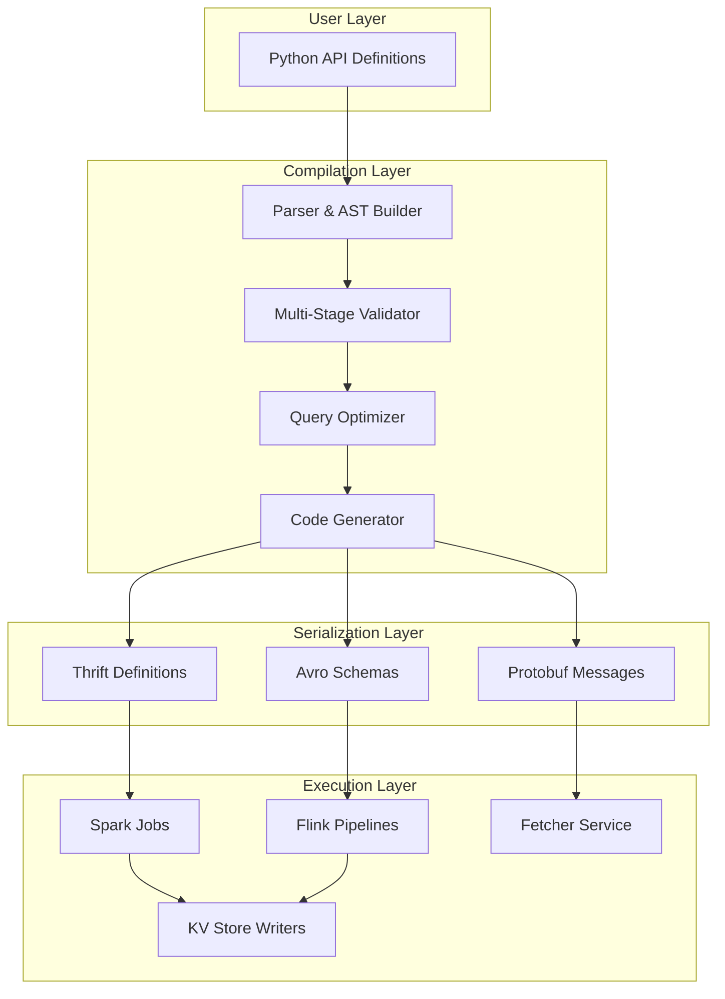
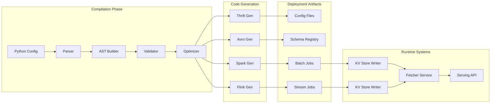

# Chapter 4: Compiler & Validation - The Brain of Chronon

Now that you've learned how to create training datasets with [Join](03_join_.md), let's dive deep into Chronon's compilation system - the sophisticated machinery that transforms your Python feature definitions into distributed compute operations across batch and streaming systems!

## Why Do We Need Compiler & Validation?

Imagine you're building a fraud detection system with hundreds of features:
- Real-time transaction aggregations from Kafka streams
- Historical user behavior from Hive tables
- Cross-system feature joins requiring complex key mappings
- Sub-millisecond serving requirements for online inference

The challenge isn't just defining these features - it's orchestrating them across:
- **Multiple data formats**: Avro, Parquet, JSON, Thrift
- **Different compute engines**: Spark for batch, Flink for streaming
- **Storage systems**: HDFS, S3, Kafka, KV stores (Redis/Cassandra)
- **Serving layers**: REST APIs, gRPC Fetcher services

One misconfiguration could cascade failures across your entire ML infrastructure! The Compiler & Validation system prevents this by providing:
- **Type-safe schema evolution** with Avro/Thrift
- **Cross-system compatibility** checks
- **Performance optimization** through execution plan generation
- **Seamless online/offline** feature consistency

## The Compilation Architecture

The Chronon Compiler is a multi-stage transformation engine that bridges the gap between high-level Python definitions and low-level distributed systems:



### The Multi-Format Serialization Strategy

Chronon uses different serialization formats for different purposes:

```python
# 1. Thrift for configuration interchange
struct GroupByConfig {
    1: required string name
    2: required list<Source> sources
    3: required list<string> keys
    4: required list<Aggregation> aggregations
    5: optional map<string, string> metadata
    6: optional OnlineConfig onlineConfig
}

# 2. Avro for data serialization
{
    "type": "record",
    "name": "FeatureRow",
    "fields": [
        {"name": "key", "type": "string"},
        {"name": "timestamp", "type": "long"},
        {"name": "features", "type": {"type": "map", "values": "double"}}
    ]
}

# 3. Python for user-facing API
user_features = GroupBy(
    sources=[purchases],
    keys=["user_id"],
    aggregations=[
        Aggregation(
            column="amount",
            function="sum",
            windows=["1d", "7d", "30d"]
        )
    ]
)

## Deep Dive: The Compilation Pipeline

### Stage 1: Python to Thrift Transformation

The compiler first converts Python definitions into Thrift IDL (Interface Definition Language) for cross-language compatibility:

```python
# Python API Definition
user_activity = GroupBy(
    name="user_activity_features",
    sources=[
        Source(
            events=EventSource(
                table="transactions",
                query=Query(
                    selects={"user_id": "user_id", "amount": "amount"},
                    time_column="timestamp"
                )
            )
        )
    ],
    keys=["user_id"],
    aggregations=[
        Aggregation(column="amount", function="sum", windows=["1h", "1d", "7d"]),
        Aggregation(column="amount", function="count", windows=["1h", "1d"])
    ],
    online=True,
    production=True
)
```

This gets compiled into Thrift structures:

```thrift
// Generated Thrift Configuration
struct GroupByServingInfo {
    1: required string name = "user_activity_features"
    2: required list<string> keyColumns = ["user_id"]
    3: required list<AggregationSpec> aggregations
    4: required SchemaInfo schemaInfo
    5: required KVStoreConfig kvStoreConfig
    6: optional FetcherConfig fetcherConfig
}

struct AggregationSpec {
    1: required string inputColumn
    2: required AggregationType aggregationType  // SUM, COUNT, etc.
    3: required list<WindowSpec> windows
    4: required string outputAlias
    5: optional BucketSpec bucketSpec  // For bucketed aggregations
}

struct KVStoreConfig {
    1: required StoreType storeType  // REDIS, CASSANDRA, DYNAMODB
    2: required string namespace
    3: required i32 ttlSeconds
    4: optional ConsistencyLevel consistency
    5: optional map<string, string> connectionParams
}
```

### Stage 2: Schema Evolution and Avro Integration

Chronon uses Avro for data serialization, providing schema evolution capabilities:

```python
# The compiler generates Avro schemas for feature data
avro_schema = {
    "namespace": "ai.chronon.features",
    "type": "record",
    "name": "UserActivityFeatures",
    "fields": [
        {"name": "user_id", "type": "string"},
        {"name": "timestamp", "type": "long", "logicalType": "timestamp-millis"},
        {"name": "sum_amount_1h", "type": ["null", "double"], "default": None},
        {"name": "sum_amount_1d", "type": ["null", "double"], "default": None},
        {"name": "sum_amount_7d", "type": ["null", "double"], "default": None},
        {"name": "count_amount_1h", "type": ["null", "long"], "default": None},
        {"name": "count_amount_1d", "type": ["null", "long"], "default": None},
        {"name": "_version", "type": "int", "default": 1}
    ]
}

# Schema evolution rules enforced by compiler
class SchemaEvolutionValidator:
    def validate_evolution(self, old_schema, new_schema):
        # Can add optional fields
        # Can't remove required fields
        # Can't change field types (except widening)
        # Can add defaults to existing fields
        
        for old_field in old_schema.fields:
            new_field = new_schema.get_field(old_field.name)
            if not new_field and old_field.required:
                raise ValueError(f"Cannot remove required field: {old_field.name}")
            if new_field and not self.types_compatible(old_field.type, new_field.type):
                raise ValueError(f"Incompatible type change for: {old_field.name}")
```

### Stage 3: Batch Job Generation

The compiler generates optimized Spark jobs for batch processing:

```scala
// Generated Spark Job for Batch Computation
class UserActivityFeaturesJob extends ChrononBatchJob {
  
  override def computeAggregations(spark: SparkSession): DataFrame = {
    // Read source data with partition pruning
    val sourceDF = spark.read
      .option("partition.filter", s"ds >= '${startDate}' AND ds <= '${endDate}'")
      .parquet("s3://data-lake/transactions")
    
    // Apply time-based windowing
    val windowedDF = sourceDF
      .withColumn("window_1h", window($"timestamp", "1 hour"))
      .withColumn("window_1d", window($"timestamp", "1 day"))
      .withColumn("window_7d", window($"timestamp", "7 days"))
    
    // Compute aggregations in parallel
    val aggregations = Seq(
      sum("amount").over(Window.partitionBy("user_id", "window_1h")).as("sum_amount_1h"),
      sum("amount").over(Window.partitionBy("user_id", "window_1d")).as("sum_amount_1d"),
      sum("amount").over(Window.partitionBy("user_id", "window_7d")).as("sum_amount_7d"),
      count("amount").over(Window.partitionBy("user_id", "window_1h")).as("count_amount_1h"),
      count("amount").over(Window.partitionBy("user_id", "window_1d")).as("count_amount_1d")
    )
    
    // Optimize with adaptive query execution
    windowedDF
      .select($"user_id", $"timestamp" +: aggregations: _*)
      .repartition($"user_id")  // Optimize for downstream KV writes
      .sortWithinPartitions($"user_id", $"timestamp")
  }
  
  override def writeToKVStore(df: DataFrame): Unit = {
    df.foreachPartition { partition =>
      val kvClient = KVStoreClientFactory.create(kvStoreConfig)
      val avroWriter = new AvroWriter(avroSchema)
      
      partition.foreach { row =>
        val key = row.getString(0)  // user_id
        val value = avroWriter.serialize(row)
        kvClient.put(key, value, ttlSeconds)
      }
    }
  }
}
```

### Stage 4: Streaming Pipeline Generation

For online features, the compiler generates Flink streaming jobs:

```java
// Generated Flink Streaming Job
public class UserActivityStreamingJob extends ChrononStreamingJob {
    
    @Override
    public DataStream<FeatureRow> processStream(StreamExecutionEnvironment env) {
        // Connect to Kafka with Avro deserialization
        FlinkKafkaConsumer<Transaction> kafkaSource = new FlinkKafkaConsumer<>(
            "transactions-stream",
            new AvroDeserializationSchema<>(Transaction.class),
            kafkaProperties
        );
        
        DataStream<Transaction> transactions = env
            .addSource(kafkaSource)
            .assignTimestampsAndWatermarks(
                WatermarkStrategy
                    .<Transaction>forBoundedOutOfOrderness(Duration.ofSeconds(30))
                    .withTimestampAssigner((event, timestamp) -> event.getTimestamp())
            );
        
        // Sliding window aggregations
        DataStream<FeatureRow> aggregated = transactions
            .keyBy(Transaction::getUserId)
            .window(SlidingEventTimeWindows.of(Time.days(7), Time.hours(1)))
            .aggregate(new MultiWindowAggregateFunction())
            .map(new FeatureRowMapper());
        
        // Write to KV store with exactly-once semantics
        aggregated.addSink(new KVStoreSink(kvStoreConfig));
        
        return aggregated;
    }
}
```

### Stage 5: Fetcher Service Integration

The compiler generates Fetcher service configurations for low-latency serving:

```proto
// Generated Protobuf for Fetcher Service
syntax = "proto3";

service FeatureService {
    rpc GetFeatures(GetFeaturesRequest) returns (GetFeaturesResponse);
    rpc GetBatchFeatures(GetBatchFeaturesRequest) returns (GetBatchFeaturesResponse);
}

message GetFeaturesRequest {
    string feature_group = 1;  // "user_activity_features"
    repeated string keys = 2;  // ["user_123"]
    int64 timestamp = 3;       // For point-in-time queries
}

message GetFeaturesResponse {
    map<string, FeatureVector> features = 1;
    int64 latency_ms = 2;
    string version = 3;
}
```

The Fetcher service implementation:

```python
class ChrononFetcherService:
    def __init__(self):
        self.kv_clients = {}  # Pool of KV store connections
        self.schema_registry = SchemaRegistry()
        self.cache = LRUCache(maxsize=10000)  # Feature cache
        
    async def get_features(self, request):
        # Check cache first
        cache_key = f"{request.feature_group}:{':'.join(request.keys)}"
        if cache_key in self.cache:
            return self.cache[cache_key]
        
        # Parallel fetch from multiple KV stores if needed
        kv_client = self.kv_clients[request.feature_group]
        futures = [
            kv_client.get_async(key) 
            for key in request.keys
        ]
        
        # Deserialize with Avro schema
        schema = self.schema_registry.get_schema(request.feature_group)
        results = await asyncio.gather(*futures)
        
        features = {}
        for key, value in zip(request.keys, results):
            if value:
                features[key] = self.deserialize_avro(value, schema)
        
        # Update cache
        self.cache[cache_key] = features
        return features
```

## Advanced Validation System

### Multi-Layer Validation Architecture

```python
class ChrononValidator:
    def __init__(self):
        self.validators = [
            SchemaValidator(),      # Type checking and schema compatibility
            ConsistencyValidator(),  # Online/offline consistency
            PerformanceValidator(),  # Query performance and resource usage
            DependencyValidator(),   # Cross-feature dependencies
            BackfillValidator()      # Historical data compatibility
        ]
    
    def validate(self, config):
        validation_results = []
        
        for validator in self.validators:
            result = validator.validate(config)
            validation_results.append(result)
            
            if result.has_errors():
                # Fail fast on critical errors
                break
                
        return ValidationReport(validation_results)

class ConsistencyValidator:
    def validate_online_offline_consistency(self, join_config):
        """
        Ensures features computed online match offline computation
        """
        errors = []
        
        # Check that all online joins use online GroupBys
        if join_config.online:
            for part in join_config.right_parts:
                if not part.group_by.online:
                    errors.append(
                        f"Online join '{join_config.name}' references "
                        f"offline GroupBy '{part.group_by.name}'"
                    )
        
        # Validate key mapping consistency
        for part in join_config.right_parts:
            if not self.validate_key_mapping(
                join_config.left.keys,
                part.group_by.keys,
                part.key_mapping
            ):
                errors.append(f"Invalid key mapping in {part.group_by.name}")
        
        # Check time semantics alignment
        if join_config.left.is_temporal != all(
            p.group_by.is_temporal for p in join_config.right_parts
        ):
            errors.append("Temporal semantics mismatch in join")
            
        return errors
```

## The Complete Compilation Flow

### End-to-End Example: From Python to Production

Let's trace a complete feature through the compilation pipeline:

```python
# Step 1: User defines features in Python
fraud_features = Join(
    name="fraud_detection_v2",
    left=Source(
        events=EventSource(
            table="transactions",
            query=Query(
                selects={"user_id": "user_id", "amount": "amount", "merchant": "merchant_id"},
                time_column="timestamp"
            )
        )
    ),
    right_parts=[
        JoinPart(
            group_by=user_activity,  # 7-day aggregations
            key_mapping={"user_id": "user_id"}
        ),
        JoinPart(
            group_by=merchant_risk_scores,  # Real-time risk scores
            key_mapping={"merchant_id": "merchant"}
        )
    ],
    online=True,
    production=True
)
```

### Step 2: Compilation Orchestration



### Step 3: Generated Artifacts

The compiler produces multiple artifacts for different systems:

```bash
# After compilation, your output directory contains:
compiled/
├── thrift/
│   ├── fraud_detection_v2.thrift       # Thrift IDL definition
│   └── fraud_detection_v2_serving.thrift
├── avro/
│   ├── fraud_detection_v2.avsc         # Avro schema
│   └── fraud_detection_v2_evolution.json
├── spark/
│   ├── FraudDetectionV2BatchJob.scala  # Spark batch job
│   └── FraudDetectionV2Backfill.scala
├── flink/
│   ├── FraudDetectionV2Stream.java     # Flink streaming job
│   └── FraudDetectionV2Processor.java
├── configs/
│   ├── kv_store_config.yaml            # KV store configuration
│   ├── fetcher_config.yaml             # Fetcher service config
│   └── monitoring_config.yaml          # Monitoring setup
└── metadata/
    ├── lineage.json                     # Data lineage tracking
    ├── dependencies.json                # Feature dependencies
    └── version_manifest.json            # Version information
```

## KV Store Integration Deep Dive

### How Features Flow to KV Stores

```python
class KVStoreWriter:
    """
    Handles writing computed features to various KV stores
    """
    def __init__(self, store_config):
        self.store_type = store_config.store_type
        self.client = self._create_client(store_config)
        self.serializer = AvroSerializer(store_config.schema)
        self.ttl = store_config.ttl_seconds
        
    def write_batch(self, feature_df):
        """
        Write batch computed features to KV store
        """
        # Partition data for parallel writes
        partitions = feature_df.repartition(100, "key")
        
        partitions.foreachPartition(lambda partition: 
            self._write_partition(partition)
        )
    
    def _write_partition(self, partition):
        # Batch writes for efficiency
        batch = []
        for row in partition:
            key = self._generate_key(row)
            value = self.serializer.serialize(row)
            
            batch.append((key, value))
            
            if len(batch) >= 1000:
                self._flush_batch(batch)
                batch = []
        
        if batch:
            self._flush_batch(batch)
    
    def _generate_key(self, row):
        """
        Generate composite key for feature storage
        Format: {namespace}:{entity_id}:{version}:{timestamp}
        """
        return f"features:fraud:{row.user_id}:v2:{row.timestamp}"
    
    def _flush_batch(self, batch):
        if self.store_type == "REDIS":
            pipeline = self.client.pipeline()
            for key, value in batch:
                pipeline.setex(key, self.ttl, value)
            pipeline.execute()
            
        elif self.store_type == "CASSANDRA":
            prepared = self.client.prepare(
                "INSERT INTO features (key, value, ttl) VALUES (?, ?, ?) USING TTL ?"
            )
            futures = []
            for key, value in batch:
                future = self.client.execute_async(prepared, (key, value, self.ttl))
                futures.append(future)
            # Wait for all writes
            for future in futures:
                future.result()
```

### KV Store Schema Management

```python
class KVSchemaManager:
    """
    Manages schema evolution in KV stores
    """
    def __init__(self):
        self.schema_registry = SchemaRegistry()
        
    def migrate_schema(self, old_version, new_version):
        """
        Handle schema migration for features in KV store
        """
        old_schema = self.schema_registry.get_schema(f"v{old_version}")
        new_schema = self.schema_registry.get_schema(f"v{new_version}")
        
        # Generate migration plan
        migration = SchemaMigration(old_schema, new_schema)
        
        if migration.is_backward_compatible():
            # Can read old data with new schema
            self.update_reader_schema(new_schema)
        else:
            # Need to rewrite data
            self.schedule_backfill(old_version, new_version)
    
    def schedule_backfill(self, old_version, new_version):
        """
        Schedule data backfill for incompatible schema changes
        """
        backfill_job = BackfillJob(
            source_version=old_version,
            target_version=new_version,
            transformation=self.generate_transformation()
        )
        backfill_job.submit()
```

## Fetcher Service Architecture

### High-Performance Feature Serving

```python
class FetcherService:
    """
    Low-latency feature serving with intelligent caching
    """
    def __init__(self):
        # Multi-tier caching
        self.l1_cache = LocalCache(size=1000)     # Process-local cache
        self.l2_cache = RedisCache()              # Distributed cache
        
        # KV store connections
        self.kv_stores = {
            "user_features": RedisClient(...),
            "merchant_features": CassandraClient(...),
            "item_features": DynamoDBClient(...)
        }
        
        # Monitoring
        self.metrics = MetricsCollector()
        
    async def get_features(self, request):
        start_time = time.time()
        
        # Check L1 cache
        cache_key = self._generate_cache_key(request)
        if cached := self.l1_cache.get(cache_key):
            self.metrics.record_hit("l1_cache")
            return cached
        
        # Check L2 cache
        if cached := await self.l2_cache.get_async(cache_key):
            self.l1_cache.put(cache_key, cached)
            self.metrics.record_hit("l2_cache")
            return cached
        
        # Fetch from KV stores in parallel
        features = await self._fetch_from_stores(request)
        
        # Update caches
        await self.l2_cache.put_async(cache_key, features, ttl=300)
        self.l1_cache.put(cache_key, features)
        
        # Record metrics
        latency = (time.time() - start_time) * 1000
        self.metrics.record_latency(latency)
        
        return features
    
    async def _fetch_from_stores(self, request):
        """
        Parallel fetch from multiple KV stores
        """
        tasks = []
        
        for feature_group in request.feature_groups:
            store = self.kv_stores[feature_group]
            task = self._fetch_feature_group(store, feature_group, request.keys)
            tasks.append(task)
        
        results = await asyncio.gather(*tasks)
        
        # Merge results
        merged = {}
        for result in results:
            merged.update(result)
            
        return merged
```

### Fetcher Service Optimizations

```python
class FetcherOptimizer:
    """
    Optimizations for feature serving performance
    """
    
    def batch_requests(self, requests):
        """
        Batch multiple requests for efficiency
        """
        batched = defaultdict(list)
        
        for request in requests:
            batch_key = (request.feature_group, request.timestamp)
            batched[batch_key].extend(request.keys)
        
        return batched
    
    def prefetch_features(self, prediction_request):
        """
        Prefetch likely-needed features based on patterns
        """
        # Analyze access patterns
        likely_features = self.access_pattern_analyzer.predict(
            user_id=prediction_request.user_id,
            context=prediction_request.context
        )
        
        # Warm up caches
        for feature_group in likely_features:
            self.cache_warmer.warm(feature_group, prediction_request.user_id)
    
    def compress_features(self, features):
        """
        Compress feature vectors for network efficiency
        """
        # Use columnar compression for dense features
        if self.is_dense(features):
            return self.columnar_compress(features)
        
        # Use sparse representation for sparse features
        return self.sparse_compress(features)
```

## Performance Optimization in Compilation

### Query Optimization

```python
class QueryOptimizer:
    """
    Optimizes generated queries for performance
    """
    
    def optimize_spark_job(self, logical_plan):
        """
        Optimize Spark execution plan
        """
        optimizations = [
            self.push_down_predicates,
            self.eliminate_subqueries,
            self.optimize_joins,
            self.add_broadcast_hints,
            self.partition_pruning
        ]
        
        optimized_plan = logical_plan
        for optimization in optimizations:
            optimized_plan = optimization(optimized_plan)
            
        return optimized_plan
    
    def optimize_joins(self, plan):
        """
        Optimize join operations
        """
        # Use broadcast join for small tables
        if plan.right_size_estimate < 10_000_000:  # 10MB
            plan.add_hint("BROADCAST")
        
        # Use sort-merge join for large tables
        elif plan.involves_shuffle:
            plan.add_hint("MERGE")
            
        # Reorder joins based on selectivity
        plan.reorder_joins_by_selectivity()
        
        return plan
    
    def partition_pruning(self, plan):
        """
        Add partition filters to reduce data scanned
        """
        if plan.has_time_filter:
            # Add partition filter based on time range
            start_date = plan.time_filter.start
            end_date = plan.time_filter.end
            plan.add_partition_filter(f"ds >= '{start_date}' AND ds <= '{end_date}'")
            
        return plan
```

## Batch vs Streaming Compilation

### Different Execution Paths

The compiler generates different code for batch vs streaming:

```python
class CompilationStrategy:
    def compile(self, config):
        if config.is_batch_only():
            return self.compile_batch(config)
        elif config.is_streaming_only():
            return self.compile_streaming(config)
        else:  # Both batch and streaming (Lambda architecture)
            return self.compile_lambda(config)
    
    def compile_lambda(self, config):
        """
        Generate both batch and streaming jobs with consistency checks
        """
        batch_job = self.compile_batch(config)
        streaming_job = self.compile_streaming(config)
        
        # Ensure batch and streaming produce identical features
        consistency_validator = ConsistencyValidator()
        consistency_validator.validate_lambda_consistency(
            batch_job, 
            streaming_job
        )
        
        return LambdaArchitecture(
            batch=batch_job,
            streaming=streaming_job,
            reconciliation=self.generate_reconciliation_logic()
        )
```

### Batch-Specific Optimizations

```scala
// Generated batch job with optimizations
class OptimizedBatchJob extends ChrononBatchJob {
    
    override def optimize(df: DataFrame): DataFrame = {
        df
          // Adaptive Query Execution for dynamic optimization
          .hint("adaptive")
          
          // Columnar processing for better CPU cache utilization
          .hint("columnar")
          
          // Dynamic partition coalescing
          .coalesce(calculateOptimalPartitions(df))
          
          // Z-order clustering for better data locality
          .sortWithinPartitions($"user_id", $"timestamp")
          
          // Enable whole-stage code generation
          .hint("codegen")
    }
}
```

### Streaming-Specific Optimizations

```java
// Generated streaming job with optimizations
public class OptimizedStreamingJob {
    
    @ProcessElement
    public void processElement(ProcessContext c) {
        // Use state for incremental computation
        ValueState<AggregationState> state = getState();
        
        // Apply incremental aggregation
        AggregationState current = state.read();
        current = incrementalUpdate(current, c.element());
        state.write(current);
        
        // Emit with watermark handling
        if (shouldEmit(current, c.watermark())) {
            c.outputWithTimestamp(
                current.toFeatureRow(),
                c.timestamp()
            );
        }
    }
}
```

## Error Handling and Recovery

### Compilation Error Categories

```python
class CompilationErrorHandler:
    """
    Categorizes and handles different compilation errors
    """
    
    def handle_error(self, error):
        if isinstance(error, SchemaError):
            return self.handle_schema_error(error)
        elif isinstance(error, DependencyError):
            return self.handle_dependency_error(error)
        elif isinstance(error, PerformanceError):
            return self.handle_performance_error(error)
        elif isinstance(error, VersionConflictError):
            return self.handle_version_conflict(error)
    
    def handle_schema_error(self, error):
        """
        Schema errors with migration suggestions
        """
        suggestion = SchemaMigrationSuggester().suggest(
            old_schema=error.old_schema,
            new_schema=error.new_schema
        )
        
        return CompilationResult(
            status="ERROR",
            message=f"Schema incompatibility: {error}",
            suggestion=suggestion,
            migration_script=self.generate_migration_script(error)
        )
    
    def handle_dependency_error(self, error):
        """
        Missing or circular dependencies
        """
        if error.is_circular():
            # Detect and break circular dependencies
            cycle = self.detect_cycle(error.dependencies)
            return CompilationResult(
                status="ERROR",
                message=f"Circular dependency detected: {' -> '.join(cycle)}",
                suggestion="Break the cycle by removing one dependency"
            )
```

## Monitoring and Observability

### Compilation Metrics

```python
class CompilationMetrics:
    """
    Track compilation performance and success rates
    """
    
    def __init__(self):
        self.metrics = {
            "compilation_time": Histogram(),
            "validation_time": Histogram(),
            "success_rate": Counter(),
            "error_types": Counter(),
            "schema_changes": Counter(),
            "optimization_gains": Gauge()
        }
    
    def record_compilation(self, result):
        self.metrics["compilation_time"].observe(result.duration)
        
        if result.success:
            self.metrics["success_rate"].inc()
        else:
            self.metrics["error_types"].inc(result.error_type)
        
        # Track optimization impact
        if result.optimizations_applied:
            estimated_savings = self.estimate_savings(result)
            self.metrics["optimization_gains"].set(estimated_savings)
```

### Feature Lineage Tracking

```python
class FeatureLineageTracker:
    """
    Track data lineage through compilation
    """
    
    def track_lineage(self, compiled_feature):
        lineage = {
            "feature_name": compiled_feature.name,
            "version": compiled_feature.version,
            "sources": self.extract_sources(compiled_feature),
            "transformations": self.extract_transformations(compiled_feature),
            "dependencies": self.extract_dependencies(compiled_feature),
            "consumers": self.find_consumers(compiled_feature),
            "compilation_time": datetime.now(),
            "compiler_version": COMPILER_VERSION
        }
        
        # Store in lineage system
        self.lineage_store.save(lineage)
        
        # Generate lineage graph
        return self.generate_lineage_graph(lineage)
```

## Production Deployment Integration

### CI/CD Pipeline Integration

```yaml
# .gitlab-ci.yml for Chronon features
stages:
  - compile
  - validate
  - test
  - deploy

compile_features:
  stage: compile
  script:
    - chronon compile --env=staging
    - chronon validate --strict
  artifacts:
    paths:
      - compiled/
    expire_in: 1 week

test_features:
  stage: test
  script:
    - chronon test --integration
    - chronon test --consistency
  dependencies:
    - compile_features

deploy_features:
  stage: deploy
  script:
    - chronon deploy --env=production
    - chronon monitor --wait-healthy
  only:
    - main
```

### Blue-Green Deployment Support

```python
class BlueGreenDeployment:
    """
    Safe feature deployment with rollback capability
    """
    
    def deploy_new_version(self, new_config):
        # Compile new version
        green_version = self.compiler.compile(new_config)
        
        # Deploy to green environment
        self.deploy_to_green(green_version)
        
        # Run validation
        validation_results = self.validate_green()
        
        if validation_results.passed():
            # Switch traffic to green
            self.switch_traffic_to_green()
            
            # Mark blue for cleanup
            self.schedule_blue_cleanup()
        else:
            # Rollback
            self.rollback()
            raise DeploymentError(validation_results)
```

## Best Practices and Tips

### 1. Compilation Performance Tips

```python
# Use compilation cache for faster iteration
chronon compile --cache-enabled

# Parallel compilation for multiple features
chronon compile --parallel --max-workers=8

# Incremental compilation for large projects
chronon compile --incremental
```

### 2. Version Management Strategy

```python
class VersioningStrategy:
    """
    Semantic versioning for features
    """
    
    @staticmethod
    def next_version(current_version, change_type):
        major, minor, patch = current_version.split('.')
        
        if change_type == "breaking":
            # Breaking changes: increment major
            return f"{int(major)+1}.0.0"
        elif change_type == "feature":
            # New features: increment minor
            return f"{major}.{int(minor)+1}.0"
        else:
            # Bug fixes: increment patch
            return f"{major}.{minor}.{int(patch)+1}"
```

### 3. Testing Compiled Features

```python
class CompiledFeatureTest:
    """
    Test framework for compiled features
    """
    
    def test_batch_streaming_consistency(self):
        """
        Ensure batch and streaming produce same results
        """
        test_data = self.generate_test_data()
        
        batch_results = self.run_batch_job(test_data)
        streaming_results = self.run_streaming_job(test_data)
        
        assert_features_equal(batch_results, streaming_results)
    
    def test_schema_evolution(self):
        """
        Test backward compatibility
        """
        old_data = self.load_with_old_schema()
        new_reader = self.create_reader_with_new_schema()
        
        # Should be able to read old data
        result = new_reader.read(old_data)
        assert result is not None
```

### 4. Debugging Compilation Issues

```bash
# Enable verbose logging
chronon compile --verbose --log-level=DEBUG

# Generate compilation report
chronon compile --report=compilation_report.html

# Validate specific feature
chronon validate --feature=user_activity_v2

# Compare versions
chronon diff --from=v1 --to=v2
```

## Conclusion

The Chronon Compiler & Validation system is a sophisticated orchestration engine that:

- 🔄 **Transforms** high-level Python definitions into optimized distributed computing jobs
- 🎯 **Generates** specialized code for Spark batch, Flink streaming, and Fetcher services
- 📊 **Manages** complex serialization with Thrift IDL and Avro schemas
- 🚀 **Optimizes** query execution and resource utilization across systems
- 🔒 **Validates** consistency between batch and streaming computations
- 💾 **Integrates** seamlessly with KV stores for low-latency serving
- 🛡️ **Ensures** production safety through multi-layer validation
- 📈 **Tracks** feature lineage and enables safe schema evolution

The compilation process is the brain of Chronon, orchestrating the complex dance between different data formats, compute engines, and serving systems. It ensures that your feature definitions are not just correct, but optimized for production performance at scale.

Next, let's explore how these compiled features run in production through the [Lambda Architecture](05_lambda_architecture_.md) - the dual-mode execution system that powers both batch and real-time feature computation!

---

Generated by [AI Codebase Knowledge Builder](https://github.com/The-Pocket/Tutorial-Codebase-Knowledge)