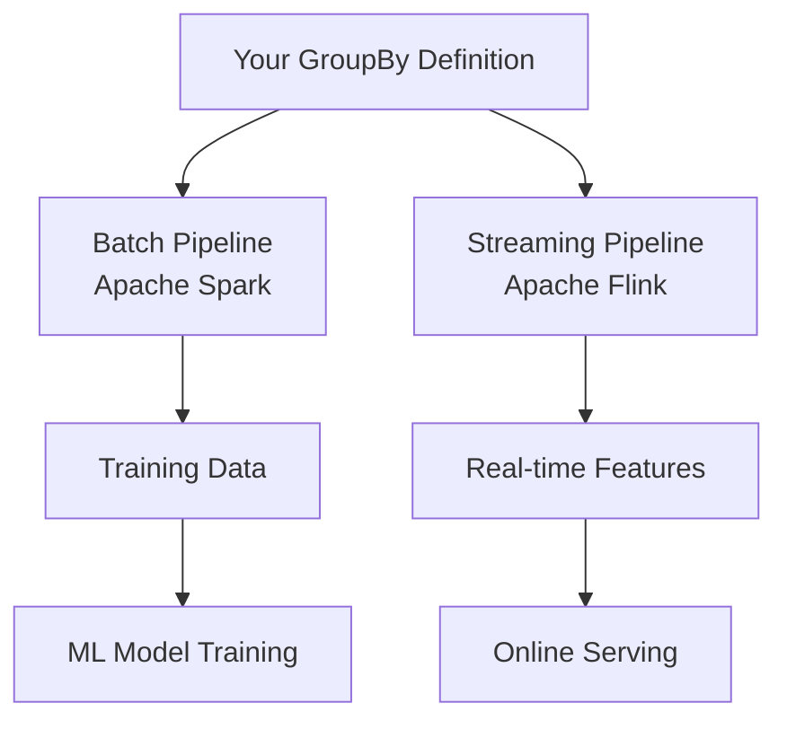
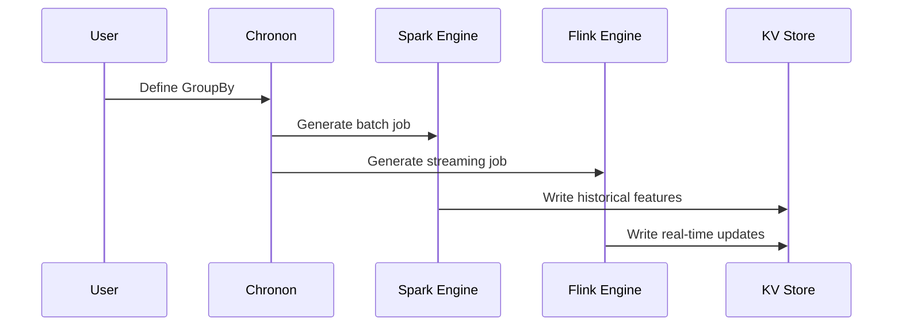

# Chapter 5: Lambda Architecture

After learning how to ensure your features are correct with [Compiler & Validation](04_compiler___validation_.md), let's explore how Chronon runs these features in both batch and real-time modes using the **Lambda Architecture**!

## Why Do We Need Lambda Architecture?

Imagine you're building a fraud detection system for a payments company. You need to:
- **Train your model** on 6 months of historical data
- **Serve predictions** in real-time when a payment happens

Here's the challenge: How do you ensure the features calculated during training match EXACTLY what's served in production?

Without proper architecture, you might:
- 🔧 Calculate "average purchase amount" one way in training (using Python)
- 🔨 Calculate it differently in serving (using Java)
- 💥 Your model sees different values and performs poorly!

This mismatch is called **training-serving skew**, and it's a nightmare for ML engineers. That's where **Lambda Architecture** comes in!

## What is Lambda Architecture?

Think of Lambda Architecture like having **two chefs in a restaurant** following the same recipe:
- 🍳 **Chef Spark** (Batch Chef): Prepares large banquets for events (historical training data)
- ⚡ **Chef Flink** (Speed Chef): Cooks individual orders as they come (real-time serving)

Both chefs use the SAME recipe (your GroupBy definition), ensuring the food tastes identical!

Here's the architecture:



## Key Concepts

### 1. Batch Pipeline (Spark)

The batch pipeline handles large-scale historical processing:

```python
# Your GroupBy runs on Spark for training
purchase_stats = GroupBy(
    sources=[purchases],
    keys=["user_id"],
    aggregations=[
        Aggregation(
            input_column="amount",
            operation=Operation.SUM,
            windows=["7d"]
        )
    ]
)
```

When you run a backfill:
```bash
# Spark processes ALL historical data
chronon backfill --start-date=2024-01-01
```

🐘 Spark is like an elephant - powerful for heavy lifting but not the fastest!

### 2. Streaming Pipeline (Flink)

The same GroupBy automatically creates a streaming job:

```python
# Same GroupBy, but with streaming source
streaming_source = Source(
    events=EventSource(
        table="purchases",
        topic="kafka://purchases",  # Enables streaming!
        query=Query(...)
    )
)
```

When events arrive:
```bash
# Flink processes events in real-time
# User 123 buys something → Feature updates immediately
```

🐆 Flink is like a cheetah - incredibly fast for real-time processing!

### 3. Consistency Guarantee

The magic is that BOTH pipelines use the SAME GroupBy definition:

```python
# One definition, two execution modes
features = GroupBy(
    aggregations=[
        Aggregation(
            operation=Operation.SUM,
            windows=["7d"]
        )
    ],
    online=True  # Enables both batch AND streaming
)
```

## Building with Lambda Architecture

Let's create a complete example for our fraud detection system:

### Step 1: Define Your Features

```python
# Single source of truth
fraud_features = GroupBy(
    sources=[purchase_events],
    keys=["user_id"],
    aggregations=[
        Aggregation(
            input_column="amount",
            operation=Operation.AVG,
            windows=["1h", "24h"]
        )
    ],
    online=True  # Critical for Lambda!
)
```

### Step 2: Run Batch Pipeline (Training)

```bash
# Backfill 6 months of data using Spark
chronon backfill \
  --conf=fraud_features \
  --start-date=2024-01-01 \
  --end-date=2024-06-30
```

This creates training data like:
```
user_id | amount_avg_1h | amount_avg_24h | timestamp
--------|---------------|----------------|------------
123     | 45.50        | 67.25          | 2024-06-15
```

### Step 3: Deploy Streaming Pipeline (Serving)

```bash
# Start Flink job for real-time updates
chronon streaming-job \
  --conf=fraud_features \
  --mode=create
```

Now when user 123 makes a purchase:
- Event flows through Kafka
- Flink updates the feature
- Same calculation as Spark!

## How Lambda Architecture Works: Under the Hood

When you define a GroupBy with `online=True`, here's what happens:



### The Batch Path (Spark)

Spark processes data in large batches:

```scala
// Simplified Spark job (from GroupByUpload.scala)
def computeBatch(groupBy: GroupBy) = {
  spark.read
    .table(groupBy.source.table)
    .groupBy("user_id")
    .agg(sum("amount"))
    .write.to(kvStore)
}
```

Processing flow:
1. Read millions of events from warehouse
2. Group by keys (user_id)
3. Calculate aggregations
4. Write to KV store

### The Streaming Path (Flink)

Flink processes events as they arrive:

```scala
// Simplified Flink job (from FlinkJob.scala)
def processStream(groupBy: GroupBy) = {
  kafkaSource
    .keyBy(_.userId)
    .window(TumblingWindow(1.hour))
    .aggregate(new SumAggregator())
    .addSink(kvStoreSink)
}
```

Processing flow:
1. Read events from Kafka
2. Key by user_id
3. Window and aggregate
4. Update KV store immediately

### The Consistency Magic

Both pipelines share the same logic:

```python
# In api/GroupBy.py
def to_spark_job(self):
    return SparkJob(self.aggregations)

def to_flink_job(self):
    return FlinkJob(self.aggregations)
```

This ensures:
- Same SQL expressions
- Same window definitions
- Same aggregation logic
- **Zero training-serving skew!**

## Advanced Features

### Tiled Architecture

For better performance, enable tiling:

```python
tiled_features = GroupBy(
    aggregations=[...],
    online=True,
    tiling_enabled=True  # Pre-aggregate in tiles!
)
```

Tiling pre-computes partial results:
```
Instead of: Sum(1000 events) on each request
With tiling: Sum(10 pre-computed tiles)
```

### Handling Late Events

Streaming handles events that arrive late:

```python
streaming_config = {
    "watermark_delay": "5 minutes",  # Wait for late events
    "allowed_lateness": "1 hour"      # Still accept very late
}
```

## Practical Tips

### 1. Start with Batch Only
Test your features with batch first:
```python
online=False  # Batch only for testing
```

### 2. Add Streaming Gradually
Once validated, enable streaming:
```python
online=True  # Now with Lambda Architecture!
```

### 3. Monitor Both Pipelines
Check that batch and streaming match:
```sql
SELECT 
  ABS(batch_value - stream_value) as diff
FROM feature_comparison
WHERE diff > 0.01  -- Flag mismatches
```

## Conclusion

Lambda Architecture is Chronon's **secret sauce** that ensures:
- 🎯 **Consistency**: Same features in training and serving
- 🚀 **Speed**: Real-time updates via streaming
- 📊 **Scale**: Historical processing via batch
- 🛡️ **Reliability**: Two paths for redundancy

You've learned how Chronon runs your features in both batch and streaming modes. But how do you actually retrieve these features for your ML model? Let's explore the [Fetcher Service](06_fetcher_service_.md) that serves features at lightning speed!

---

Generated by [AI Codebase Knowledge Builder](https://github.com/The-Pocket/Tutorial-Codebase-Knowledge)