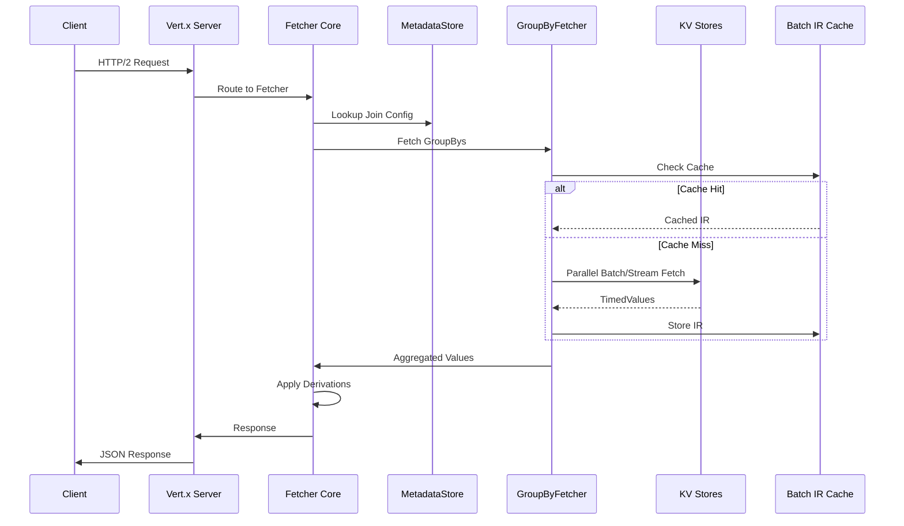

# Chapter 6: Fetcher Service

After learning how Chronon computes features in both batch and streaming modes with [Lambda Architecture](05_lambda_architecture_.md), let's explore how to retrieve these pre-computed features at lightning speed using the **Fetcher Service**!

## Why Do We Need a Fetcher Service?

Imagine you're running an e-commerce website with millions of users. When user 123 clicks "checkout":
- Your fraud model needs their features in **10 milliseconds**
- Features like "purchase_sum_7d" are already computed and stored
- But they're scattered across multiple key-value stores
- You need ALL features assembled instantly!

Without a fast fetcher:
- 🐌 Fetching takes 100ms → Users wait → Cart abandonment
- 💥 System overloaded → Timeouts → Lost sales
- 🔧 Each model fetches differently → Maintenance nightmare

That's where the **Fetcher Service** comes in - it's like having a **super-fast waiter** who knows exactly where every dish is stored and can serve multiple tables simultaneously!

## What is the Fetcher Service?

Think of the Fetcher Service as a **high-speed restaurant waiter** that:
- 📍 Knows exactly where each feature is stored (which KV store, which key)
- 🚀 Retrieves features in parallel (serves multiple tables at once)
- ⚡ Responds in under 10ms (faster than you can blink!)
- 🎯 Assembles complete feature vectors for your ML model

Here's what using the Fetcher looks like:

```python
# Request features for user 123
POST /v1/fetch/join/fraud_detection
{
  "user_id": "123"
}
```

```json
# Response in ~5ms
{
  "purchase_sum_7d": 1250.50,
  "return_count_30d": 2,
  "account_age_days": 365
}
```

It's that simple - one request, all features, blazing fast!

## Key Concepts

### 1. Feature Registry

The Fetcher knows where every feature lives:

```python
# The Fetcher maintains a registry like:
{
  "fraud_detection": {
    "purchase_sum_7d": "kv_store_1/user_purchases",
    "return_count_30d": "kv_store_2/user_returns"
  }
}
```

🗺️ Think of it as a restaurant menu that tells the waiter which kitchen has each dish!

### 2. Bulk Fetching

Fetch features for multiple entities at once:

```python
# Request for multiple users
POST /v1/fetch/join/fraud_detection
[
  {"user_id": "123"},
  {"user_id": "456"}, 
  {"user_id": "789"}
]
```

This is like a waiter carrying multiple plates in one trip - much more efficient!

### 3. Online-Only Features

The Fetcher only serves features marked for online serving:

```python
# In your GroupBy definition
purchase_stats = GroupBy(
    aggregations=[...],
    online=True  # Must be True for Fetcher!
)
```

🏃 Only "ready-to-serve" dishes are on the menu!

## Using the Fetcher Service

Let's fetch features for our fraud detection model:

### Step 1: Start the Service

```bash
# Run with Docker
docker run -p 9000:9000 \
  ziplineai/chronon-fetcher:latest
```

The service starts and connects to your KV stores automatically!

### Step 2: Check Available Features

```bash
# List all online joins
curl http://localhost:9000/v1/joins
```

Response:
```json
{
  "joinNames": [
    "fraud_detection_v1",
    "recommendation_v2"
  ]
}
```

### Step 3: Fetch Features

```bash
# Get features for user 123
curl -X POST http://localhost:9000/v1/fetch/join/fraud_detection_v1 \
  -H 'Content-Type: application/json' \
  -d '[{"user_id": "123"}]'
```

Response:
```json
{
  "results": [{
    "status": "Success",
    "entityKeys": {"user_id": "123"},
    "features": {
      "purchase_sum_7d": 1250.50,
      "purchase_count_7d": 3,
      "avg_purchase_30d": 416.83
    }
  }]
}
```

## How the Fetcher Works: Under the Hood

When you request features, here's what happens:



Let's trace through the request in detail:

### 1. Service Architecture

The Fetcher Service uses **Vert.x** for high-performance async I/O:

```java
// From FetcherVerticle.java
public class FetcherVerticle extends AbstractVerticle {
    
    @Override
    public void start(Promise<Void> startPromise) {
        // Build the API with KV store connections
        Api api = ApiProvider.buildApi(cfgStore);
        
        // Execute blocking BigTable initialization in worker thread
        vertx.executeBlocking(() -> api.buildJavaFetcher("feature-service", false))
            .onSuccess(fetcher -> {
                // Start HTTP/2 server on event loop
                startHttpServer(cfgStore.getServerPort(), fetcher, startPromise);
            });
    }
    
    protected void startHttpServer(int port, JavaFetcher fetcher, Promise<Void> promise) {
        // Configure HTTP/2 for high concurrency
        Http2Settings http2Settings = new Http2Settings()
            .setMaxConcurrentStreams(200)
            .setInitialWindowSize(1024 * 1024);
            
        HttpServerOptions httpOptions = new HttpServerOptions()
            .setTcpKeepAlive(true)
            .setIdleTimeout(60)
            .setHttp2ClearTextEnabled(true)
            .setInitialSettings(http2Settings);
            
        // Create non-blocking server
        server = vertx.createHttpServer(httpOptions);
    }
}
```

### 2. Request Flow Through Core Fetcher

The core `Fetcher.scala` handles the request orchestration:

```scala
// From Fetcher.scala
class Fetcher(val kvStore: KVStore,
              metaDataSet: String,
              timeoutMillis: Long = 10000,
              debug: Boolean = false,
              flagStore: FlagStore = null,
              executionContextOverride: ExecutionContext = null) {
              
    private val fetchContext = FetchContext(kvStore, metaDataSet, timeoutMillis, debug, flagStore)
    val metadataStore = new MetadataStore(fetchContext)
    private val joinPartFetcher = new JoinPartFetcher(fetchContext, metadataStore)
    
    def fetchJoin(requests: Seq[Request], joinConf: Option[api.Join] = None): Future[Seq[Response]] = {
        val ts = System.currentTimeMillis()
        
        // Fetch internal features (from KV stores)
        val internalResponsesF = joinPartFetcher.fetchJoins(requests, joinConf)
        
        // Fetch external features (from external services) in parallel
        val externalResponsesF = fetchExternal(requests)
        
        // Combine and apply derivations
        val combinedResponsesF = internalResponsesF.zip(externalResponsesF).map { 
            case (internalResponses, externalResponses) =>
                // Merge internal and external features
                val baseMap = mergeResponses(internalResponses, externalResponses)
                // Apply derived features computation
                applyDerivations(ts, request, baseMap)
        }
        
        combinedResponsesF.map(_.map(logResponse(_, ts)))
    }
}
```

### 3. GroupBy Fetching with Lambda Architecture

The `GroupByFetcher` implements the Lambda Architecture pattern:

```scala
// From GroupByFetcher.scala
class GroupByFetcher(fetchContext: FetchContext, metadataStore: MetadataStore)
    extends GroupByResponseHandler(fetchContext, metadataStore) {
    
    private def toLambdaKvRequest(request: Request): Try[LambdaKvRequest] = {
        metadataStore.getGroupByServingInfo(request.name).map { servingInfo =>
            
            // Create keys for batch and streaming datasets
            val batchKeyBytes = kvStore.createKeyBytes(
                request.keys, 
                servingInfo, 
                servingInfo.groupByOps.batchDataset
            )
            
            val streamingKeyBytes = kvStore.createKeyBytes(
                request.keys,
                servingInfo,
                servingInfo.groupByOps.streamingDataset
            )
            
            val batchRequest = GetRequest(batchKeyBytes, servingInfo.groupByOps.batchDataset)
            
            // Determine if we need streaming data based on accuracy
            val streamingRequestOpt = servingInfo.groupByOps.inferredAccuracy match {
                case Accuracy.TEMPORAL =>
                    // For temporal accuracy, fetch both batch IR and streaming events
                    Some(GetRequest(streamingKeyBytes, servingInfo.groupByOps.streamingDataset))
                case Accuracy.SNAPSHOT =>
                    // For snapshot accuracy, only batch data needed
                    None
            }
            
            LambdaKvRequest(batchRequest, streamingRequestOpt, servingInfo)
        }
    }
}
```

### 4. Intelligent Caching Layer

The `FetcherCache` trait provides sophisticated caching:

```scala
// From FetcherCache.scala
trait FetcherCache {
    // Configurable cache size via system property
    val configuredBatchIrCacheSize: Option[Int] =
        Option(System.getProperty("ai.chronon.fetcher.batch_ir_cache_size_elements"))
            .orElse(Some("10000"))
            .map(_.toInt)
            .filter(_ > 0)
    
    // Caffeine cache for batch IRs
    val maybeBatchIrCache: Option[BatchIrCache] =
        configuredBatchIrCacheSize.map(size => new BatchIrCache(batchIrCacheName, size))
    
    def getBatchIrFromBatchResponse(
        batchResponses: BatchResponses,
        batchBytes: Array[Byte],
        servingInfo: GroupByServingInfoParsed,
        decodingFunction: (Array[Byte], GroupByServingInfoParsed) => FinalBatchIr,
        keys: Map[String, Any]
    ): FinalBatchIr = {
        if (!isCachingEnabled(servingInfo.groupBy)) 
            return decodingFunction(batchBytes, servingInfo)
        
        batchResponses match {
            case _: KvStoreBatchResponse =>
                // Create cache key with dataset, keys, and batch end time
                val cacheKey = BatchIrCache.Key(
                    servingInfo.groupByOps.batchDataset, 
                    keys, 
                    servingInfo.batchEndTsMillis
                )
                
                // Decode and cache the IR
                val decodedIr = decodingFunction(batchBytes, servingInfo)
                if (decodedIr != null) {
                    maybeBatchIrCache.get.cache.put(cacheKey, CachedFinalIrBatchResponse(decodedIr))
                }
                decodedIr
                
            case CachedFinalIrBatchResponse(cachedIr) =>
                // Return cached IR directly
                cachedIr
        }
    }
}
```

### 5. Parallel Fetching and Response Merging

The system fetches from multiple sources in parallel:

```scala
// From GroupByResponseHandler.scala  
def decodeAndMerge(
    batchResponses: BatchResponses,
    streamingResponsesOpt: Option[Seq[TimedValue]],
    requestContext: RequestContext
): Map[String, AnyRef] = {
    
    val newServingInfo = getServingInfo(requestContext.servingInfo, batchResponses)
    val batchBytes = batchResponses.getBatchBytes(newServingInfo.batchEndTsMillis)
    
    val responseMap = if (newServingInfo.groupBy.aggregations == null || streamingResponsesOpt.isEmpty) {
        // No aggregations needed - return batch data directly
        getMapResponseFromBatchResponse(
            batchResponses, 
            batchBytes,
            newServingInfo.outputCodec.decodeMap,
            newServingInfo,
            requestContext.keys
        )
    } else {
        // Merge batch and streaming with temporal accuracy
        val streamingResponses = streamingResponsesOpt.get
        mergeWithStreaming(
            batchResponses,
            streamingResponses, 
            batchBytes,
            requestContext.copy(servingInfo = newServingInfo)
        )
    }
    
    responseMap
}
```

## Scaling and Performance

### Horizontal Scaling Architecture

The Fetcher Service scales horizontally through multiple mechanisms:

#### 1. Stateless Service Design

```yaml
# Kubernetes deployment for horizontal scaling
apiVersion: apps/v1
kind: Deployment
metadata:
  name: chronon-fetcher
spec:
  replicas: 10  # Scale horizontally
  template:
    spec:
      containers:
      - name: fetcher
        image: ziplineai/chronon-fetcher:latest
        resources:
          requests:
            memory: "4Gi"
            cpu: "2"
          limits:
            memory: "8Gi"
            cpu: "4"
        env:
        - name: JAVA_OPTS
          value: "-Xmx6g -XX:+UseG1GC -XX:MaxGCPauseMillis=20"
        - name: VERTX_EVENT_LOOP_POOL_SIZE
          value: "8"  # Match CPU cores
        - name: VERTX_WORKER_POOL_SIZE
          value: "20" # For blocking operations
```

#### 2. Connection Pooling and Resource Management

```scala
// Efficient KV store connection pooling
class KVStoreConnectionPool {
    val connectionPoolConfig = PoolConfig(
        maxConnections = 100,        // Per KV store
        maxIdleTime = 60.seconds,
        connectionTimeout = 5.seconds,
        socketTimeout = 10.seconds
    )
    
    // Separate pools for batch and streaming
    val batchPool = createPool(batchEndpoints)
    val streamingPool = createPool(streamingEndpoints)
}
```

#### 3. Load Balancing Strategies

```nginx
# Nginx configuration for load balancing
upstream fetcher_backend {
    least_conn;  # Least connections algorithm
    
    server fetcher-1:9000 weight=1 max_fails=3 fail_timeout=30s;
    server fetcher-2:9000 weight=1 max_fails=3 fail_timeout=30s;
    server fetcher-3:9000 weight=1 max_fails=3 fail_timeout=30s;
    
    keepalive 32;  # Keep connections alive
}

server {
    location /v1/fetch/ {
        proxy_pass http://fetcher_backend;
        proxy_http_version 2.0;
        proxy_set_header Connection "";
        proxy_buffering off;
    }
}
```

### Performance Optimization Techniques

#### 1. Multi-Level Caching

```scala
// Three-tier caching strategy
object CachingStrategy {
    // L1: In-memory IR cache (Caffeine)
    val irCache = Caffeine.newBuilder()
        .maximumSize(10000)
        .expireAfterWrite(5.minutes)
        .recordStats()
        .build[BatchIrCache.Key, FinalBatchIr]()
    
    // L2: Decoded value cache
    val valueCache = Caffeine.newBuilder()
        .maximumSize(50000)
        .expireAfterWrite(1.minute)
        .build[String, Map[String, AnyRef]]()
    
    // L3: Redis for distributed caching (optional)
    val redisCache = RedisClient(
        servers = List("redis-1:6379", "redis-2:6379"),
        ttl = 10.minutes
    )
}
```

#### 2. Batch Request Optimization

```scala
// Efficient batch processing
class BatchOptimizer {
    def optimizeBatchRequests(requests: Seq[Request]): Map[String, Seq[Request]] = {
        requests
            .groupBy(_.datasetName)  // Group by dataset
            .mapValues { reqs =>
                reqs.grouped(100)     // Batch size of 100
                    .map(batch => MultiGetRequest(batch.map(_.key)))
            }
    }
    
    // Execute in parallel with controlled concurrency
    def executeBatches(batches: Map[String, Seq[MultiGetRequest]]): Future[Responses] = {
        val parallelism = 10  // Max parallel requests per KV store
        
        Future.traverse(batches) { case (dataset, requests) =>
            Source(requests)
                .mapAsync(parallelism)(kvStore.multiGet)
                .runWith(Sink.seq)
        }
    }
}
```

#### 3. Zero-Copy Serialization

```scala
// Efficient serialization without copying
class ZeroCopySerializer {
    def deserializeWithoutCopy(bytes: Array[Byte]): FinalBatchIr = {
        // Use ByteBuffer views instead of copying
        val buffer = ByteBuffer.wrap(bytes)
        
        // Direct deserialization from buffer
        val ir = FinalBatchIr(
            collapsed = readArray(buffer),
            tailHops = readTailHops(buffer)
        )
        
        ir
    }
}
```

### Monitoring and Observability

#### 1. Comprehensive Metrics

```scala
// Detailed metrics collection
object FetcherMetrics {
    // Latency metrics
    val overallLatency = histogram("fetcher.overall.latency.millis")
    val kvLatency = histogram("fetcher.kv.latency.millis")
    val derivationLatency = histogram("fetcher.derivation.latency.millis")
    
    // Throughput metrics
    val requestRate = meter("fetcher.requests.per.second")
    val cacheHitRate = gauge("fetcher.cache.hit.rate")
    
    // Error metrics
    val errorRate = meter("fetcher.errors.per.second")
    val timeoutRate = meter("fetcher.timeouts.per.second")
    
    // Resource metrics
    val connectionPoolUsage = gauge("fetcher.connection.pool.usage")
    val memoryUsage = gauge("fetcher.memory.usage.bytes")
}
```

#### 2. Distributed Tracing

```scala
// OpenTelemetry integration
class TracedFetcher extends Fetcher {
    val tracer = OpenTelemetry.getTracer("chronon-fetcher")
    
    override def fetchJoin(requests: Seq[Request]): Future[Seq[Response]] = {
        val span = tracer.spanBuilder("fetch-join")
            .setAttribute("join.name", requests.head.name)
            .setAttribute("request.count", requests.size)
            .startSpan()
        
        val scope = span.makeCurrent()
        
        try {
            super.fetchJoin(requests).map { responses =>
                span.setAttribute("response.count", responses.size)
                span.setAttribute("null.count", responses.count(_.values.isEmpty))
                responses
            }
        } finally {
            scope.close()
            span.end()
        }
    }
}
```

### Advanced Configuration

#### System Properties for Tuning

```bash
# JVM and Fetcher configuration
java \
  -Xmx8g \
  -XX:+UseG1GC \
  -XX:MaxGCPauseMillis=20 \
  -XX:+ParallelRefProcEnabled \
  -Dai.chronon.fetcher.batch_ir_cache_size_elements=50000 \
  -Dai.chronon.fetcher.timeout_millis=50 \
  -Dai.chronon.fetcher.parallelism=20 \
  -Dai.chronon.fetcher.connection_pool_size=100 \
  -Dvertx.eventLoopPoolSize=8 \
  -Dvertx.workerPoolSize=20 \
  -Dvertx.blockedThreadCheckInterval=10000 \
  -jar chronon-fetcher.jar
```

#### Feature Flags for A/B Testing

```scala
// Dynamic feature flag configuration
val flagStore = new FlagStore {
    def isEnabled(flag: String, context: Map[String, Any]): Boolean = {
        flag match {
            case "enable_ir_caching" => 
                context.get("user_id").exists(_.hashCode % 100 < 50) // 50% rollout
            case "use_redis_cache" => 
                context.get("join_name").contains("high_volume")
            case "enable_compression" =>
                true  // Enabled for all
        }
    }
}
```

## Best Practices and Optimization Guide

### 1. Client-Side Optimization

#### Connection Management
```python
import requests
from requests.adapters import HTTPAdapter
from urllib3.util.retry import Retry

class OptimizedFetcherClient:
    def __init__(self, base_url):
        self.base_url = base_url
        self.session = requests.Session()
        
        # Configure connection pooling
        adapter = HTTPAdapter(
            pool_connections=10,
            pool_maxsize=100,
            pool_block=False,
            max_retries=Retry(
                total=3,
                backoff_factor=0.1,
                status_forcelist=[500, 502, 503, 504]
            )
        )
        
        self.session.mount('http://', adapter)
        self.session.mount('https://', adapter)
        
        # Keep-alive and HTTP/2
        self.session.headers.update({
            'Connection': 'keep-alive',
            'Accept-Encoding': 'gzip, deflate',
        })
    
    def fetch_features(self, join_name, keys, batch_size=100):
        """Fetch features with automatic batching"""
        results = []
        
        for i in range(0, len(keys), batch_size):
            batch = keys[i:i + batch_size]
            response = self.session.post(
                f"{self.base_url}/v1/fetch/join/{join_name}",
                json=batch,
                timeout=(5, 30)  # (connect, read) timeouts
            )
            results.extend(response.json()['results'])
        
        return results
```

#### Request Batching Strategy
```python
# Optimal batch sizes based on testing
BATCH_SIZE_GUIDELINES = {
    'small_join': 500,    # <10 features
    'medium_join': 200,   # 10-50 features  
    'large_join': 50,     # 50+ features
    'complex_join': 20    # With derivations
}

def determine_batch_size(join_name, feature_count):
    if feature_count < 10:
        return 500
    elif feature_count < 50:
        return 200
    else:
        return 50
```

### 2. Server-Side Configuration

#### GroupBy Optimization
```scala
// Configure GroupBy for optimal online serving
GroupBy(
    sources = Seq(eventSource),
    keyColumns = Seq("user_id"),
    aggregations = Seq(
        // Use appropriate windows
        Aggregation(
            operation = Operation.SUM,
            windows = Seq(
                Window(7, TimeUnit.DAYS),   // Most queries
                Window(30, TimeUnit.DAYS)    // Less frequent
            )
        )
    ),
    // Optimization flags
    accuracy = Accuracy.TEMPORAL,  // Enable streaming
    online = true,                  // Required for Fetcher
    production = true,
    // Performance tuning
    batchSchedule = "@daily",
    streamingSchedule = "*/5 * * * *",  // 5-minute micro-batches
    // Enable IR caching for this GroupBy
    additionalMetadata = Map(
        "enable_ir_cache" -> "true",
        "cache_ttl_minutes" -> "10"
    )
)
```

#### Join Configuration
```scala
// Optimize Join definitions
Join(
    left = Source.events(query),
    joinParts = Seq(
        // Order by fetch latency - fastest first
        JoinPart(
            groupBy = fastCachedGroupBy,  // Cached features
            keyMapping = Map("user_id" -> "user_id")
        ),
        JoinPart(
            groupBy = mediumGroupBy,      // Regular features
            keyMapping = Map("user_id" -> "user_id")
        ),
        // External features last
        ExternalPart(
            source = externalApiSource,   // External API
            keyMapping = Map("user_id" -> "external_id")
        )
    ),
    // Enable partial serving if some parts fail
    metaData = MetaData(
        name = "optimized_join",
        online = true,
        production = true,
        customJson = """{"partial_serving": true}"""
    )
)
```

### 3. Monitoring and Alerting

#### Grafana Dashboard Queries
```promql
# P99 latency by join
histogram_quantile(0.99, 
    sum(rate(fetcher_overall_latency_millis_bucket[5m])) by (join, le)
)

# Cache hit rate
rate(fetcher_cache_hits_total[5m]) / 
    (rate(fetcher_cache_hits_total[5m]) + rate(fetcher_cache_misses_total[5m]))

# Error rate by type
sum(rate(fetcher_errors_total[5m])) by (error_type)

# Request rate
sum(rate(fetcher_requests_total[1m])) by (join)
```

#### Alert Rules
```yaml
groups:
- name: fetcher_alerts
  rules:
  - alert: HighFetcherLatency
    expr: |
      histogram_quantile(0.99, 
        sum(rate(fetcher_overall_latency_millis_bucket[5m])) by (le)
      ) > 50
    for: 5m
    annotations:
      summary: "Fetcher P99 latency above 50ms"
      
  - alert: LowCacheHitRate
    expr: |
      rate(fetcher_cache_hits_total[5m]) / 
        (rate(fetcher_cache_hits_total[5m]) + rate(fetcher_cache_misses_total[5m]))
      < 0.8
    for: 10m
    annotations:
      summary: "Cache hit rate below 80%"
      
  - alert: FetcherErrorSpike
    expr: rate(fetcher_errors_total[1m]) > 10
    for: 2m
    annotations:
      summary: "Fetcher error rate spike"
```

### 4. Troubleshooting Guide

#### Common Issues and Solutions

| Issue | Symptoms | Solution |
|-------|----------|----------|
| High Latency | P99 > 50ms | 1. Check cache hit rate<br>2. Increase IR cache size<br>3. Add more Fetcher replicas |
| Memory Issues | OOM errors | 1. Tune JVM heap size<br>2. Reduce cache size<br>3. Enable G1GC |
| Connection Exhaustion | Connection refused | 1. Increase connection pool<br>2. Check for connection leaks<br>3. Enable keep-alive |
| Stale Data | Old feature values | 1. Check GroupBy upload schedule<br>2. Verify streaming pipeline<br>3. Clear IR cache |
| Partial Failures | Missing features | 1. Enable partial serving<br>2. Add fallback values<br>3. Check external services |

## Conclusion

The Fetcher Service is your **speed demon** that:
- 🚀 **Retrieves** pre-computed features in <10ms
- 📦 **Assembles** complete feature vectors
- ⚡ **Scales** to millions of requests per second
- 🎯 **Serves** your ML models in production

You've learned how to fetch pre-computed features at lightning speed. But what if you need to compute new features on-the-fly from the fetched values? Let's explore [Derived Features](07_derived_features_.md) that enable real-time feature transformations!

---

Generated by [AI Codebase Knowledge Builder](https://github.com/The-Pocket/Tutorial-Codebase-Knowledge)