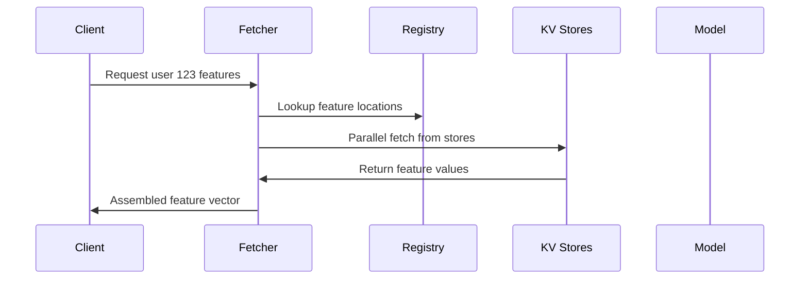

# Chapter 6: Fetcher Service

After learning how Chronon computes features in both batch and streaming modes with [Lambda Architecture](05_lambda_architecture_.md), let's explore how to retrieve these pre-computed features at lightning speed using the **Fetcher Service**!

## Why Do We Need a Fetcher Service?

Imagine you're running an e-commerce website with millions of users. When user 123 clicks "checkout":
- Your fraud model needs their features in **10 milliseconds**
- Features like "purchase_sum_7d" are already computed and stored
- But they're scattered across multiple key-value stores
- You need ALL features assembled instantly!

Without a fast fetcher:
- 🐌 Fetching takes 100ms → Users wait → Cart abandonment
- 💥 System overloaded → Timeouts → Lost sales
- 🔧 Each model fetches differently → Maintenance nightmare

That's where the **Fetcher Service** comes in - it's like having a **super-fast waiter** who knows exactly where every dish is stored and can serve multiple tables simultaneously!

## What is the Fetcher Service?

Think of the Fetcher Service as a **high-speed restaurant waiter** that:
- 📍 Knows exactly where each feature is stored (which KV store, which key)
- 🚀 Retrieves features in parallel (serves multiple tables at once)
- ⚡ Responds in under 10ms (faster than you can blink!)
- 🎯 Assembles complete feature vectors for your ML model

Here's what using the Fetcher looks like:

```python
# Request features for user 123
POST /v1/fetch/join/fraud_detection
{
  "user_id": "123"
}
```

```json
# Response in ~5ms
{
  "purchase_sum_7d": 1250.50,
  "return_count_30d": 2,
  "account_age_days": 365
}
```

It's that simple - one request, all features, blazing fast!

## Key Concepts

### 1. Feature Registry

The Fetcher knows where every feature lives:

```python
# The Fetcher maintains a registry like:
{
  "fraud_detection": {
    "purchase_sum_7d": "kv_store_1/user_purchases",
    "return_count_30d": "kv_store_2/user_returns"
  }
}
```

🗺️ Think of it as a restaurant menu that tells the waiter which kitchen has each dish!

### 2. Bulk Fetching

Fetch features for multiple entities at once:

```python
# Request for multiple users
POST /v1/fetch/join/fraud_detection
[
  {"user_id": "123"},
  {"user_id": "456"}, 
  {"user_id": "789"}
]
```

This is like a waiter carrying multiple plates in one trip - much more efficient!

### 3. Online-Only Features

The Fetcher only serves features marked for online serving:

```python
# In your GroupBy definition
purchase_stats = GroupBy(
    aggregations=[...],
    online=True  # Must be True for Fetcher!
)
```

🏃 Only "ready-to-serve" dishes are on the menu!

## Using the Fetcher Service

Let's fetch features for our fraud detection model:

### Step 1: Start the Service

```bash
# Run with Docker
docker run -p 9000:9000 \
  ziplineai/chronon-fetcher:latest
```

The service starts and connects to your KV stores automatically!

### Step 2: Check Available Features

```bash
# List all online joins
curl http://localhost:9000/v1/joins
```

Response:
```json
{
  "joinNames": [
    "fraud_detection_v1",
    "recommendation_v2"
  ]
}
```

### Step 3: Fetch Features

```bash
# Get features for user 123
curl -X POST http://localhost:9000/v1/fetch/join/fraud_detection_v1 \
  -H 'Content-Type: application/json' \
  -d '[{"user_id": "123"}]'
```

Response:
```json
{
  "results": [{
    "status": "Success",
    "entityKeys": {"user_id": "123"},
    "features": {
      "purchase_sum_7d": 1250.50,
      "purchase_count_7d": 3,
      "avg_purchase_30d": 416.83
    }
  }]
}
```

## How the Fetcher Works: Under the Hood

When you request features, here's what happens:



Let's trace through a request:

### 1. Request Handling

The service receives your request (from `FetcherVerticle.java`):

```java
// Route for fetching join features
router.route("/v1/fetch/*")
  .subRouter(FetchRouter.createFetchRoutes(
    vertx, fetcher
  ));
```

### 2. Feature Resolution

The Fetcher looks up where features are stored:

```java
// Simplified from JavaFetcher
Future<Seq<Response>> fetchJoin(requests) {
  // 1. Parse join configuration
  // 2. Identify required GroupBys
  // 3. Map to KV store locations
}
```

### 3. Parallel Retrieval

Features are fetched in parallel for speed:

```java
// Fetch from multiple KV stores
CompletableFuture<List<JavaResponse>> futures = 
  fetchGroupBys(groupByRequests);
```

This parallel fetching is key to sub-10ms latency!

### 4. Response Assembly

Results are combined into the final response:

```java
// Convert and return
List<JavaResponse> responses = 
  toJavaResponses(scalaResponses);
```

## Advanced Features

### Metrics and Monitoring

Track Fetcher performance:

```bash
# Enable Prometheus metrics
docker run -p 9000:9000 \
  -e CHRONON_PROMETHEUS_SERVER_PORT=8905 \
  ziplineai/chronon-fetcher:latest
```

Monitor key metrics:
- `java.overall.latency.millis`: Total request time
- `join.fetch`: Per-join performance

### Bulk Operations

Fetch for thousands of entities efficiently:

```python
# Bulk request
requests = [
  {"user_id": str(i)} 
  for i in range(1000)
]
```

The Fetcher handles batching and parallelization automatically!

### Schema Discovery

Get feature schemas for integration:

```bash
curl http://localhost:9000/v1/join/fraud_detection/schema
```

Returns Avro schemas for type safety!

## Practical Tips

### 1. Keep Requests Small
Fetch only what you need:
```python
# Good: Specific join
/v1/fetch/join/fraud_light_v1

# Avoid: Heavy join with 100s of features
/v1/fetch/join/fraud_everything_v1
```

### 2. Use Connection Pooling
Reuse HTTP connections:
```python
# Use a connection pool
session = requests.Session()
session.post("/v1/fetch/join/...")
```

### 3. Monitor Latencies
Set up alerts for slow fetches:
```yaml
alert: FetcherSlowResponse
expr: fetcher_latency_p99 > 50ms
```

## Conclusion

The Fetcher Service is your **speed demon** that:
- 🚀 **Retrieves** pre-computed features in <10ms
- 📦 **Assembles** complete feature vectors
- ⚡ **Scales** to millions of requests per second
- 🎯 **Serves** your ML models in production

You've learned how to fetch pre-computed features at lightning speed. But what if you need to compute new features on-the-fly from the fetched values? Let's explore [Derived Features](07_derived_features_.md) that enable real-time feature transformations!

---

Generated by [AI Codebase Knowledge Builder](https://github.com/The-Pocket/Tutorial-Codebase-Knowledge)