# Chapter 7: Derived Features

After learning how to fetch pre-computed features at lightning speed with the [Fetcher Service](06_fetcher_service_.md), let's explore how to create new features on-the-fly using **Derived Features**!

## Why Do We Need Derived Features?

Imagine you're tracking user behavior on your e-commerce site:
- You've aggregated total clicks: 1,000
- You've aggregated total impressions: 50,000
- Your ML model needs the click-through rate (CTR)

You could:
- 🔨 Create another aggregation to calculate CTR
- 💾 Store it in your database
- 🔄 Update it every time clicks or impressions change

But wait! CTR is just `clicks / impressions`. Why store something you can calculate instantly?

That's where **Derived Features** come in - they're like **Excel formulas** for your ML features! Instead of storing the result, you store the formula and calculate on-demand.

## What are Derived Features?

Think of Derived Features as **smart calculations** that:
- 📐 Apply mathematical formulas to existing features
- 🎯 Compute results only when needed
- 💡 Save storage by not duplicating data
- 🔄 Update automatically when base features change

It's like having a spreadsheet where:
- Column A = Total Sales (stored)
- Column B = Total Orders (stored)
- Column C = Average Order Value (formula: A/B)

Here's the simplest example:

```python
from ai.chronon import Derivation

# Calculate average purchase amount
Derivation(
    name="avg_purchase",
    expression="total_amount / order_count"
)
```

When someone asks for `avg_purchase`, Chronon calculates it instantly from the stored values!

## Key Concepts

### 1. SQL Expressions

Derived features use SQL-like expressions:

```python
# Simple arithmetic
expression="clicks / impressions"

# With safety for division by zero
expression="clicks / NULLIF(impressions, 0)"
```

📝 Think of expressions as formulas you'd write in a spreadsheet cell!

### 2. Base Features vs Derived Features

**Base features** are stored:
```python
Aggregation(
    input_column="amount",
    operation=Operation.SUM,
    windows=["7d"]
)  # Creates: amount_sum_7d (stored)
```

**Derived features** are calculated:
```python
Derivation(
    name="daily_average",
    expression="amount_sum_7d / 7.0"
)  # Calculated on-demand
```

💾 Base features live in your database; derived features live in your code!

### 3. Computation Timing

Derived features are computed at different times:
- **Batch jobs**: Calculate and store with results
- **Online serving**: Calculate fresh each request
- **Streaming**: ⚠️ Not supported with Flink!

⏱️ It's like choosing between pre-cooking meals (batch) or cooking to order (online)!

## Building Your First Derived Feature

Let's create a complete example for user engagement scoring:

### Step 1: Define Base Aggregations

```python
from ai.chronon import GroupBy, Aggregation, Operation

user_activity = GroupBy(
    sources=[clicks_source],
    keys=["user_id"],
    aggregations=[
        Aggregation(
            input_column="click",
            operation=Operation.COUNT,
            windows=["7d"]
        )
    ]
)
```

This gives us `click_count_7d` as a base feature.

### Step 2: Add a Simple Derivation

```python
user_activity_with_ratio = GroupBy(
    sources=[activity_source],
    keys=["user_id"],
    aggregations=[
        Aggregation(
            input_column="click",
            operation=Operation.COUNT,
            windows=["7d"]
        ),
        Aggregation(
            input_column="impression",
            operation=Operation.COUNT,
            windows=["7d"]
        )
    ],
    derivations=[
        Derivation(
            name="ctr_7d",
            expression="click_count_7d * 100.0 / impression_count_7d"
        )
    ]
)
```

Now you get THREE features:
- `click_count_7d` (stored)
- `impression_count_7d` (stored)
- `ctr_7d` (calculated as clicks/impressions * 100)

### Step 3: Use in a Join

```python
from ai.chronon import Join, JoinPart, Derivation

model_features = Join(
    left=checkouts,
    right_parts=[
        JoinPart(group_by=user_activity_with_ratio)
    ],
    derivations=[
        Derivation(
            name="engagement_score",
            expression="ctr_7d * 0.3 + click_count_7d * 0.7"
        )
    ]
)
```

This creates an engagement score combining CTR and click volume!

## How Derived Features Work: Under the Hood

When you request derived features, here's what happens:


Let's trace through the process:

### 1. Base Feature Retrieval

First, Chronon fetches stored aggregations:
```python
# From KV store
{
    "click_count_7d": 100,
    "impression_count_7d": 5000
}
```

### 2. Expression Evaluation

Then it applies your SQL expression:
```sql
-- Your expression
ctr_7d = click_count_7d * 100.0 / impression_count_7d

-- Becomes
ctr_7d = 100 * 100.0 / 5000 = 2.0
```

### 3. Result Assembly

Finally, all features are combined:
```python
# Final response
{
    "click_count_7d": 100,
    "impression_count_7d": 5000,
    "ctr_7d": 2.0  # Computed!
}
```

## Advanced Features

### Conditional Logic

Create user segments dynamically:

```python
Derivation(
    name="user_tier",
    expression="""
        CASE 
            WHEN total_purchases > 1000 THEN 'gold'
            WHEN total_purchases > 100 THEN 'silver'
            ELSE 'bronze'
        END
    """
)
```

### Safe Division

Handle edge cases gracefully:

```python
Derivation(
    name="safe_average",
    expression="total / NULLIF(count, 0)"
)
```

This returns NULL instead of crashing when count is zero!

### Multiple Derivations

Combine features from different GroupBys:

```python
derivations=[
    # Simple ratio
    Derivation(
        name="purchase_frequency",
        expression="purchase_count_30d / 30.0"
    ),
    # Complex scoring
    Derivation(
        name="value_score", 
        expression="(amount_sum_30d / 1000) * purchase_frequency"
    ),
    # Include all base features too
    Derivation(name="*", expression="*")
]
```

The wildcard `*` ensures base features are included!

## Practical Tips

### 1. Keep It Simple
Start with basic arithmetic:
```python
# Good: Clear and fast
expression="a + b"

# Avoid: Too complex for online
expression="complex_udf(a, b, c, d, e)"
```

### 2. Handle Nulls
Always consider missing data:
```python
# Null-safe addition
expression="COALESCE(a, 0) + COALESCE(b, 0)"
```

### 3. Test Your Math
Verify calculations match expectations:
```python
# Force floating point math
expression="count * 1.0 / total"  # Not count / total
```

### 4. Document Your Logic
Use meaningful names:
```python
# Clear purpose
name="clicks_per_dollar_spent"

# Not helpful
name="metric_1"
```

## Important Limitation: Streaming with Flink

⚠️ **Critical**: If you use Flink for streaming, derived features are NOT computed during streaming!

```mermaid
graph TD
    A[Streaming Events] --> B{Which Engine?}
    B -->|Spark Streaming| C[✅ Derives features]
    B -->|Flink| D[❌ Base features only]
    D --> E[Derivations at serving time]
    
    style D fill:#ffcccc
```



This means with Flink:
- Base aggregations: ✅ Computed in streaming
- Derived features: ❌ Must wait until serving
- Impact: Extra 1-10ms latency per request

## Conclusion

Derived Features are your **formula engine** that:
- 📐 **Calculates** new features from existing ones
- 💾 **Saves storage** by not duplicating data
- 🔄 **Updates automatically** when base features change
- ⚡ **Computes quickly** at serving time

You've learned how to create dynamic features that adapt to your data. But what if you need features that depend on other features in a chain? Let's explore [Chained Features](08_chained_features_.md) to build complex feature dependencies!

---

Generated by [AI Codebase Knowledge Builder](https://github.com/The-Pocket/Tutorial-Codebase-Knowledge)