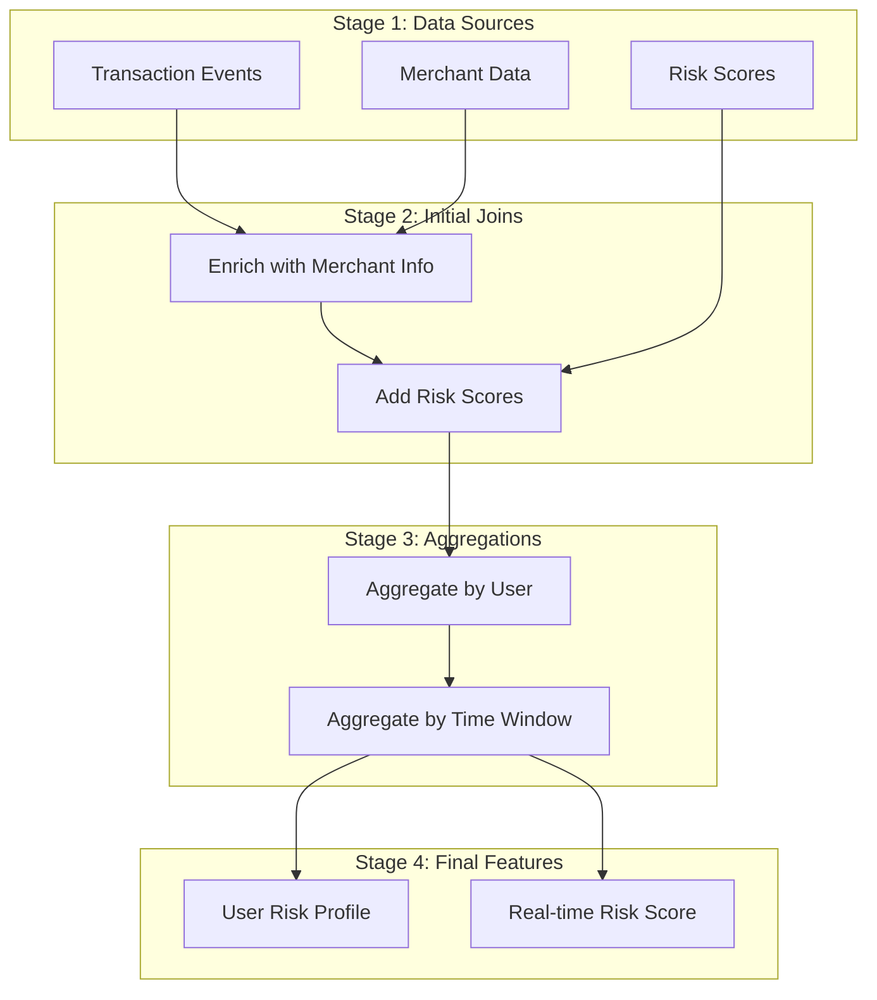
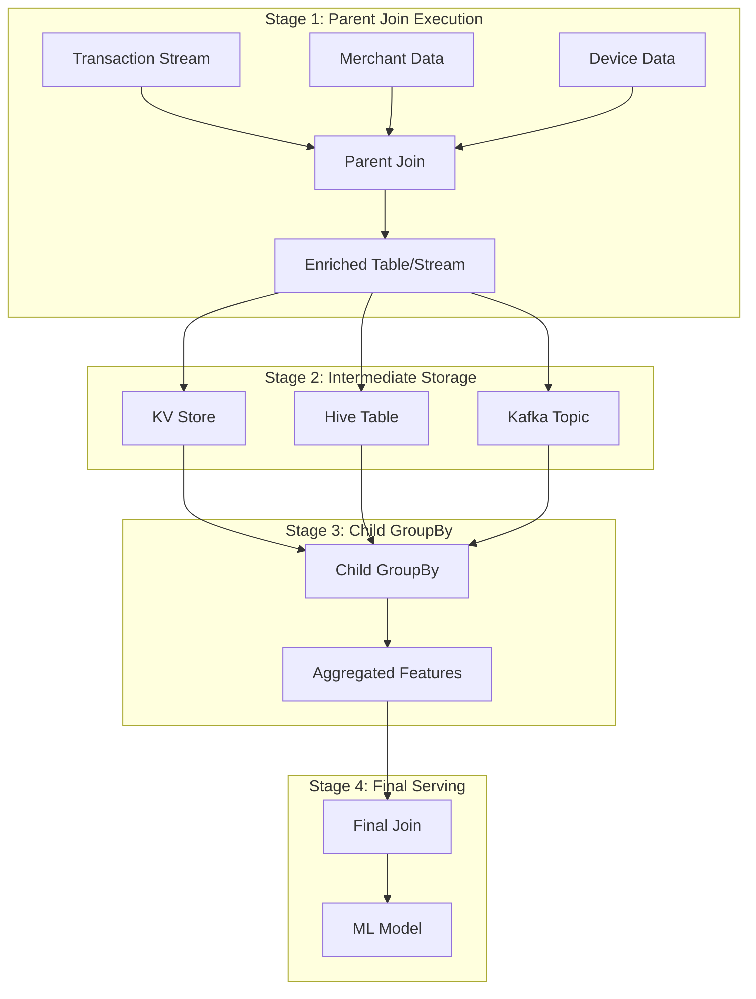

# Chapter 8: Chained Features - Multi-Stage Feature Engineering Pipelines

After learning how to create new features on-the-fly with [Derived Features](07_derived_features_.md), let's dive deep into **Chained Features** - Chronon's sophisticated system for building multi-level feature pipelines that enable complex ML patterns!

## The Challenge: Multi-Stage Feature Dependencies

Consider building a real-time fraud detection system for an e-commerce platform. You need to calculate:
- "What's the risk score of merchants that a user has purchased from in the last 30 days?"

This requires a complex multi-stage pipeline:
1. **Stage 1**: Track user purchases (transaction events)
2. **Stage 2**: Join with merchant data to get merchant IDs
3. **Stage 3**: Look up merchant risk scores from another system
4. **Stage 4**: Aggregate risk scores over time windows
5. **Stage 5**: Calculate weighted risk based on transaction amounts

Traditional feature systems fail here because:
- **Single-stage limitation**: Can't JOIN then aggregate in one operation
- **Data locality**: Information spread across multiple systems
- **Temporal complexity**: Different data has different update frequencies
- **Performance**: Need real-time computation for fraud prevention

**Chained Features** solve this by creating sophisticated **multi-level pipelines** where outputs cascade through multiple transformation stages!

## Chained Features Architecture

### Conceptual Model

Chained Features implement a **directed acyclic graph (DAG)** of feature transformations:



### Technical Implementation

```python
# Traditional single-stage approach (LIMITED!)
# ❌ Cannot perform join-then-aggregate pattern
user_merchant_risk = GroupBy(
    sources=[transactions],  # Missing merchant risk scores!
    aggregations=[
        Aggregation(
            input_column="risk_score",  # This column doesn't exist yet!
            operation=Operation.AVERAGE
        )
    ]
)

# Chained multi-stage approach (POWERFUL!)
# ✅ Sophisticated pipeline with multiple transformations
class ChainedPipeline:
    def __init__(self):
        # Stage 1: Enrich transactions with merchant data
        self.enriched_transactions = Join(...)
        
        # Stage 2: Add risk scores (uses Stage 1 output)
        self.transactions_with_risk = Join(
            left=JoinSource(self.enriched_transactions),
            ...
        )
        
        # Stage 3: Aggregate enriched data
        self.user_risk_profile = GroupBy(
            sources=JoinSource(self.transactions_with_risk),
            ...
        )
```

## Core Technical Components

### 1. JoinSource: The Pipeline Connector

JoinSource is the critical abstraction that enables chaining by treating Join outputs as data sources:

```python
class JoinSource:
    """
    Connects pipeline stages by using Join output as GroupBy input
    """
    def __init__(self, join, query):
        self.join = join           # Parent Join that produces data
        self.query = query         # SQL-like query to transform output
        self.schema = None         # Inferred from parent Join
        self.lineage = []          # Track data transformations
        
    def get_schema(self):
        """Derive schema from parent Join output"""
        parent_schema = self.join.get_output_schema()
        return self.query.apply_to_schema(parent_schema)
    
    def to_streaming_source(self):
        """Convert to streaming source for real-time processing"""
        return StreamingSource(
            topic=f"{self.join.name}_output",
            deserializer=self.join.output_deserializer,
            query=self.query
        )
```

### 2. Pipeline Execution Models

Chronon supports different execution models for chains:

```python
class ChainExecutionModel(Enum):
    BATCH_SEQUENTIAL = "batch_sequential"      # Process stages in order
    BATCH_PARALLEL = "batch_parallel"          # Parallelize independent stages
    STREAMING_SPARK = "streaming_spark"        # Real-time with Spark
    HYBRID = "hybrid"                          # Batch + streaming

class ChainExecutor:
    def execute(self, chain, mode):
        if mode == ChainExecutionModel.BATCH_SEQUENTIAL:
            return self.execute_batch_sequential(chain)
        elif mode == ChainExecutionModel.STREAMING_SPARK:
            return self.execute_streaming_spark(chain)
        # ... other modes
```

### 3. Data Lineage and Dependencies

Chains maintain sophisticated dependency tracking:

```python
class ChainedFeatureLineage:
    """
    Track data flow through pipeline stages
    """
    def __init__(self):
        self.stages = []
        self.dependencies = {}  # stage -> [upstream stages]
        self.schemas = {}       # stage -> schema evolution
        
    def add_stage(self, stage, upstream_deps):
        self.stages.append(stage)
        self.dependencies[stage.name] = upstream_deps
        self.schemas[stage.name] = stage.output_schema
        
    def get_execution_order(self):
        """Topological sort for correct execution order"""
        return self.topological_sort(self.dependencies)
    
    def validate_chain(self):
        """Ensure no cycles and schema compatibility"""
        if self.has_cycle():
            raise ValueError("Circular dependency detected!")
        return self.validate_schema_compatibility()

## Complete Example: Multi-Stage Fraud Detection Pipeline

Let's build a sophisticated fraud detection pipeline that demonstrates the full power of chained features:

### Step 1: Define All Data Sources

```python
# Transaction events - the primary data stream
transaction_events = Source(
    events=EventSource(
        table="payments.transactions",
        query=Query(
            selects={
                "user_id": "user_id",
                "merchant_id": "merchant_id", 
                "amount": "transaction_amount",
                "currency": "currency",
                "payment_method": "payment_method",
                "device_id": "device_id"
            },
            time_column="transaction_time"
        )
    )
)

# Merchant profile data with risk indicators
merchant_profiles = Source(
    entities=EntitySource(
        snapshotTable="merchants.profiles_daily",
        query=Query(
            selects={
                "merchant_id": "merchant_id",
                "merchant_category": "category",
                "country": "country",
                "age_days": "age_days",
                "chargeback_rate": "chargeback_rate"
            }
        )
    )
)

# Real-time merchant risk scores from ML model
merchant_risk_scores = Source(
    events=EventSource(
        table="ml.merchant_risk_scores",
        query=Query(
            selects={
                "merchant_id": "merchant_id",
                "risk_score": "risk_score",
                "risk_category": "risk_category"  # LOW, MEDIUM, HIGH, CRITICAL
            },
            time_column="score_time"
        )
    )
)

# Device reputation data
device_reputation = Source(
    events=EventSource(
        table="security.device_reputation",
        query=Query(
            selects={
                "device_id": "device_id",
                "reputation_score": "reputation_score",
                "is_vpn": "is_vpn",
                "is_proxy": "is_proxy"
            },
            time_column="update_time"
        )
    )
)
```

### Step 2: Create Pre-Aggregations (GroupBys)

First, create GroupBys to prepare data for joining:

```python
# Latest merchant risk score per merchant
latest_merchant_risk = GroupBy(
    name="latest_merchant_risk",
    sources=[merchant_risk_scores],
    keys=["merchant_id"],
    aggregations=[
        Aggregation(
            input_column="risk_score",
            operation=Operation.LAST
        ),
        Aggregation(
            input_column="risk_category",
            operation=Operation.LAST
        )
    ],
    online=True  # Enable for real-time serving
)

# Device reputation aggregations
device_risk_stats = GroupBy(
    name="device_risk_stats",
    sources=[device_reputation],
    keys=["device_id"],
    aggregations=[
        Aggregation(
            input_column="reputation_score",
            operation=Operation.AVERAGE,
            windows=["24h", "7d"]
        ),
        Aggregation(
            input_column="is_vpn",
            operation=Operation.MAX,  # Flag if ever used VPN
            windows=["30d"]
        )
    ],
    online=True
)

# User transaction patterns (will be used later)
user_transaction_stats = GroupBy(
    name="user_transaction_stats",
    sources=[transaction_events],
    keys=["user_id"],
    aggregations=[
        Aggregation(
            input_column="amount",
            operation=Operation.COUNT,
            windows=["1h", "24h", "7d"]
        ),
        Aggregation(
            input_column="amount",
            operation=Operation.SUM,
            windows=["24h", "7d", "30d"]
        ),
        Aggregation(
            input_column="merchant_id",
            operation=Operation.APPROX_DISTINCT_COUNT,
            windows=["24h", "7d"]
        )
    ],
    online=True
)
```

### Step 3: Create First-Level Join (Parent Join)

Enrich transactions with merchant and device data:

```python
# Level 1 Join: Enrich transactions with all context
enriched_transactions = Join(
    name="enriched_transactions",
    left=transaction_events,
    right_parts=[
        # Add merchant profile (snapshot data)
        JoinPart(
            group_by=merchant_profiles,
            key_mapping={"merchant_id": "merchant_id"}
        ),
        # Add latest merchant risk score
        JoinPart(
            group_by=latest_merchant_risk,
            key_mapping={"merchant_id": "merchant_id"}
        ),
        # Add device reputation
        JoinPart(
            group_by=device_risk_stats,
            key_mapping={"device_id": "device_id"}
        ),
        # Add user's historical patterns
        JoinPart(
            group_by=user_transaction_stats,
            key_mapping={"user_id": "user_id"}
        )
    ],
    online=True,
    output_namespace="fraud_detection.enriched"
)
```

Output schema after enrichment:
```
user_id | merchant_id | amount | risk_score_last | risk_category_last | 
reputation_score_average_24h | is_vpn_max_30d | amount_count_24h | ...
```

### Step 4: Create Chained GroupBy (THE KEY INNOVATION!)

This is where the magic happens - aggregate the ENRICHED data:

```python
# CHAINED GROUPBY: Aggregate merchant risk for each user
user_merchant_risk_profile = GroupBy(
    name="user_merchant_risk_profile",
    sources=JoinSource(  # ← THIS IS THE CHAINING!
        join=enriched_transactions,  # Use Join output as source
        query=Query(
            selects={
                "user_id": "user_id",
                "merchant_risk": "risk_score_last",
                "risk_category": "risk_category_last",
                "transaction_amount": "amount",
                "device_reputation": "reputation_score_average_24h",
                "merchant_category": "merchant_category",
                "chargeback_rate": "chargeback_rate"
            },
            time_column="transaction_time"  # Preserve time semantics
        )
    ),
    keys=["user_id"],
    aggregations=[
        # Average risk score of merchants user transacts with
        Aggregation(
            input_column="merchant_risk",
            operation=Operation.AVERAGE,
            windows=["1h", "24h", "7d", "30d"]
        ),
        # Weighted average by transaction amount
        Aggregation(
            input_column="merchant_risk",
            operation=Operation.WEIGHTED_AVERAGE,
            weight_column="transaction_amount",
            windows=["24h", "7d"]
        ),
        # Count of high-risk merchant interactions
        Aggregation(
            input_column="risk_category",
            operation=Operation.COUNT,
            filter="risk_category IN ('HIGH', 'CRITICAL')",
            windows=["24h", "7d"]
        ),
        # Unique merchant categories
        Aggregation(
            input_column="merchant_category",
            operation=Operation.APPROX_DISTINCT_COUNT,
            windows=["24h", "7d"]
        ),
        # Average device reputation for user's transactions
        Aggregation(
            input_column="device_reputation",
            operation=Operation.AVERAGE,
            windows=["24h"]
        ),
        # Maximum chargeback rate among merchants
        Aggregation(
            input_column="chargeback_rate",
            operation=Operation.MAX,
            windows=["7d", "30d"]
        )
    ],
    online=True
)
```

### Step 5: Second-Level Chaining (Optional but Powerful!)

Create even more sophisticated features by chaining again:

```python
# Another chained GroupBy on top of the first chain!
user_risk_velocity = GroupBy(
    name="user_risk_velocity",
    sources=JoinSource(
        join=Join(
            left=transaction_events,
            right_parts=[
                JoinPart(group_by=user_merchant_risk_profile)
            ]
        ),
        query=Query(
            selects={
                "user_id": "user_id",
                "current_risk": "merchant_risk_average_1h",
                "daily_risk": "merchant_risk_average_24h"
            }
        )
    ),
    keys=["user_id"],
    aggregations=[
        # Rate of change in risk exposure
        Aggregation(
            input_column="current_risk",
            operation=Operation.STDDEV,  # Volatility
            windows=["24h"]
        )
    ]
)
```

### Step 6: Final Feature Join for Model Serving

```python
# Final Join: Combine everything for real-time scoring
fraud_detection_features = Join(
    name="fraud_detection_features_v1",
    left=transaction_events,  # Real-time transaction
    right_parts=[
        # User's merchant risk profile
        JoinPart(
            group_by=user_merchant_risk_profile,
            key_mapping={"user_id": "user_id"}
        ),
        # Risk velocity
        JoinPart(
            group_by=user_risk_velocity,
            key_mapping={"user_id": "user_id"}
        ),
        # Current merchant risk
        JoinPart(
            group_by=latest_merchant_risk,
            key_mapping={"merchant_id": "merchant_id"}
        )
    ],
    online=True,
    production=True
)
```

Final feature vector for each transaction:
```
transaction_id | user_id | amount | merchant_risk_average_30d | 
merchant_risk_weighted_average_7d | high_risk_merchant_count_24h |
risk_velocity_stddev_24h | current_merchant_risk | ...
```

## Deep Dive: How Chained Features Execute

### Execution Architecture



### Batch Execution Deep Dive

In batch mode, Chronon optimizes the chain execution:

```scala
// From JoinSourceOps.scala - Batch chain optimization
class BatchChainExecutor {
  
  def executeBatchChain(chain: ChainedFeature): DataFrame = {
    // Stage 1: Execute parent join
    val parentOutput = executeParentJoin(chain.parentJoin)
    
    // Optimization: Materialize only if needed
    val materializedParent = if (chain.requiresMaterialization) {
      parentOutput.cache()
      parentOutput.write
        .mode("overwrite")
        .saveAsTable(s"${chain.namespace}.parent_output")
      spark.table(s"${chain.namespace}.parent_output")
    } else {
      parentOutput
    }
    
    // Stage 2: Apply query transformation
    val transformed = chain.query.apply(materializedParent)
    
    // Stage 3: Execute child GroupBy
    val childGroupBy = chain.childGroupBy
    childGroupBy.setSource(transformed)
    
    // Optimize aggregation based on window sizes
    val optimizedPlan = optimizeAggregationPlan(childGroupBy)
    
    return executeOptimizedPlan(optimizedPlan)
  }
  
  def optimizeAggregationPlan(groupBy: GroupBy): LogicalPlan = {
    // Analyze window patterns
    val windows = groupBy.aggregations.flatMap(_.windows).distinct
    
    if (windows.forall(w => w.duration < 1.day)) {
      // Short windows: in-memory aggregation
      InMemoryAggregation(groupBy)
    } else if (windows.exists(w => w.duration > 7.days)) {
      // Long windows: use pre-aggregation
      TiledAggregation(groupBy)
    } else {
      // Standard aggregation
      StandardAggregation(groupBy)
    }
  }
}
```

### Streaming Execution: The Spark Requirement

Streaming chains require Spark because of complex state management:

```java
// From JoinSourceRunner.java - Why Spark is required
public class JoinSourceRunner {
    
    private final Map<String, StateStore> stateStores;
    private final LookupCache lookupCache;
    
    public void processStreamingChain(ChainConfig config) {
        // 1. Setup parent join output consumer
        KafkaConsumer<String, GenericRecord> parentConsumer = 
            createConsumer(config.getParentOutputTopic());
        
        // 2. Initialize state management (Spark-specific)
        StateStore parentState = StateStore.create(
            config.getParentJoin().getName(),
            StateStore.Type.ROCKSDB  // Spark's RocksDB state
        );
        
        // 3. Process with configurable lag
        long lagMillis = config.getLagMillis(); // Default: 2000ms
        
        while (true) {
            ConsumerRecords<String, GenericRecord> records = 
                parentConsumer.poll(Duration.ofMillis(100));
            
            for (ConsumerRecord<String, GenericRecord> record : records) {
                // Apply lag to ensure parent features are ready
                Thread.sleep(lagMillis);
                
                // 4. Perform runtime lookup (requires Spark's state management)
                GenericRecord enriched = performRuntimeLookup(
                    record,
                    parentState,
                    lookupCache
                );
                
                // 5. Feed to child GroupBy
                childGroupBy.process(enriched);
            }
        }
    }
    
    private GenericRecord performRuntimeLookup(
        ConsumerRecord record,
        StateStore state,
        LookupCache cache) {
        
        // This is why Flink can't handle chains - 
        // it doesn't support this type of dynamic lookup
        String key = extractKey(record);
        
        // Check cache first
        if (cache.contains(key)) {
            return cache.get(key);
        }
        
        // Lookup from state store
        GenericRecord stateValue = state.get(key);
        
        // Merge with current record
        GenericRecord merged = merge(record.value(), stateValue);
        
        // Update cache
        cache.put(key, merged);
        
        return merged;
    }
}
```

### Why Not Flink?

Flink's architecture doesn't support chained features because:

```java
// Flink's limitation for chains
class FlinkLimitation {
    /*
     * Flink processes events in a pipeline where each operator
     * must be defined at compile time. Chained features require:
     * 
     * 1. Dynamic schema resolution from parent Join
     * 2. Runtime lookups across different state stores
     * 3. Flexible query transformations between stages
     * 
     * These violate Flink's static DAG requirement.
     */
    
    // ❌ This doesn't work in Flink
    DataStream<Row> chainedStream = inputStream
        .keyBy(row -> row.getField("key"))
        .process(new ProcessFunction<Row, Row>() {
            @Override
            public void processElement(Row value, Context ctx, Collector<Row> out) {
                // Cannot dynamically lookup from another job's state!
                Row parentState = lookupFromOtherJob(value); // ❌
                Row enriched = merge(value, parentState);
                out.collect(enriched);
            }
        });
}
```

### Optimization Strategies

```python
class ChainOptimizer:
    """
    Optimize chain execution for performance
    """
    
    def optimize_chain(self, chain):
        optimizations = []
        
        # 1. Pushdown predicates to parent
        if chain.has_filters():
            optimizations.append(
                PredicatePushdown(chain.filters, chain.parent_join)
            )
        
        # 2. Column pruning
        used_columns = chain.get_used_columns()
        optimizations.append(
            ColumnPruning(used_columns, chain.parent_join)
        )
        
        # 3. Partition alignment
        if chain.parent_join.is_partitioned():
            optimizations.append(
                PartitionAlignment(
                    chain.parent_join.partition_key,
                    chain.child_groupby.keys
                )
            )
        
        # 4. Cache intermediate results
        if chain.is_frequently_accessed():
            optimizations.append(
                IntermediateCaching(
                    cache_duration="1h",
                    cache_location="memory"
                )
            )
        
        return optimizations
```

## Advanced Chaining Patterns

### Multi-Level Chaining Architecture

Build sophisticated ML features through deep chains:

```python
class DeepChainExample:
    """
    Example: E-commerce recommendation system with 4-level chaining
    """
    
    def __init__(self):
        # Level 1: Enrich user actions with product data
        self.user_product_interactions = Join(
            left=user_clicks,
            right_parts=[
                JoinPart(group_by=product_catalog),
                JoinPart(group_by=product_embeddings)
            ]
        )
        
        # Level 2: Aggregate product categories per user
        self.user_category_preferences = GroupBy(
            sources=JoinSource(
                join=self.user_product_interactions,
                query=Query(
                    selects={
                        "user_id": "user_id",
                        "category": "product_category",
                        "embedding": "product_embedding"
                    }
                )
            ),
            keys=["user_id"],
            aggregations=[
                Aggregation(
                    input_column="category",
                    operation=Operation.TOP_K(10),
                    windows=["7d", "30d"]
                ),
                Aggregation(
                    input_column="embedding",
                    operation=Operation.VECTOR_AVERAGE,  # Custom operation
                    windows=["24h", "7d"]
                )
            ]
        )
        
        # Level 3: Join with user segments
        self.user_segment_features = Join(
            left=JoinSource(
                join=Join(
                    left=user_events,
                    right_parts=[JoinPart(group_by=self.user_category_preferences)]
                )
            ),
            right_parts=[
                JoinPart(group_by=user_segments),
                JoinPart(group_by=segment_statistics)
            ]
        )
        
        # Level 4: Final aggregation for recommendation scoring
        self.recommendation_features = GroupBy(
            sources=JoinSource(
                join=self.user_segment_features,
                query=Query(
                    selects={
                        "user_id": "user_id",
                        "segment": "user_segment",
                        "category_affinity": "category_top_k_7d",
                        "segment_avg_spend": "segment_avg_spend"
                    }
                )
            ),
            keys=["user_id", "segment"],
            aggregations=[
                Aggregation(
                    input_column="category_affinity",
                    operation=Operation.DIVERSITY_SCORE,  # Measures variety
                    windows=["24h"]
                )
            ]
        )
```

### Conditional Chaining

Apply different chains based on conditions:

```python
class ConditionalChain:
    """
    Different processing paths based on user type
    """
    
    def create_conditional_chain(self):
        # Premium users get more sophisticated features
        premium_chain = GroupBy(
            sources=JoinSource(
                join=enriched_transactions,
                query=Query(
                    selects={...},
                    where="user_type = 'PREMIUM'"  # Filter in chain
                )
            ),
            aggregations=[
                # Complex aggregations for premium users
                Aggregation(
                    operation=Operation.PERCENTILE(95),
                    windows=["1h", "24h"]
                )
            ]
        )
        
        # Standard users get basic features
        standard_chain = GroupBy(
            sources=JoinSource(
                join=enriched_transactions,
                query=Query(
                    selects={...},
                    where="user_type = 'STANDARD'"
                )
            ),
            aggregations=[
                # Simple aggregations for standard users
                Aggregation(
                    operation=Operation.AVERAGE,
                    windows=["24h"]
                )
            ]
        )
        
        return premium_chain, standard_chain
```

### Recursive Chaining Pattern

Build features that depend on their own historical values:

```python
class RecursiveChain:
    """
    Example: Momentum features that depend on previous momentum
    """
    
    def create_momentum_chain(self):
        # Base momentum calculation
        base_momentum = GroupBy(
            sources=[price_events],
            keys=["symbol"],
            aggregations=[
                Aggregation(
                    input_column="price",
                    operation=Operation.RATE_OF_CHANGE,
                    windows=["1h", "24h"]
                )
            ]
        )
        
        # Chain momentum on itself for acceleration
        momentum_acceleration = GroupBy(
            sources=JoinSource(
                join=Join(
                    left=price_events,
                    right_parts=[JoinPart(group_by=base_momentum)]
                ),
                query=Query(
                    selects={
                        "symbol": "symbol",
                        "momentum": "price_rate_of_change_1h"
                    }
                )
            ),
            keys=["symbol"],
            aggregations=[
                # Rate of change of rate of change!
                Aggregation(
                    input_column="momentum",
                    operation=Operation.RATE_OF_CHANGE,
                    windows=["1h"]
                )
            ]
        )
```

## Performance Optimization

### Chain Performance Tuning

```python
class ChainPerformanceOptimizer:
    """
    Optimize chain execution for production
    """
    
    def optimize_for_latency(self, chain):
        """Minimize end-to-end latency"""
        optimizations = {
            # Reduce lag between stages
            "spark.chronon.stream.chain.lag_millis": 500,  # From 2000ms
            
            # Increase parallelism
            "spark.sql.shuffle.partitions": 400,
            
            # Cache intermediate results
            "spark.chronon.chain.cache_enabled": True,
            "spark.chronon.chain.cache_ttl": 3600,
            
            # Use broadcast joins for small tables
            "spark.sql.autoBroadcastJoinThreshold": 104857600  # 100MB
        }
        
        return optimizations
    
    def optimize_for_throughput(self, chain):
        """Maximize processing volume"""
        optimizations = {
            # Batch multiple records
            "spark.streaming.kafka.maxRatePerPartition": 10000,
            
            # Use micro-batching
            "spark.streaming.batchDuration": 10000,  # 10 seconds
            
            # Optimize shuffle
            "spark.sql.adaptive.enabled": True,
            "spark.sql.adaptive.coalescePartitions.enabled": True
        }
        
        return optimizations
```

### Memory Management for Chains

```scala
// Manage memory for deep chains
class ChainMemoryManager {
  
  def configureMemory(chainDepth: Int): SparkConf = {
    val conf = new SparkConf()
    
    // Scale memory with chain depth
    val executorMemory = chainDepth match {
      case d if d <= 2 => "4g"
      case d if d <= 4 => "8g"
      case _ => "16g"
    }
    
    conf.set("spark.executor.memory", executorMemory)
    conf.set("spark.executor.memoryOverhead", "2g")
    
    // Configure storage levels for intermediate results
    if (chainDepth > 3) {
      conf.set("spark.storage.memoryFraction", "0.6")
      conf.set("spark.shuffle.memoryFraction", "0.3")
    }
    
    // Enable off-heap storage for very deep chains
    if (chainDepth > 5) {
      conf.set("spark.memory.offHeap.enabled", "true")
      conf.set("spark.memory.offHeap.size", "4g")
    }
    
    conf
  }
}
```

## Production Best Practices

### 1. Chain Monitoring

```python
class ChainMonitor:
    """Monitor chain health in production"""
    
    def setup_monitoring(self):
        metrics = {
            # Latency metrics
            "chain.stage1.latency": HistogramMetric(),
            "chain.stage2.latency": HistogramMetric(),
            "chain.total.latency": HistogramMetric(),
            
            # Throughput metrics
            "chain.records.processed": CounterMetric(),
            "chain.records.failed": CounterMetric(),
            
            # Data quality
            "chain.null.rate": GaugeMetric(),
            "chain.schema.mismatches": CounterMetric()
        }
        
        alerts = [
            Alert("Chain latency > 10s", "chain.total.latency.p99 > 10000"),
            Alert("High failure rate", "chain.records.failed.rate > 0.01"),
            Alert("Schema drift", "chain.schema.mismatches.rate > 0")
        ]
        
        return metrics, alerts
```

### 2. Testing Chained Features

```python
class ChainTester:
    """Test framework for chained features"""
    
    def test_chain_correctness(self, chain):
        # Test data lineage
        test_input = self.generate_test_data()
        
        # Execute chain stages
        stage1_output = chain.parent_join.process(test_input)
        stage2_output = chain.child_groupby.process(stage1_output)
        
        # Verify output schema
        assert stage2_output.schema == chain.expected_schema
        
        # Verify aggregation correctness
        manual_calculation = self.calculate_manually(test_input)
        assert abs(stage2_output.value - manual_calculation) < 0.001
        
    def test_chain_performance(self, chain):
        # Load test with production-like data
        load_data = self.generate_load_test_data(
            records=1_000_000,
            time_range="24h"
        )
        
        start = time.time()
        result = chain.process(load_data)
        latency = time.time() - start
        
        assert latency < 60  # Should process 1M records in < 1 minute
        assert result.count() > 0  # Should produce output
```

### 3. Chain Debugging

```python
class ChainDebugger:
    """Debug tools for complex chains"""
    
    def trace_chain_execution(self, chain, sample_data):
        """Step through chain execution with logging"""
        
        # Enable verbose logging
        logging.getLogger("chronon.chain").setLevel(logging.DEBUG)
        
        # Trace each stage
        traces = []
        
        # Stage 1: Parent Join
        stage1_trace = {
            "stage": "parent_join",
            "input_count": sample_data.count(),
            "input_schema": sample_data.schema,
            "output_count": None,
            "output_sample": None
        }
        
        stage1_output = chain.parent_join.process(sample_data)
        stage1_trace["output_count"] = stage1_output.count()
        stage1_trace["output_sample"] = stage1_output.limit(5).collect()
        traces.append(stage1_trace)
        
        # Continue for other stages...
        return traces
```

## Conclusion

Chained Features represent one of Chronon's most powerful capabilities, enabling:

- **Multi-Stage Pipelines**: Build sophisticated features through multiple transformation stages
- **JoinSource Magic**: Seamlessly connect Join outputs to GroupBy inputs
- **Complex Patterns**: Support for deep chains, conditional processing, and recursive features
- **Production Scale**: Optimized execution with Spark for batch and streaming
- **Real-World Applications**: From fraud detection to recommendation systems

Key takeaways:
- 🔗 **JoinSource** is the critical connector enabling multi-stage pipelines
- 📊 **Enrichment-then-aggregation** is the fundamental pattern
- ⚡ **Spark-only** for streaming due to dynamic lookup requirements
- 🚀 **Deep chains** can have 4+ levels for sophisticated ML features
- 🎯 **Performance tuning** is crucial for production deployments

You've mastered building complex multi-stage features that would be impossible with traditional feature stores. Next, let's explore how [Tiling Architecture](09_tiling_architecture_.md) can make these sophisticated aggregations blazingly fast at scale!

---

Generated by [AI Codebase Knowledge Builder](https://github.com/The-Pocket/Tutorial-Codebase-Knowledge)