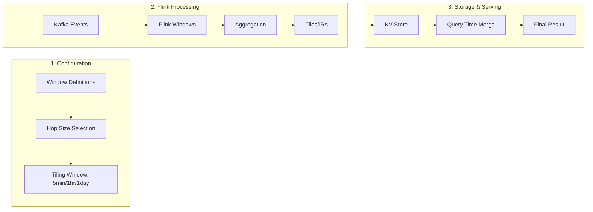

# Understanding Hop Configuration and Flink Tiled Feature Generation

## Executive Summary

Chronon's tiling architecture uses **pre-computed time-aligned aggregations (hops)** to efficiently serve real-time feature queries. This document explains how users configure hops, how the system automatically determines hop sizes, and how Flink generates and stores these tiled aggregations in real-time.

## Core Concepts

### What Are Hops?

**Hops** are pre-aggregated intermediate results (IRs) computed at regular time intervals. They serve as building blocks for constructing aggregations over arbitrary time windows without reprocessing raw events.

```
Raw Events:     • • • • • • • • • • • • • • • • • •  (individual transactions)
                ↓ Pre-aggregation at regular intervals
5-min Hops:     [█] [█] [█] [█] [█] [█]  (each block = 5 minutes of pre-aggregated data)
Hourly Hops:    [████████████]           (each block = 1 hour of pre-aggregated data)  
Daily Hops:     [████████████████████]   (each block = 1 day of pre-aggregated data)
```

### The Resolution System

Chronon uses a **Resolution** trait that defines:
1. Which hop sizes are available for tiling
2. How to select the appropriate hop size based on window size

## How Users Configure Hops

### 1. Default Configuration (No User Action Required)

Most users don't need to configure hops directly. Chronon automatically determines hop sizes based on your window definitions:

```python
# User only defines the window in their GroupBy
from ai.chronon import GroupBy, Aggregation, Window, TimeUnit

group_by = GroupBy(
    name="merchant_7day_stats",
    aggregations=[
        Aggregation(
            input_column="transaction_amount",
            operation="SUM",
            windows=[Window(7, TimeUnit.DAYS)]  # User just specifies the window
        )
    ]
)
```

### 2. Automatic Hop Size Selection

Based on the window size, Chronon automatically selects the **smallest hop size** (finest granularity) using these rules:

```scala
// From FiveMinuteResolution.calculateTailHop()
def calculateTailHop(window: Window): Long = {
  window.millis match {
    case x if x >= 12 DAYS  => 1 DAY    // Windows ≥ 12 days use daily hops
    case x if x >= 12 HOURS => 1 HOUR   // Windows ≥ 12 hours use hourly hops
    case _                  => 5 MINUTES // Smaller windows use 5-minute hops
  }
}
```

### 3. How Hop Size Affects Tiling

The selected hop size determines:
- **Flink tiling window size**: How frequently Flink writes pre-aggregated data
- **Storage granularity**: The time resolution of stored tiles
- **Query precision**: The accuracy of window boundaries

## The Flink Tiled Feature Generation Process

### Step 1: Hop Size Determination

When a Flink job starts, it analyzes all windows in the GroupBy to find the smallest required hop:

```scala
// From FlinkJob.scala
val tilingWindowSizeInMillis: Long = 
  ResolutionUtils.getSmallestTailHopMillis(groupByServingInfoParsed.groupBy)

// This scans all aggregations and windows to find the minimum hop size needed
def getSmallestTailHopMillis(groupBy: GroupBy): Long = {
  val tailHops = for {
    aggregation <- groupBy.aggregations
    window <- aggregation.windows
  } yield FiveMinuteResolution.calculateTailHop(window)
  
  if (tailHops.isEmpty) Day.millis  // Default to daily if no windows
  else tailHops.min                  // Use the smallest hop size
}
```

### Step 2: Flink Window Configuration

Flink creates tumbling event-time windows based on the calculated hop size:

```scala
// Create time-aligned windows
val window = TumblingEventTimeWindows
  .of(Time.milliseconds(tilingWindowSizeInMillis))
  
// Example: If smallest hop is 5 minutes (300,000ms)
// Flink creates windows: [14:00-14:05), [14:05-14:10), [14:10-14:15), ...
```

### Step 3: Real-Time Aggregation

For each window, Flink:
1. **Collects events** falling within the window boundaries
2. **Computes partial aggregates** (intermediate results)
3. **Emits tiles** when the window triggers

```scala
// Simplified aggregation flow
streamWithWatermarks
  .keyBy(groupByKeys)                        // Partition by merchant_id
  .window(TumblingEventTimeWindows(5.minutes)) // 5-minute windows
  .aggregate(
    new FlinkRowAggregationFunction(),       // Compute IRs
    new FlinkRowAggProcessFunction()          // Format as tiles
  )
```

### Step 4: Tile Storage

Each tile contains:
- **Key**: The groupBy keys (e.g., merchant_id)
- **Timestamp**: The window end time (aligned to hop boundaries)
- **IR**: Pre-aggregated intermediate results
- **Metadata**: Schema version, processing time

```
Key: merchant_123
Timestamp: 2024-01-15 14:05:00 (5-minute boundary)
IR: {
  sum: 125000.50,
  count: 342,
  min: 10.00,
  max: 2500.00
}
```

## Practical Examples

### Example 1: Mixed Window Sizes

```python
group_by = GroupBy(
    aggregations=[
        Aggregation(
            input_column="amount",
            operation="SUM",
            windows=[
                Window(1, TimeUnit.HOURS),   # Requires 5-min hops
                Window(7, TimeUnit.DAYS),    # Could use hourly hops
                Window(30, TimeUnit.DAYS)    # Could use daily hops
            ]
        )
    ]
)

# Result: System uses 5-MINUTE hops (smallest required)
# Flink creates 5-minute tiles for all windows
```

### Example 2: Large Windows Only

```python
group_by = GroupBy(
    aggregations=[
        Aggregation(
            input_column="amount", 
            operation="AVERAGE",
            windows=[
                Window(30, TimeUnit.DAYS),   # Could use daily hops
                Window(90, TimeUnit.DAYS)    # Could use daily hops
            ]
        )
    ]
)

# Result: System uses DAILY hops (all windows ≥ 12 days)
# Flink creates daily tiles - much more efficient!
```

### Example 3: Query Time Aggregation

When serving a 7-day window query at 14:32:

```
Available 5-minute tiles:
[14:00] [14:05] [14:10] [14:15] [14:20] [14:25] [14:30]
        
Query window: [Jan 8 14:32 ────────→ Jan 15 14:32]
                                              ↑ Now

System combines:
1. Historical tiles from Jan 8-14 (stored in KV store)
2. Recent tiles from Jan 14-15 14:30 (5-min boundaries)  
3. Real-time events from 14:30-14:32 (Flink streaming)
```

## Mental Model: The Tiling Pipeline



## Key Insights

### 1. Hop Size Trade-offs

| Hop Size | Storage Overhead | Query Precision | Write Frequency | Best For |
|----------|-----------------|-----------------|-----------------|----------|
| 5 minutes | High (288 tiles/day) | Excellent | Every 5 min | Short windows (<12 hours) |
| 1 hour | Medium (24 tiles/day) | Good | Every hour | Medium windows (12h-12d) |
| 1 day | Low (1 tile/day) | Moderate | Once daily | Long windows (>12 days) |

### 2. Why Automatic Selection Works

The system chooses the **smallest necessary hop** because:
- **Correctness**: Smaller hops can always construct larger windows
- **Precision**: Finer granularity enables accurate window boundaries
- **Flexibility**: Supports all window sizes in the GroupBy

### 3. Optimization Opportunities

For GroupBys with only large windows (≥12 days):
- System automatically uses daily hops
- 288x reduction in storage and write operations
- Significant cost savings for high-volume streams

## Common Misconceptions Clarified

### Misconception 1: "Users must configure hop sizes"
**Reality**: Hop sizes are automatically determined from window definitions. No user configuration needed.

### Misconception 2: "Different windows use different hop sizes"
**Reality**: All windows in a GroupBy use the same hop size (the smallest required).

### Misconception 3: "Hops are only for batch processing"
**Reality**: Flink generates hops in real-time streaming. Batch processing uses the same hop boundaries.

### Misconception 4: "Tail hops are separate from regular hops"
**Reality**: Tail hops are the same pre-aggregated tiles, just used differently at query time for precise window alignment.

## Configuration Best Practices

### 1. Group Similar Window Sizes

```python
# Good: All large windows, uses daily hops
large_window_gb = GroupBy(
    windows=[Window(30, DAYS), Window(60, DAYS), Window(90, DAYS)]
)

# Less optimal: Mixed sizes, forced to use 5-min hops
mixed_window_gb = GroupBy(
    windows=[Window(1, HOURS), Window(30, DAYS)]  # 1-hour window forces 5-min hops
)
```

### 2. Consider Separate GroupBys for Different Scales

```python
# Better: Separate GroupBys with appropriate hop sizes
realtime_gb = GroupBy(
    name="realtime_stats",
    windows=[Window(1, HOURS), Window(6, HOURS)]  # Uses 5-min hops
)

historical_gb = GroupBy(
    name="historical_stats", 
    windows=[Window(30, DAYS), Window(90, DAYS)]  # Uses daily hops
)
```

### 3. Understand Storage Implications

```python
# Storage calculation
hop_size = 5 * 60 * 1000  # 5 minutes in milliseconds
tiles_per_day = 24 * 60 * 60 * 1000 / hop_size  # 288 tiles
keys = 1_000_000  # Number of unique keys
storage_per_tile = 100  # bytes (approximate)

daily_storage = keys * tiles_per_day * storage_per_tile
# = 1M * 288 * 100 bytes = 28.8 GB per day
```

## Advanced Topics

### Custom Resolution (Future Enhancement)

While not currently exposed, the architecture supports custom Resolution implementations:

```scala
// Potential future API
object CustomResolution extends Resolution {
  val hopSizes = Array(
    10.minutes.toMillis,  // 10-minute hops
    6.hours.toMillis,     // 6-hour hops  
    7.days.toMillis       // Weekly hops
  )
  
  def calculateTailHop(window: Window): Long = {
    // Custom logic for hop selection
  }
}
```

### Trigger Strategies

Flink supports different triggering strategies for when to emit tiles:

```scala
// Default: Fire on every element (real-time)
AlwaysFireOnElementTrigger

// Alternative: Buffered writes (batch every X seconds)
BufferedProcessingTimeTrigger(bufferTime = 10.seconds)
```

## Conclusion

The hop configuration and tiling system in Chronon provides:

1. **Automatic Configuration**: No manual hop size configuration needed
2. **Intelligent Selection**: Optimal hop size based on window requirements
3. **Real-time Generation**: Flink continuously generates aligned tiles
4. **Efficient Storage**: Pre-aggregated tiles reduce query-time computation
5. **Precise Queries**: Accurate window boundaries through hop alignment

Understanding these concepts helps in:
- Designing efficient GroupBy configurations
- Optimizing storage and compute costs
- Debugging aggregation accuracy issues
- Planning for scale and performance

The beauty of the system is that it handles the complexity internally while exposing a simple window-based API to users.