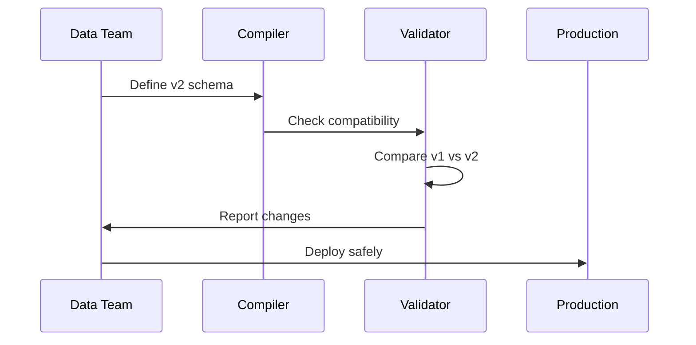

# Chapter 10: Schema Evolution

After learning how to dramatically speed up your feature serving with [Tiling Architecture](09_tiling_architecture_.md), let's explore how to handle the inevitable reality of changing data schemas over time using **Schema Evolution**!

## Why Do We Need Schema Evolution?

Imagine your e-commerce company has been running successfully for a year. Your fraud detection model uses features like:
- Total purchase amount
- Number of purchases
- User account age

But now your business is expanding internationally! You need to add:
- Currency for each purchase (USD, EUR, JPY)
- User's preferred language
- Shipping country

Here's the challenge: You can't just change your data schema overnight because:
- 🏃 Your ML model is actively serving millions of predictions
- 📊 You have 12 months of historical data for training
- ⚡ Your streaming pipeline is processing live transactions
- 💥 One wrong change could break everything!

Without proper schema evolution:
- ❌ Add a new field → Old data doesn't have it → Training fails
- ❌ Rename a column → Production model can't find it → Serving crashes
- ❌ Change a type → Float becomes String → Calculations break

That's where **Schema Evolution** comes in - it's like renovating your house while still living in it!

## What is Schema Evolution?

Think of Schema Evolution as a **careful renovation plan** that:
- 🏗️ Adds new rooms (fields) without tearing down walls
- 🔄 Replaces old fixtures (columns) gradually
- 🛡️ Keeps the house livable (system running) throughout
- 📋 Documents every change for safety

It's not just about changing schemas - it's about changing them **safely**!

Here's the basic idea:

```python
# Version 1: Original schema
purchases_v1 = Source(
    events=EventSource(
        table="purchases",
        query=Query(
            selects={"user_id": "user_id",
                    "amount": "amount"}
        )
    )
)
```

```python
# Version 2: With currency field
purchases_v2 = Source(
    events=EventSource(
        table="purchases",
        query=Query(
            selects={"user_id": "user_id",
                    "amount": "amount",
                    "currency": "currency"}  # New field!
        )
    )
)
```

## Key Concepts

### 1. Backward Compatibility

Changes that don't break existing features:

```python
# ✅ Adding optional fields
selects={"user_id": "user_id",
         "amount": "amount",
         "currency": "COALESCE(currency, 'USD')"}  # Default for old data
```

🔧 Like adding a new electrical outlet - old appliances still work!

### 2. Breaking Changes

Changes that require migration:

```python
# ❌ Renaming required fields
# Old: "amount"
# New: "total_amount"  # Breaks existing features!
```

🏚️ Like moving the kitchen - you need a complete renovation plan!

### 3. Versioning

Using versions to manage changes:

```python
# Old version stays active
purchase_stats_v1 = GroupBy(
    sources=[purchases_v1],
    version=1
)
```

```python
# New version runs in parallel
purchase_stats_v2 = GroupBy(
    sources=[purchases_v2],
    version=2  # Different version!
)
```

📚 Like keeping the old edition of a book while printing the new one!

## Handling Schema Evolution

Let's evolve our schema to support international expansion:

### Step 1: Plan Your Changes

First, identify what's changing:

```python
# What we have (v1)
# - user_id: string
# - amount: double
# - timestamp: timestamp

# What we need (v2)
# - user_id: string
# - amount: double
# - currency: string (NEW!)
# - timestamp: timestamp
```

### Step 2: Create Backward-Compatible Source

Handle missing currency in old data:

```python
# Source that works with both schemas
international_purchases = Source(
    events=EventSource(
        table="purchases",
        query=Query(
            selects={
                "user_id": "user_id",
                "amount": "amount",
                # Handle missing currency
                "currency": "COALESCE(currency, 'USD')"
            }
        )
    )
)
```

### Step 3: Create New GroupBy Version

```python
# New GroupBy with currency support
purchase_stats_intl = GroupBy(
    sources=[international_purchases],
    keys=["user_id", "currency"],  # Group by currency!
    aggregations=[
        Aggregation(
            input_column="amount",
            operation=Operation.SUM,
            windows=["7d"]
        )
    ],
    version=2  # New version!
)
```

### Step 4: Parallel Run Strategy

Run both versions side-by-side:

```python
# Join using BOTH versions
fraud_model_migration = Join(
    left=checkouts,
    right_parts=[
        # Old features (for comparison)
        JoinPart(
            group_by=purchase_stats_v1,
            prefix="v1"
        ),
        # New features (being tested)
        JoinPart(
            group_by=purchase_stats_intl,
            prefix="v2"
        )
    ]
)
```

This gives you features from both versions for validation!

## How Schema Evolution Works: Under the Hood

When you evolve schemas, here's what happens:



Let's trace through the process:

### 1. Version Detection

The compiler detects version changes (from `version_utils.py`):

```python
def parse_name_and_version(name):
    # Extract version from name
    if "__" in name:
        base, version = name.rsplit("__", 1)
        return base, int(version)
    return name, None
```

When you change from `features__1` to `features__2`, Chronon knows it's a version bump!

### 2. Column Hash Tracking

Chronon tracks what each column represents (from `column_hashing.py`):

```python
def compute_semantic_hash(components):
    # Create unique hash for column
    hash_input = "|".join(sorted(components))
    return hashlib.md5(hash_input.encode()).hexdigest()
```

This detects when columns change meaning:
- Same name, different calculation → Different hash → Warning!
- New name, same calculation → Same hash → Safe alias

### 3. Schema Compatibility Check

The validator ensures safety:

```python
# Check if old features still computable
for feature in old_features:
    if feature not in new_schema:
        raise BreakingChange(f"Missing: {feature}")
```

## Migration Strategies

### Strategy 1: Blue-Green Deployment

Run old and new in parallel:

```python
# Deploy v2 alongside v1
chronon upload purchase_stats_v2

# Backfill v2 features
chronon backfill \
  --conf purchase_stats_v2 \
  --start-date 2024-01-01
```

Monitor both versions:
```python
# Compare results
diff = v2_features - v1_features
assert diff < 0.01  # Should match!
```

### Strategy 2: Gradual Migration

Slowly shift traffic:

```python
# Start with 10% on new schema
if random() < 0.1:
    use_v2_features()
else:
    use_v1_features()
```

Increase percentage as confidence grows!

### Strategy 3: Backward-Compatible Evolution

Make changes that work with old data:

```python
# Add derived feature instead
derivations=[
    Derivation(
        name="amount_usd",
        expression="amount * exchange_rate"
    )
]
```

## Practical Tips

### 1. Always Version Major Changes
```python
# Good: Clear versions
purchase_stats_v1 = GroupBy(version=1)
purchase_stats_v2 = GroupBy(version=2)

# Bad: In-place changes
purchase_stats = GroupBy()  # Which version?
```

### 2. Test with Historical Data
```python
# Validate old data works
chronon backfill \
  --conf features_v2 \
  --start-date 2023-01-01 \
  --end-date 2023-01-31
```

### 3. Document Changes
```python
# In your GroupBy
GroupBy(
    version=2,
    metadata={
        "changes": "Added currency field",
        "migration": "Use USD default"
    }
)
```

### 4. Monitor During Migration
Set up alerts for:
- Feature computation failures
- Significant value differences
- Increased nulls or errors

## Common Patterns

### Adding Optional Fields

Safe to add with defaults:

```python
# Old records get default
"new_field": "COALESCE(new_field, 'default')"
```

### Renaming Columns

Requires careful migration:

```python
# Step 1: Add new name as alias
"new_name": "old_name"

# Step 2: Migrate consumers
# Step 3: Remove old name
```

### Changing Types

Most dangerous - requires new version:

```python
# v1: String amounts (oops!)
"amount": "amount_str"

# v2: Proper numeric
"amount": "CAST(amount_str AS DOUBLE)"
```

## Conclusion

Schema Evolution is your **safety harness** for data changes:
- 🔄 **Versions** let you run old and new side-by-side
- 🛡️ **Compatibility checks** prevent breaking changes
- 📊 **Parallel runs** validate before switching
- 🏗️ **Migration strategies** ensure smooth transitions

You've completed your journey through Chronon's core concepts! From connecting to data with [Sources](01_source_.md), through aggregating with [GroupBy](02_groupby_.md), all the way to safely evolving schemas - you now have the tools to build production-ready ML features at scale.

Remember: great ML models need great features, and Chronon helps you build them reliably, efficiently, and safely. Happy feature engineering! 🚀

---

Generated by [AI Codebase Knowledge Builder](https://github.com/The-Pocket/Tutorial-Codebase-Knowledge)