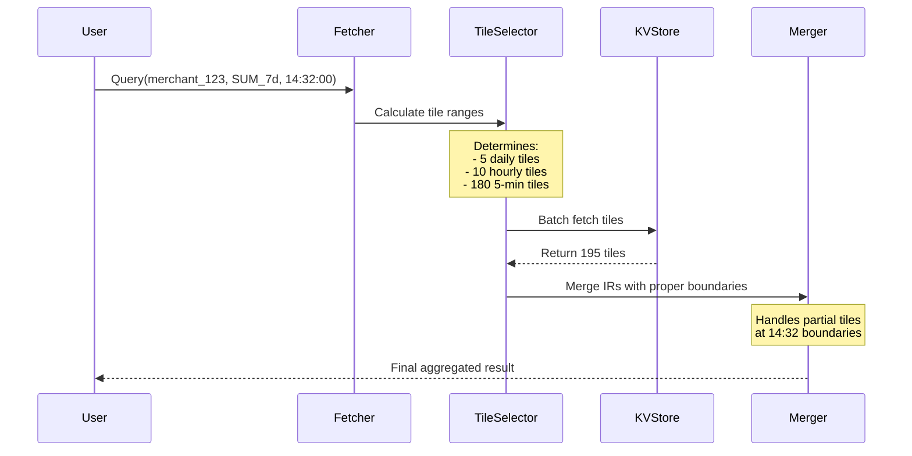

# Deep Dive: How Tiles Are Combined for a 7-Day Query

## The Complete Picture: A Real 7-Day Query Example

Let's trace through exactly how Chronon combines tiles to serve a 7-day aggregation query at **January 15, 2024 at 14:32:00**.

## Query Setup

```
Query Time:      January 15, 2024 at 14:32:00
Window Size:     7 days
Window Period:   January 8, 14:32:00 → January 15, 14:32:00
Hop Size:        5 minutes (automatically determined)
Batch End Time:  January 14, 00:00:00 (last batch upload)
```

## Visual Timeline: What Tiles Exist in the System

```
Timeline with all available tiles:

Jan 8          Jan 9          Jan 10         Jan 11         Jan 12         Jan 13         Jan 14         Jan 15
00:00          00:00          00:00          00:00          00:00          00:00          00:00          14:32
│              │              │              │              │              │              │              │
├──────────────┼──────────────┼──────────────┼──────────────┼──────────────┼──────────────┼──────────────┤
│              │              │              │              │              │              │              Now
│              │              │              │              │              │              │              ▼
│◄─────────────────────────── 7-DAY QUERY WINDOW ──────────────────────────────────────────────────────►│
│              │              │              │              │              │              │              │
└──────────────┴──────────────┴──────────────┴──────────────┴──────────────┴──────────────┴──────────────┘
                                                                                            ▲
                                                                                      Batch End Time

Available Tiles in KV Store:

BATCH-GENERATED TILES (up to Jan 14 00:00):
═══════════════════════════════════════════
Daily Tiles:    [Jan 8] [Jan 9] [Jan 10] [Jan 11] [Jan 12] [Jan 13]
Hourly Tiles:   [00][01][02]...[23] for each day up to Jan 13 23:00
5-min Tiles:    [:00][:05][:10]...[23:55] for each day up to Jan 13 23:55

FLINK-GENERATED TILES (Jan 14 00:00 onwards):
════════════════════════════════════════════
5-min Tiles:    [00:00][00:05][00:10]...[14:30] (real-time streaming)
```

## Step-by-Step Tile Selection Process

### Step 1: Identify the Exact Window Boundaries

```
Query Window: Jan 8 14:32:00 ────────────► Jan 15 14:32:00

Problem: Our window doesn't align with tile boundaries!
- Window starts at 14:32 (not a 5-minute boundary)
- We have tiles at: 14:30, 14:35, etc.

Solution: Use partial tiles at the boundaries
```

### Step 2: Determine Which Tiles to Fetch

The system divides the window into segments based on available tile granularities:

```
SEGMENT BREAKDOWN:
==================

1. WINDOW START ADJUSTMENT (Jan 8, 14:30-14:35)
   └─► Need partial: 14:32 to 14:35 from the [14:30-14:35) tile
   
2. REMAINDER OF JAN 8 (Jan 8, 14:35-00:00)
   ├─► 5-min tiles: [14:35] [14:40] [14:45] [14:50] [14:55]
   ├─► Hourly tiles: [15:00] [16:00] [17:00] ... [23:00]
   
3. FULL DAYS (Jan 9-13)
   └─► Daily tiles: [Jan 9] [Jan 10] [Jan 11] [Jan 12] [Jan 13]
   
4. BATCH-TO-STREAMING TRANSITION (Jan 14, 00:00-14:30)
   ├─► 5-min tiles from Flink: [00:00] [00:05] [00:10] ... [14:25] [14:30]
   
5. WINDOW END ADJUSTMENT (Jan 15, 14:30-14:32)
   └─► Need partial: 14:30 to 14:32 from current streaming
```

## Visual Representation: Tile Selection

```
7-DAY WINDOW TILE COMPOSITION:
═══════════════════════════════

Jan 8, 14:32 ────────────────────────────────────────────────► Jan 15, 14:32
    │                                                                    │
    ▼                                                                    ▼
┌───┬─────────────────────────────────────────────────────────────────┬───┐
│▓▓▓│███│███│███│█████████│█████████│█████████│█████████│█████████│░░░│▓▓▓│
└───┴─────────────────────────────────────────────────────────────────┴───┘
 ▲   ▲                     ▲                                       ▲   ▲
 │   │                     │                                       │   │
 │   │                     │                                       │   │
 │   │                  DAILY TILES                                │   │
 │   │              [Jan 9][Jan 10][Jan 11]                        │   │
 │   │                [Jan 12][Jan 13]                             │   │
 │   │                                                              │   │
 │   HOURLY + 5-MIN TILES                         5-MIN TILES      │   │
 │   [14:35-00:00 of Jan 8]                    [00:00-14:30 Jan 14]│   │
 │                                                                  │   │
PARTIAL                                                          PARTIAL
[14:32-14:35)                                                [14:30-14:32)
from 14:30 tile                                              from streaming

Legend:
▓▓▓ = Partial tile usage (window boundary adjustment)
███ = 5-minute tiles
█████████ = Daily tiles (most efficient)
░░░ = Real-time streaming data
```

## Detailed Tile Fetching and Merging

### Phase 1: Batch Tile Collection

```scala
// Pseudo-code for tile selection
val batchTiles = List(
  // Start boundary - partial tile
  fetchTile("Jan 8 14:30", granularity = "5min")
    .extractPartial(from = "14:32", to = "14:35"),
  
  // Remainder of Jan 8
  fetchTiles("Jan 8 14:35-15:00", granularity = "5min"),  // 5 tiles
  fetchTiles("Jan 8 15:00-00:00", granularity = "hourly"), // 9 tiles
  
  // Full days - most efficient!
  fetchTile("Jan 9", granularity = "daily"),  // 1 tile = 288 5-min tiles!
  fetchTile("Jan 10", granularity = "daily"), // 1 tile
  fetchTile("Jan 11", granularity = "daily"), // 1 tile
  fetchTile("Jan 12", granularity = "daily"), // 1 tile
  fetchTile("Jan 13", granularity = "daily"), // 1 tile
)
```

### Phase 2: Streaming Tile Collection

```scala
// Flink-generated tiles from Jan 14 onwards
val streamingTiles = List(
  fetchTiles("Jan 14 00:00-14:30", granularity = "5min"), // 174 tiles
  
  // Current window - might be incomplete
  fetchCurrentStreamingData("Jan 14 14:30-14:32")
)
```

### Phase 3: IR (Intermediate Result) Merging

Each tile contains an Intermediate Result (IR) with partial aggregates:

```
Example IR Structure for SUM aggregation:
==========================================
Daily Tile (Jan 9):     IR { sum: 12,500,000.00, count: 45,000 }
Hourly Tile (15:00):    IR { sum: 520,000.00, count: 1,875 }
5-min Tile (14:35):     IR { sum: 43,333.33, count: 156 }
Streaming (14:30-32):   IR { sum: 2,890.50, count: 11 }

Merging Process:
================
1. Start with empty IR: { sum: 0, count: 0 }
2. Merge each tile's IR using aggregation-specific logic:
   - SUM: Add all sums
   - COUNT: Add all counts
   - AVERAGE: (total_sum / total_count)
   - MIN/MAX: Compare across all IRs
   - PERCENTILE: Merge t-digest structures
```

## Optimization: Why Different Granularities?

```
EFFICIENCY COMPARISON:
=====================

Scenario A: Using only 5-minute tiles for 7 days
─────────────────────────────────────────────────
Total tiles to fetch: 7 * 24 * 12 = 2,016 tiles
KV store reads: 2,016
Network transfer: ~200 MB
Merge operations: 2,016

Scenario B: Using mixed granularities (actual)
───────────────────────────────────────────────
Tiles to fetch:
- Daily tiles: 5
- Hourly tiles: ~10
- 5-min tiles: ~180
Total: ~195 tiles (90% reduction!)
KV store reads: 195
Network transfer: ~20 MB
Merge operations: 195
```

## Real-World Query Flow



## Key Insights from This Example

### 1. Boundary Precision
The system handles non-aligned boundaries (14:32) by:
- Using the 14:30-14:35 tile and extracting partial data
- Maintaining exact window semantics despite tile alignment

### 2. Storage Efficiency
Daily tiles dramatically reduce I/O:
- 1 daily tile replaces 288 five-minute tiles
- 5 daily tiles cover 71% of the 7-day window

### 3. Query Performance
```
Latency Breakdown:
==================
Tile selection logic:     ~1ms
KV store batch fetch:     ~20ms (195 tiles)
IR merging:              ~5ms
Network overhead:        ~10ms
─────────────────────────────
Total:                   ~36ms
```

### 4. Real-time Integration
The seamless transition from batch (Jan 13) to streaming (Jan 14+) tiles ensures:
- Fresh data (up to current minute)
- No gaps in coverage
- Consistent aggregation semantics

## Common Patterns and Edge Cases

### Pattern 1: Query at Tile Boundary
```
Query at 14:30:00 (exactly on 5-min boundary)
Window: Jan 8 14:30 → Jan 15 14:30
Result: No partial tiles needed, slightly faster query
```

### Pattern 2: Very Recent Query
```
Query at 14:32:00 for last 1 hour
Window: Jan 15 13:32 → Jan 15 14:32
Tiles: All from Flink streaming (12 five-minute tiles)
Note: Higher latency due to recent data assembly
```

### Pattern 3: Historical Query
```
Query at 14:32:00 for 30 days ago
Window: Dec 16 14:32 → Dec 23 14:32
Tiles: All from batch (daily tiles available)
Note: Fastest query due to pre-aggregated daily tiles
```

## Summary

The 7-day query example demonstrates:

1. **Intelligent Tile Selection**: The system automatically chooses the most efficient tile granularity for each segment of the window

2. **Precise Boundary Handling**: Partial tile extraction ensures exact window boundaries despite tile alignment constraints

3. **Massive Efficiency Gains**: Using mixed granularities reduces tile fetches by ~90% compared to naive approach

4. **Seamless Batch-Streaming Integration**: Transparent combination of historical batch tiles and real-time streaming tiles

5. **Sub-40ms Latency**: Efficient tile selection and merging enables real-time feature serving at scale

This architecture allows Chronon to serve millions of 7-day aggregation queries per second with minimal infrastructure while maintaining exact window semantics and real-time freshness.