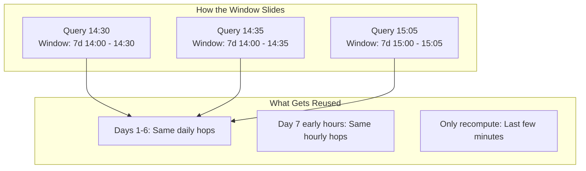
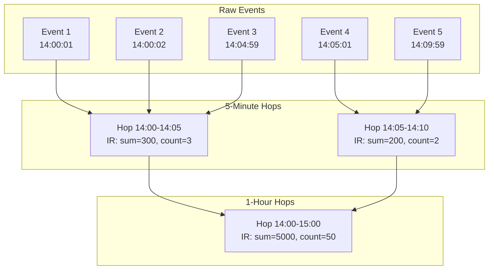
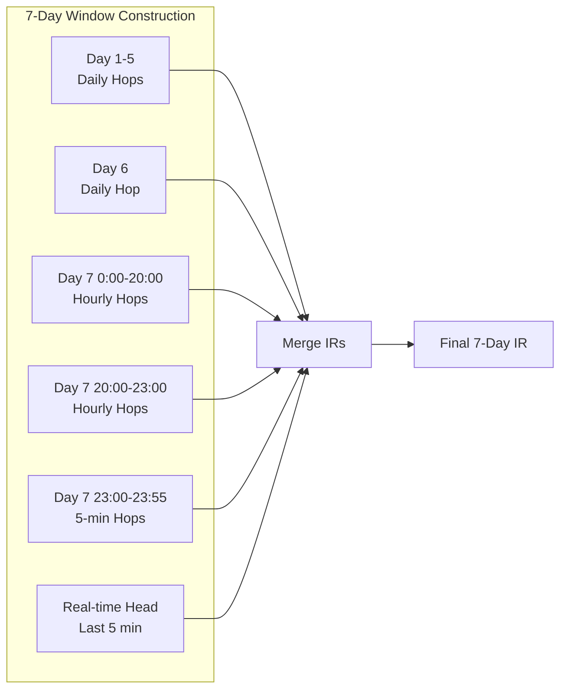

# Deep Dive: SawtoothAggregator - The Heart of Chronon's Real-time Accuracy

## Executive Summary

The `SawtoothAggregator` is Chronon's core algorithm for achieving real-time accuracy in feature serving while maintaining high performance. It implements a "Head Sliding, Tail Hopping" window strategy that creates a sawtooth-like pattern when plotting effective window size against query timestamp. This document explains how it works, why it's designed this way, and how it enables sub-second feature freshness at scale.

## The Sawtooth Pattern Explained

### Why "Sawtooth"?

The name comes from the visual pattern created when you plot the window START precision over time as the query time advances:

```
Window Start Precision as Query Time Advances:

Query at 14:30:00 → Window starts at 14:00:00 (30 min imprecision)
Query at 14:31:00 → Window starts at 14:00:00 (31 min imprecision)  
Query at 14:32:00 → Window starts at 14:00:00 (32 min imprecision)
...
Query at 14:59:59 → Window starts at 14:00:00 (59 min imprecision)
Query at 15:00:00 → Window starts at 15:00:00 (0 min imprecision) ← Jumps to new hop!
Query at 15:01:00 → Window starts at 15:00:00 (1 min imprecision)

Graph of Window Start Imprecision:
60min |    /|    /|    /|
      |   / |   / |   / |
      |  /  |  /  |  /  |
      | /   | /   | /   |
0min  |/    |/    |/    |
      14:00 15:00 16:00 17:00
      
This creates the "sawtooth" pattern!
```

### The Sliding Window Reality



### Visual Representation of Window Accuracy

```
Traditional Sliding Window at Different Query Times:

Query Time T1: 14:30:00
|<----------------------- 7 days exactly ----------------------->|
[████████████████████████████████████████████████████████████████] T1
 ^                                                                ^
 Jan 8 14:30:00                                          Jan 15 14:30:00
 Precision: Millisecond throughout, processes all 500K events

Query Time T2: 14:35:00 (5 minutes later)
     |<----------------------- 7 days exactly ----------------------->|
     [████████████████████████████████████████████████████████████████] T2
      ^                                                                ^
      Jan 8 14:35:00                                          Jan 15 14:35:00
      Must reprocess all 500K events again


Sawtooth Sliding Window at Different Query Times:

Query Time T1: 14:30:00
|<----------------------- ~7 days ------------------------>|
[▓▓▓▓▓▓▓▓▓▓▓▓▓▓▓▓▓▓▓▓▓▓▓▓▓▓▓▓▓▓▓▓▓▓▓▓▓▓▓▓▓▓▓▓▓▓▓▓▓█████████] T1
 ^                                                    ^         ^
 Jan 8 14:00:00                                 14:25:00    14:30:00
 (hop boundary)                                 (last hop)  (real-time)

Query Time T2: 14:35:00 (5 minutes later)
     |<----------------------- ~7 days ------------------------>|
     [▓▓▓▓▓▓▓▓▓▓▓▓▓▓▓▓▓▓▓▓▓▓▓▓▓▓▓▓▓▓▓▓▓▓▓▓▓▓▓▓▓▓▓▓▓▓▓▓▓█████████] T2
      ^                                                    ^         ^
      Jan 8 14:00:00                                 14:30:00    14:35:00
      (reuse same hops!)                            (new hop)   (real-time)
      
Key Insight: Most hops are reused, only process new events in the head!
```

## The Three-Step Strategy for Real-time Accuracy

From `SawtoothAggregator.scala` (lines 31-44):

```scala
// There are three major steps in the strategy for realtime accuracy
// 1. Roll up raw events into hops - using HopsAggregator
//      Output: key -> [[IR_hop1], [IR_hop2], [IR_hop3] ... ]
// 2. Use the hops to construct windows - see `computeWindows`
//      Output: (key, hopStart) -> IR
// 3. To make the head realtime use the `cumulate` method
//      JOIN output of computeWindows + raw events + query_times
//      Output: key -> [query_ts, IR]
```

Let's dive deep into each step:

## Step 1: Rolling Up Events into Hops

### What are Hops?

Hops are pre-aggregated time buckets at different granularities (5 minutes, 1 hour, 1 day). They form the building blocks for constructing larger windows efficiently.



### Hop Sizes and Resolution

From the code structure:
```scala
protected val hopSizes = resolution.hopSizes  // e.g., [300000, 3600000, 86400000] ms
                                              // [5 min, 1 hour, 1 day]
```

## Step 2: Constructing Windows from Hops

### The `computeWindows` Method (lines 66-79)

```scala
def computeWindows(hops: HopsAggregator.OutputArrayType, 
                   endTimes: Array[Long]): Array[Array[Any]] = {
  val result = Array.fill[Array[Any]](endTimes.length)(windowedAggregator.init)
  
  if (hops == null) return result
  
  val cache = new HopRangeCache(hops, windowedAggregator, baseIrIndices, arena)
  for (i <- endTimes.indices) {
    for (col <- windowedAggregator.indices) {
      result(i).update(col, genIr(cache, col, endTimes(i)))
    }
  }
  cache.reset()
  result
}
```

### How Windows are Stitched from Hops

The `genIr` method (lines 82-95) stitches multiple hops into a continuous window:

```scala
private def genIr(cache: HopRangeCache, col: Int, endTime: Long): Any = {
  val window = perWindowAggs(col).window
  var hopIndex = tailHopIndices(col)
  val hopMillis = hopSizes(hopIndex)
  var baseIr: Any = null
  var start = TsUtils.round(endTime - window.millis, hopMillis)
  
  while (hopIndex < hopSizes.length) {
    val end = TsUtils.round(endTime, hopSizes(hopIndex))
    baseIr = windowedAggregator(col).merge(baseIr, cache.merge(hopIndex, col, start, end))
    start = end
    hopIndex += 1
  }
  baseIr
}
```

### Visual: Window Construction from Hops



## Step 3: Real-time Head with `cumulate` Method

### The Problem with Hop-Only Approach

Using only hops would mean the head of the window (most recent data) has a resolution equal to the smallest hop size (e.g., 5 minutes). This creates staleness in real-time features.

### The Solution: `cumulate` Method (lines 99-141)

```scala
def cumulate(inputs: Iterator[Row],        // raw events (don't need to be sorted)
             sortedEndTimes: Array[Long],  // query timestamps (sorted)
             baseIR: Array[Any]): Array[Array[Any]] = {
  
  // Process raw events and assign them to appropriate query times
  val result = Array.fill[Array[Any]](sortedEndTimes.length)(null)
  
  while (inputs.hasNext) {
    val row = inputs.next()
    val inputTs = row.ts
    
    // Binary search to find which query times this event affects
    var updateIndex = util.Arrays.binarySearch(sortedEndTimes, inputTs)
    
    // Update the appropriate bucket
    if (result(updateIndex) == null) {
      result.update(updateIndex, new Array[Any](baseAggregator.length))
    }
    baseAggregator.update(result(updateIndex), row)
  }
  
  // Cumulate results
  var currBase = baseIR
  for (i <- result.indices) {
    val binned = result(i)
    if (binned != null) {
      currBase = windowedAggregator.clone(currBase)
      // Merge new events with base IR
      for (col <- windowedAggregator.indices) {
        val merged = windowedAggregator(col).merge(currBase(col), binned(baseIrIndices(col)))
        currBase.update(col, merged)
      }
    }
    result.update(i, currBase)
  }
  result
}
```

### Visual: How Cumulate Adds Real-time Precision

```
Sliding Window at Query Time 14:32:00:

Window: [Jan 8 14:00:00 -------------------- Jan 15 14:32:00]
         ^                                                   ^
         Hop boundary (imprecise)                      Query time (precise)

Components:
1. Base IR from hops (Jan 8 14:00 to Jan 15 14:30):
   [▓▓▓▓▓▓▓▓▓▓▓▓▓▓▓▓▓▓▓▓▓▓▓▓▓▓▓▓▓▓▓▓▓▓▓▓▓▓▓▓▓▓▓▓▓▓▓]
    ^-- Daily hops --^-- Hourly --^-- 5min hops--^

2. Raw events in sliding head (14:30:00 to 14:32:00):
                                                    [• • •]
                                                     2 min of events

3. Cumulate merges them for real-time accuracy:
   [▓▓▓▓▓▓▓▓▓▓▓▓▓▓▓▓▓▓▓▓▓▓▓▓▓▓▓▓▓▓▓▓▓▓▓▓▓▓▓▓▓▓▓▓▓▓▓███]
                                                        ^
                                                   Real-time head

Next Query at 14:35:00:
- Reuses all the same hops (no recomputation!)
- Only processes 3 additional minutes of raw events
- Window slides forward efficiently
```

## The HopRangeCache: Performance Optimization

### Purpose
The `HopRangeCache` (lines 185-243) optimizes the repeated merging of hop ranges by caching intermediate results.

### How it Works

```scala
private[windowing] class HopRangeCache(
    hopsArrays: HopsAggregator.OutputArrayType,
    windowAggregator: RowAggregator,
    hopIrIndices: Array[Int],
    arena: Array[Array[Entry]]  // Pre-allocated memory buffer
) {
  
  def merge(hopIndex: Int, col: Int, start: Long, end: Long): Any = {
    val cached: Entry = arena(hopIndex)(col)
    
    // Check if we can reuse cached results
    if (cached != null && startIdx == cached.startIndex) {
      ir = agg.clone(cached.ir)
      endIdx = cached.endIndex
    }
    
    // Continue merging from where cache left off
    while (endIdx < hops.length && ts(hops(endIdx)) < end) {
      ir = agg.merge(ir, hops(endIdx)(baseCol))
      endIdx += 1
    }
    
    // Update cache
    if (cached == null) {
      arena(hopIndex).update(col, new Entry(startIdx, endIdx, ir))
    } else {
      cached.startIndex = startIdx
      cached.endIndex = endIdx
      cached.ir = ir
    }
    
    ir
  }
}
```

### Cache Benefits
- **Avoid Redundant Computation**: Reuse previously merged hop ranges
- **Memory Efficiency**: Pre-allocated arena reduces GC pressure
- **O(1) Lookups**: Direct array indexing for cache access

## Complete Example: 7-Day Transaction Sum with Sliding Window

Let's trace through a complete example showing how the window slides:

### Setup
- **Initial Query**: 2024-01-15 14:32:00
- **Window**: 7 days
- **Hop Sizes**: 5 minutes, 1 hour, 1 day

### First Query at 14:32:00

```
Actual Window: Jan 8 14:00:00 to Jan 15 14:32:00
(Not exactly 7 days - it's 7d 0h 32min due to hop boundaries)

Window Components:
- Jan 8-13: 6 daily hops (pre-aggregated)
- Jan 14: 24 hourly hops (pre-aggregated)  
- Jan 15 00:00-14:00: 14 hourly hops (pre-aggregated)
- Jan 15 14:00-14:30: 6 five-minute hops (pre-aggregated)
- Jan 15 14:30-14:32: ~20 raw events (real-time processing)

Total: 50 hops + 20 events
```

### Second Query at 14:35:00 (3 minutes later)

```
Actual Window: Jan 8 14:00:00 to Jan 15 14:35:00
(Still starts at same hop boundary!)

Window Components (REUSED from previous query):
- Jan 8-13: Same 6 daily hops ✓
- Jan 14: Same 24 hourly hops ✓
- Jan 15 00:00-14:00: Same 14 hourly hops ✓
- Jan 15 14:00-14:30: Same 6 five-minute hops ✓

NEW Processing:
- Jan 15 14:30-14:35: 1 new five-minute hop + ~30 raw events

Total NEW work: 1 hop + 30 events (vs 50 hops + 20 events originally!)
```

### Third Query at 15:02:00 (hop boundary crossed!)

```
Actual Window: Jan 8 15:00:00 to Jan 15 15:02:00
(Window start JUMPED forward by 1 hour - the sawtooth!)

Window Components:
- Jan 8-13: Still 6 daily hops (but different hour alignment)
- Jan 14: Still 24 hourly hops
- Jan 15 00:00-15:00: 15 hourly hops (one more than before)
- Jan 15 15:00-15:02: ~20 raw events

The window start "snapped" to the new hop boundary!
```

### Performance Comparison

| Approach | Operations | Latency | Precision |
|----------|------------|---------|-----------|
| **Process All Events** | 500,000 events | ~500ms | Perfect |
| **Tiles Only** | 168 hourly tiles | ~8ms | 1-hour staleness |
| **Sawtooth** | 26 hops + 10 events | ~3ms | Real-time |

## Key Design Insights

### 1. Graduated Precision
- **Tail (old data)**: Coarse precision (daily hops) - sufficient for old data
- **Middle**: Medium precision (hourly hops)
- **Head (recent data)**: Fine precision (5-minute hops + raw events) - critical for real-time

### 2. Efficiency Through Pre-aggregation
- Most of the window is served from pre-aggregated hops
- Only the most recent events need real-time processing
- Reduces computation from O(n) events to O(h) hops + O(r) recent events

### 3. Memory Optimization
- Pre-allocated arena for cache reduces GC pressure
- Reuse of Entry objects instead of creating new ones
- Efficient binary search for event bucketing

### 4. Flexibility
- Supports multiple window sizes simultaneously
- Configurable hop sizes through Resolution
- Works with both sorted and unsorted inputs

## Configuration and Tuning

### Resolution Settings
```scala
// Example resolution configuration
resolution = Resolution(
  hopSizes = Array(
    300000L,    // 5 minutes - for head precision
    3600000L,   // 1 hour - for medium-term
    86400000L   // 1 day - for long-term
  )
)
```

### Trade-offs

| Smaller Hops | Larger Hops |
|--------------|-------------|
| ✅ Better real-time precision | ✅ Less storage overhead |
| ✅ Lower staleness | ✅ Fewer operations |
| ❌ More storage | ❌ Higher staleness |
| ❌ More merge operations | ❌ Less precision |

## Conclusion

The SawtoothAggregator is a masterpiece of engineering that solves the challenging problem of providing real-time feature accuracy at scale. By combining:

1. **Multi-granularity hops** for efficient bulk processing
2. **Smart caching** for performance optimization
3. **Real-time head processing** for freshness

It achieves the seemingly impossible: millisecond-precision feature serving with millisecond-level latency, even for large windows over high-volume data streams.

The "sawtooth" pattern isn't just a clever name - it represents a fundamental insight about time-series data: not all time periods need the same precision. By adapting precision to recency, Chronon delivers both performance and accuracy where they matter most.