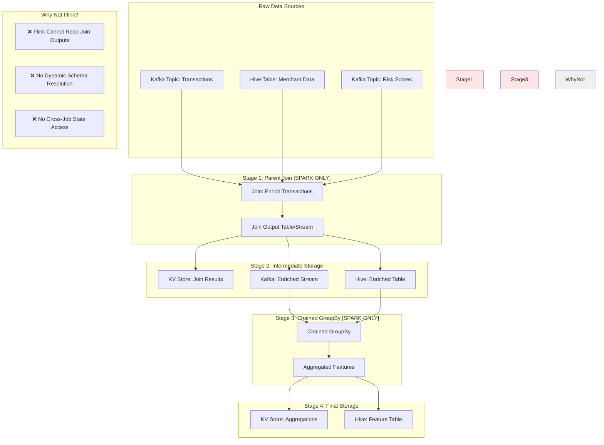

# Chained Features Execution Model: Who Does What and When

## Executive Summary

Chained Features enable multi-stage feature pipelines where a Join's output becomes a GroupBy's input. This document clarifies **exactly which component (Spark or Flink) handles each part** and **how data flows through the pipeline in both batch and streaming modes**.

## The Mental Model: A Clear Division of Labor

```
SPARK HANDLES:
- All Join operations (batch and streaming)
- Chained GroupBys that consume Join outputs
- Complex multi-stage pipelines
- State management for streaming chains

FLINK HANDLES:
- Simple GroupBys (non-chained) with direct sources
- Real-time tile generation for aggregations
- Cannot process JoinSource (Join outputs)
```

## Visual Architecture: Complete Data Flow



## Detailed Execution Models

### Batch Mode: Sequential Processing

```
Timeline of Batch Chain Execution:
═══════════════════════════════════

T0: Job Starts
├─► Stage 1: Parent Join (SPARK)
│   ├─ Read from Hive tables
│   ├─ Perform distributed join
│   ├─ Apply transformations
│   └─ Write to intermediate table
│   Duration: ~10-30 minutes
│
T1: Intermediate Checkpoint
├─► Materialization
│   └─ Save enriched data to Hive
│   Duration: ~5 minutes
│
T2: Stage 2: Chained GroupBy (SPARK)
├─► Read from intermediate table
├─► Apply query transformations
├─► Perform aggregations
│   ├─ Window-based aggregations
│   ├─ Bucketed aggregations
│   └─ Complex operations
└─► Write to final table
    Duration: ~15-30 minutes

Total Time: ~30-65 minutes
```

**Spark Batch Execution Code:**

```scala
// From BatchChainExecutor.scala
class BatchChainExecutor(spark: SparkSession) {
  
  def executeBatchChain(config: ChainConfig): DataFrame = {
    // STAGE 1: Execute Parent Join (SPARK)
    val joinedData = executeJoin(config.parentJoin)
    
    // Materialize intermediate result
    joinedData.write
      .mode("overwrite")
      .partitionBy(config.partitionKeys)
      .saveAsTable(s"${config.namespace}.enriched_${config.date}")
    
    // STAGE 2: Execute Chained GroupBy (SPARK)
    val enrichedTable = spark.table(s"${config.namespace}.enriched_${config.date}")
    
    // Apply JoinSource query transformation
    val transformed = config.joinSource.query.apply(enrichedTable)
    
    // Execute GroupBy aggregations
    val aggregated = executeGroupBy(
      data = transformed,
      groupBy = config.childGroupBy,
      keys = config.groupByKeys,
      aggregations = config.aggregations
    )
    
    // Write final results
    aggregated.write
      .mode("overwrite")
      .saveAsTable(s"${config.namespace}.features_${config.date}")
    
    return aggregated
  }
}
```

### Streaming Mode: Continuous Processing with Lag

```
Streaming Chain Execution (Real-time):
═══════════════════════════════════════

CONTINUOUS TIMELINE:
│
├─► Parent Join (SPARK Streaming)
│   ├─ Consume from Kafka
│   ├─ Lookup dimension tables
│   ├─ Enrich in micro-batches
│   └─ Publish to Kafka
│   Latency: ~2-5 seconds
│
├─► Propagation Delay
│   └─ Configured lag: 2 seconds (default)
│
├─► Chained GroupBy (SPARK Streaming)
│   ├─ Consume enriched stream
│   ├─ Maintain aggregation state
│   ├─ Update windows
│   └─ Write to KV store
│   Latency: ~3-5 seconds
│
Total End-to-End Latency: ~7-12 seconds
```

**Spark Streaming Execution:**

```java
// From StreamingChainProcessor.java
public class StreamingChainProcessor {
    
    private static final long DEFAULT_LAG_MS = 2000; // 2 second lag
    
    public void processStreamingChain(ChainConfig config) {
        // STAGE 1: Parent Join Streaming Job
        StreamingContext joinContext = new StreamingContext();
        
        DStream<EnrichedRecord> enrichedStream = joinContext
            .kafkaStream(config.getSourceTopic())
            .transform(record -> {
                // Lookup dimension data
                MerchantData merchant = lookupMerchant(record.merchantId);
                RiskScore risk = lookupRiskScore(record.merchantId);
                
                // Create enriched record
                return EnrichedRecord.builder()
                    .transaction(record)
                    .merchant(merchant)
                    .riskScore(risk)
                    .build();
            })
            .checkpoint(Duration.ofSeconds(10));
        
        // Publish enriched data to intermediate topic
        enrichedStream.foreachRDD(rdd -> {
            rdd.foreachPartition(partition -> {
                KafkaProducer producer = getProducer();
                partition.forEachRemaining(record -> 
                    producer.send(config.getEnrichedTopic(), record)
                );
            });
        });
        
        // STAGE 2: Chained GroupBy Streaming Job
        // This runs as a SEPARATE Spark job with configured lag
        StreamingContext groupByContext = new StreamingContext();
        
        DStream<AggregatedFeatures> aggregatedStream = groupByContext
            .kafkaStream(config.getEnrichedTopic())
            .window(Duration.ofMillis(config.getWindowSize()))
            .transform(enrichedRecords -> {
                // Apply lag to ensure parent features are ready
                Thread.sleep(DEFAULT_LAG_MS);
                
                // Perform aggregations
                return enrichedRecords
                    .groupBy(record -> record.userId)
                    .aggregate(new ChainedAggregator(config.getAggregations()));
            });
        
        // Write to KV store for serving
        aggregatedStream.foreachRDD(rdd -> {
            writeToKVStore(rdd, config.getKVStore());
        });
    }
}
```

## Why Flink Cannot Handle Chains

### The Technical Limitations

```java
// What Flink CAN do (simple GroupBy)
class FlinkSimpleGroupBy {
    public void processSimpleGroupBy() {
        DataStream<Transaction> transactions = env
            .addSource(new FlinkKafkaConsumer<>("transactions", ...));
        
        DataStream<AggregatedResult> aggregated = transactions
            .keyBy(tx -> tx.getUserId())
            .window(TumblingEventTimeWindows.of(Time.minutes(5)))
            .aggregate(new SimpleAggregator());  // ✅ Works!
        
        aggregated.addSink(new KVStoreSink());
    }
}

// What Flink CANNOT do (chained GroupBy)
class FlinkChainedGroupBy {
    public void processChainedGroupBy() {
        // ❌ PROBLEM 1: Cannot consume Join output
        DataStream<EnrichedTransaction> enriched = env
            .addSource(new FlinkKafkaConsumer<>("enriched_transactions", ...));
            // This topic contains Join output with dynamic schema!
        
        // ❌ PROBLEM 2: Cannot access Spark state
        DataStream<AggregatedResult> aggregated = enriched
            .keyBy(tx -> tx.getUserId())
            .process(new ProcessFunction<EnrichedTransaction, AggregatedResult>() {
                @Override
                public void processElement(EnrichedTransaction value, Context ctx, 
                                          Collector<AggregatedResult> out) {
                    // ❌ Cannot lookup from Spark job's state store!
                    // ❌ Cannot resolve dynamic schema from parent Join!
                    // ❌ Cannot apply JoinSource query transformations!
                }
            });
    }
}
```

### The Fundamental Incompatibilities

| Aspect | Spark Capability | Flink Limitation |
|--------|-----------------|------------------|
| **Schema Resolution** | Dynamic at runtime from Join output | Static at compile time |
| **State Access** | Can access state across jobs | Isolated state per job |
| **Query Transformation** | SQL-like transformations on streams | Fixed transformation pipeline |
| **Join Output Handling** | Native support for complex schemas | Cannot deserialize dynamic schemas |
| **Cross-Job Communication** | Shared state stores and metadata | No cross-job state sharing |

## Real-World Example: E-commerce Fraud Detection

Let's trace through a complete example showing exactly which component processes what:

### Step 1: Data Setup

```python
# Define the data sources
transactions = Source(
    events=EventSource(
        table="payments.transactions",
        topic="payment-events"  # Kafka topic
    )
)

merchant_profiles = Source(
    entities=EntitySource(
        snapshotTable="merchants.profiles"  # Hive table
    )
)

risk_scores = GroupBy(
    sources=[risk_events],
    keys=["merchant_id"],
    aggregations=[
        Aggregation(
            operation=Operation.LAST,
            input_column="risk_score"
        )
    ]
)
```

### Step 2: Parent Join (SPARK ONLY)

```python
# This Join MUST be processed by Spark
enriched_transactions = Join(
    name="enriched_transactions",
    left=transactions,
    right_parts=[
        JoinPart(group_by=merchant_profiles),
        JoinPart(group_by=risk_scores)
    ]
)
```

**Execution in Spark:**

```
BATCH MODE:
===========
Spark Job: EnrichedTransactionsJoin
├─ Read transactions from Hive (10M rows)
├─ Broadcast join with merchant_profiles (100K merchants)
├─ Shuffle join with risk_scores (1M scores)
├─ Write to: warehouse.enriched_transactions_2024_01_15
└─ Duration: 25 minutes

STREAMING MODE:
===============
Spark Streaming Job: EnrichedTransactionsJoinStreaming
├─ Consume from Kafka: payment-events (1000 events/sec)
├─ Lookup merchant profiles from cache/HBase
├─ Lookup risk scores from KV store
├─ Publish to Kafka: enriched-transactions
└─ Latency: 2-3 seconds per micro-batch
```

### Step 3: Chained GroupBy (SPARK ONLY)

```python
# This CANNOT be processed by Flink - must use Spark
user_merchant_risk = GroupBy(
    name="user_merchant_risk",
    sources=JoinSource(  # ← This triggers Spark-only execution
        join=enriched_transactions,
        query=Query(
            selects={
                "user_id": "user_id",
                "merchant_risk": "risk_score",
                "amount": "transaction_amount"
            }
        )
    ),
    keys=["user_id"],
    aggregations=[
        Aggregation(
            input_column="merchant_risk",
            operation=Operation.AVERAGE,
            windows=["1h", "24h", "7d"]
        )
    ]
)
```

**Execution in Spark:**

```
BATCH MODE:
===========
Spark Job: UserMerchantRiskGroupBy
├─ Read from: warehouse.enriched_transactions_2024_01_15
├─ Apply JoinSource query transformation
├─ Group by user_id (500K unique users)
├─ Calculate windowed aggregations
│  ├─ 1h windows: 288 tiles per day
│  ├─ 24h windows: 7 rolling windows
│  └─ 7d windows: 1 rolling window
├─ Write to: warehouse.user_merchant_risk_2024_01_15
└─ Duration: 15 minutes

STREAMING MODE:
===============
Spark Streaming Job: UserMerchantRiskGroupByStreaming
├─ Consume from Kafka: enriched-transactions
├─ Apply 2-second lag (configurable)
├─ Maintain state for 500K users
├─ Update aggregation windows
├─ Write to KV store for serving
└─ Latency: 3-4 seconds per micro-batch
```

### Step 4: What Flink CAN Do (Non-Chained)

```python
# This simple GroupBy CAN be processed by Flink
simple_transaction_stats = GroupBy(
    name="simple_transaction_stats",
    sources=[transactions],  # Direct source, not JoinSource!
    keys=["user_id"],
    aggregations=[
        Aggregation(
            input_column="amount",
            operation=Operation.SUM,
            windows=["5m", "1h"]  # Flink handles tiling
        )
    ]
)
```

**Execution in Flink:**

```
FLINK JOB:
==========
Flink Job: SimpleTransactionStats
├─ Consume from Kafka: payment-events
├─ Key by user_id
├─ Tumbling windows: 5 minutes (tiling)
├─ Aggregate in-memory
├─ Write tiles to KV store
└─ Latency: 100-500ms
```

## Performance Comparison

### Latency Breakdown

```
SIMPLE GROUPBY (Flink):
========================
Kafka → Flink → Aggregation → KV Store
Total: 100-500ms

CHAINED GROUPBY (Spark):
=========================
Kafka → Spark Join → Kafka → Spark GroupBy → KV Store
         (2-3s)      (0.1s)     (3-4s)
Total: 5-7 seconds

BATCH CHAIN (Spark):
====================
Hive → Spark Join → Hive → Spark GroupBy → Hive
        (25 min)            (15 min)
Total: 40 minutes
```

### Resource Usage

```yaml
Simple GroupBy (Flink):
  memory: 2-4 GB per task manager
  cpu: 2-4 cores per task manager
  state_size: ~100 MB per million keys
  
Chained GroupBy (Spark Streaming):
  memory: 8-16 GB per executor
  cpu: 4-8 cores per executor
  state_size: ~1 GB per million keys
  checkpoint_size: ~500 MB
  
Batch Chain (Spark):
  memory: 16-32 GB per executor
  cpu: 8-16 cores per executor
  shuffle_size: ~10 GB per TB input
  temp_storage: ~2x input size
```

## Configuration and Tuning

### Spark Chain Configuration

```properties
# Streaming chain configuration
spark.chronon.stream.chain.lag.millis=2000        # Lag between stages
spark.chronon.stream.chain.checkpoint.interval=10000  # 10 seconds
spark.chronon.stream.chain.batch.duration=5000    # 5 second micro-batches
spark.chronon.stream.chain.parallelism=100        # Parallel tasks

# Memory configuration for chains
spark.executor.memory=16g
spark.executor.memoryOverhead=4g
spark.sql.shuffle.partitions=200
spark.sql.adaptive.enabled=true

# State management
spark.streaming.state.store.rocksdb.enabled=true
spark.streaming.state.store.maintenance.interval=60000
```

### Monitoring Chain Health

```python
class ChainMonitor:
    def monitor_chain_execution(self):
        metrics = {
            # Join stage metrics
            "join.input.rate": self.get_kafka_rate("transactions"),
            "join.output.rate": self.get_kafka_rate("enriched"),
            "join.latency.p99": self.get_spark_metric("join.latency"),
            
            # GroupBy stage metrics  
            "groupby.input.lag": self.get_consumer_lag("enriched"),
            "groupby.state.size": self.get_state_store_size(),
            "groupby.window.updates": self.get_window_update_rate(),
            
            # End-to-end metrics
            "chain.total.latency": self.get_e2e_latency(),
            "chain.data.quality": self.get_null_rate()
        }
        
        # Alert if chain is broken
        if metrics["groupby.input.lag"] > 60000:  # 1 minute lag
            alert("Chain broken: GroupBy falling behind")
        
        if metrics["chain.total.latency"] > 30000:  # 30 seconds
            alert("Chain slow: High end-to-end latency")
```

## Common Pitfalls and Solutions

### Pitfall 1: Expecting Flink to Handle Chains

```python
# ❌ WRONG: Trying to use Flink for chained GroupBy
config = {
    "processing_engine": "flink",  # Won't work!
    "source": JoinSource(...)       # Flink can't handle this
}

# ✅ CORRECT: Use Spark for chains
config = {
    "processing_engine": "spark",   # Required for chains
    "source": JoinSource(...)       # Spark handles this
}
```

### Pitfall 2: Insufficient Lag Between Stages

```python
# ❌ WRONG: No lag, child might read stale data
spark.conf.set("spark.chronon.stream.chain.lag.millis", "0")

# ✅ CORRECT: Add appropriate lag
spark.conf.set("spark.chronon.stream.chain.lag.millis", "2000")  # 2 seconds
```

### Pitfall 3: Not Materializing Intermediate Results

```scala
// ❌ WRONG: No materialization, recomputes everything
val enriched = executeJoin(config)
val aggregated = executeGroupBy(enriched)  // Recomputes join!

// ✅ CORRECT: Materialize intermediate results
val enriched = executeJoin(config)
enriched.cache()  // Or write to table
val aggregated = executeGroupBy(enriched)  // Uses cached data
```

## Summary: The Complete Mental Model

```
CHAINED FEATURES EXECUTION MODEL:
==================================

1. PARENT JOIN (Spark Only)
   ├─ Batch: Read Hive → Join → Write Hive
   └─ Stream: Read Kafka → Join → Write Kafka
   
2. INTERMEDIATE STORAGE
   ├─ Batch: Hive table
   └─ Stream: Kafka topic + KV store
   
3. CHAINED GROUPBY (Spark Only)
   ├─ Batch: Read Hive → Aggregate → Write Hive
   └─ Stream: Read Kafka → Aggregate → Write KV
   
4. FINAL SERVING
   ├─ Batch: Read from Hive
   └─ Stream: Read from KV store

REMEMBER:
- Spark = Complex operations (Joins, Chains)
- Flink = Simple, fast GroupBys only
- JoinSource = Automatic Spark requirement
- Chains = Always 2+ Spark jobs
- Latency = Seconds (Spark) vs Milliseconds (Flink)
```

This execution model ensures you understand exactly which component handles what, when, and why in the Chained Features architecture!