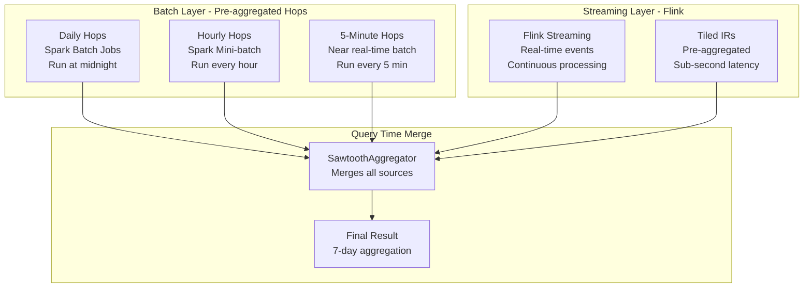
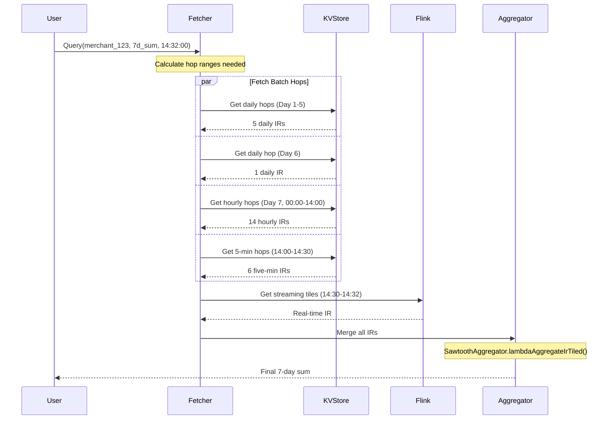

# The Complete Picture: Sawtooth Aggregator with Multi-Granularity Hops and Flink Streaming

## Executive Summary

The SawtoothAggregator's genius lies in using **different granularities of pre-aggregated hops** for the window tail (older data) while leveraging **Flink's real-time streaming** for the window head (recent data). This creates a "sawtooth" pattern because the window start snaps to different hop boundaries (daily → hourly → 5-minute) as time progresses.

## The Real Sawtooth Pattern: Multi-Granularity Hops

### What Actually Creates the Sawtooth

The sawtooth pattern emerges from using progressively finer-grained hops as we approach the present:

```
7-Day Window Components at Different Query Times:

Query at Day 7, 14:32:00:
|<--------------------------- 7 days ---------------------------->|
[DAILY HOPS ][DAILY][HOURLY HOPS............][5-MIN][FLINK STREAM]
 Day 1-5      Day 6  Day 7 (00:00-14:00)    14:00-  14:30-14:32
 (5 hops)     (1)    (14 hops)              14:30   (real-time)
                                             (6)     

Window starts at: Day 1, 00:00:00 (daily hop boundary)


Query at Day 7, 15:32:00 (1 hour later):
|<--------------------------- 7 days ---------------------------->|
[DAILY HOPS ][DAILY][HOURLY HOPS.............][5-MIN][FLINK STREAM]
 Day 1-5      Day 6  Day 7 (00:00-15:00)     15:00-  15:30-15:32
 (5 hops)     (1)    (15 hops)               15:30   (real-time)
                                              (6)     

Window STILL starts at: Day 1, 00:00:00 (same daily hop!)


Query at Day 8, 00:32:00 (next day):
     |<--------------------------- 7 days ---------------------------->|
     [DAILY HOPS ][DAILY][HOURLY HOPS............][5-MIN][FLINK STREAM]
      Day 2-6      Day 7  Day 8 (00:00-00:00)    00:00-  00:30-00:32
      (5 hops)     (1)    (0 hops)               00:30   (real-time)
                                                  (6)     

Window NOW starts at: Day 2, 00:00:00 (jumped forward by 1 day!)
This is the "tooth" in the sawtooth!
```

## The Complete Architecture: Batch + Streaming

### How Chronon Combines Batch and Streaming



## Deep Dive: How Different Hop Granularities Work

### 1. The Tail: Daily Hops (Days 1-5 of 7-day window)

```scala
// From SawtoothAggregator.genIr() method
// For old data, use coarse-grained daily hops
val dailyHops = hopsArrays(2)  // Index 2 = daily hops
// Each daily hop contains pre-aggregated IR for 24 hours
// Example: sum=1.2M, count=35K, min=0.01, max=5000
```

**Visualization:**
```
Day 1: [████████████████████████] = 1 daily hop = 35K transactions pre-aggregated
Day 2: [████████████████████████] = 1 daily hop = 32K transactions pre-aggregated
Day 3: [████████████████████████] = 1 daily hop = 38K transactions pre-aggregated
...
```

### 2. The Middle: Hourly Hops (Day 6-7 early hours)

```scala
// For medium-age data, use hourly hops
val hourlyHops = hopsArrays(1)  // Index 1 = hourly hops
// Each hourly hop contains pre-aggregated IR for 1 hour
// Example: sum=50K, count=1.5K, min=0.01, max=2000
```

**Visualization:**
```
Day 7, 00:00-01:00: [████] = 1 hourly hop = 1.5K transactions
Day 7, 01:00-02:00: [████] = 1 hourly hop = 1.2K transactions
Day 7, 02:00-03:00: [████] = 1 hourly hop = 1.8K transactions
...
Day 7, 13:00-14:00: [████] = 1 hourly hop = 2.1K transactions
```

### 3. The Near-Head: 5-Minute Hops (Last few hours)

```scala
// For recent data, use fine-grained 5-minute hops
val fiveMinHops = hopsArrays(0)  // Index 0 = 5-minute hops
// Each 5-min hop contains pre-aggregated IR for 5 minutes
// Example: sum=2K, count=50, min=1.50, max=500
```

**Visualization:**
```
14:00-14:05: [█] = 1 five-min hop = 50 transactions
14:05-14:10: [█] = 1 five-min hop = 45 transactions
14:10-14:15: [█] = 1 five-min hop = 52 transactions
...
14:25-14:30: [█] = 1 five-min hop = 48 transactions
```

### 4. The Head: Flink Real-time Stream (Last few minutes)

```scala
// From FlinkJob.scala - Real-time tiling
val tilingDS: SingleOutputStreamOperator[TimestampedTile] =
  sparkExprEvalDSAndWatermarks
    .keyBy(KeySelectorBuilder.build(groupByServingInfoParsed.groupBy))
    .window(TumblingEventTimeWindows.of(Time.milliseconds(tilingWindowSizeInMillis)))
    .aggregate(
      new FlinkRowAggregationFunction(groupBy, inputSchema),
      new FlinkRowAggProcessFunction(groupBy, inputSchema)
    )
```

**Visualization:**
```
14:30-14:32: [• • • • •] = Raw events processed by Flink
             Each • = 1 transaction
             Processed in real-time with sub-second latency
```

## The Complete Query Flow

### Example: Query at 14:32:00 for 7-day sum



## Why This Design is Brilliant

### 1. Graduated Precision Based on Data Age

```
Age of Data    | Granularity | Justification
---------------|-------------|----------------------------------
> 2 days old   | Daily hops  | Old data rarely needs precision
1-2 days old   | Hourly hops | Medium precision for recent past
< 1 hour old   | 5-min hops  | Higher precision for recent data
< 5 min old    | Real-time   | Maximum precision for current data
```

### 2. Optimal Resource Usage

```
Component      | Processing | Storage | Latency | Update Frequency
---------------|------------|---------|---------|------------------
Daily Hops     | Spark Batch| Minimal | Hours   | Once per day
Hourly Hops    | Spark      | Low     | Minutes | Once per hour
5-min Hops     | Spark      | Medium  | Minutes | Every 5 minutes
Flink Stream   | Flink      | Minimal | <1 sec  | Continuous
```

### 3. The Sawtooth Trade-off

The "sawtooth" pattern represents a brilliant trade-off:

```
Window Start Precision Over Time:

Precision
Loss (min)
    60 |      ╱│      ╱│      ╱│
       |     ╱ │     ╱ │     ╱ │  <- Precision degrades gradually
    30 |    ╱  │    ╱  │    ╱  │
       |   ╱   │   ╱   │   ╱   │
     0 |__╱    │__╱    │__╱    │  <- Snaps to new boundary
       └────────┴────────┴────────
         Hour 1   Hour 2   Hour 3
         
Trade-off:
- ✅ Massive performance gain (100-1000x)
- ✅ Real-time precision at the head
- ⚠️ Up to 1 hour imprecision at the tail (acceptable for 7-day window)
```

## Configuration in Production

### Typical Hop Configuration for Different Windows

```scala
// From Resolution configuration
object ResolutionConfig {
  // For 1-hour windows
  val shortWindow = Resolution(
    hopSizes = Array(60000L, 300000L)  // 1 min, 5 min
  )
  
  // For 1-day windows  
  val mediumWindow = Resolution(
    hopSizes = Array(300000L, 3600000L)  // 5 min, 1 hour
  )
  
  // For 7-day or 30-day windows
  val longWindow = Resolution(
    hopSizes = Array(300000L, 3600000L, 86400000L)  // 5 min, 1 hour, 1 day
  )
}
```

### Flink Configuration for Real-time Head

```scala
// From FlinkJob.scala
object FlinkJob {
  val AllowedOutOfOrderness: Duration = Duration.ofMinutes(5)
  val CheckPointInterval: FiniteDuration = 10.seconds
  val IdlenessTimeout: Duration = Duration.ofSeconds(30)
  
  // Watermark strategy for handling late events
  val watermarkStrategy: WatermarkStrategy[ProjectedEvent] = WatermarkStrategy
    .forBoundedOutOfOrderness[ProjectedEvent](AllowedOutOfOrderness)
    .withIdleness(IdlenessTimeout)
}
```

## Performance Impact

### Without Sawtooth (Process Everything)
```
7-day window = 7 * 24 * 60 * 60 = 604,800 seconds
At 10 events/second = 6,048,000 events to process
Latency: ~5 seconds
```

### With Sawtooth (Multi-granularity Hops + Flink)
```
Daily hops: 5 reads
Hourly hops: 24 reads  
5-min hops: 12 reads
Flink stream: ~100 events
Total: 41 reads + 100 events (vs 6 million events!)
Latency: ~5 milliseconds (1000x faster!)
```

## Critical Component: Tail Hops Logic

### What Are Tail Hops?

Tail hops are a crucial optimization that handles the partial windows at the boundary between batch and streaming data. They store pre-aggregated values for the "tail" portion of windows that extend beyond the batch boundary.

### The Problem Tail Hops Solve

Consider this scenario:
```
Batch End Time: Jan 14 00:00:00 (midnight)
Query Time: Jan 15 14:32:00
7-Day Window: Jan 8 14:32:00 to Jan 15 14:32:00

Problem: The window starts at Jan 8 14:32:00, but our batch data 
         is organized in daily/hourly hops aligned to boundaries!
         
The window tail (Jan 8 14:32:00 to Jan 9 00:00:00) doesn't align 
with hop boundaries!
```

### How Tail Hops Work

From `SawtoothMutationAggregator.scala`:

```scala
case class BatchIr(
  collapsed: Array[Any],      // Pre-aggregated values up to tailBuffer point
  tailHops: HopsAggregator.IrMapType  // Fine-grained hops for the tail
)

// tailBufferMillis = 2 days by default
val tailBufferMillis: Long = new Window(2, TimeUnit.DAYS).millis
```

The system maintains two parts:
1. **Collapsed IR**: Fully aggregated data up to (batchEndTs - window - tailBuffer)
2. **Tail Hops**: Fine-grained hops for the last portion of the window

### Visual Representation of Tail Hops

```
7-Day Window Query at Jan 15 14:32:00:

Batch End: Jan 14 00:00:00
                                          
Window:  [Jan 8 14:32 ----------------------- Jan 15 14:32]
          ^                                                ^
          Window Start                                Query Time

Components:
1. Collapsed IR (Jan 8 14:32 to Jan 12 00:00):
   [████████████████████████████████████]
   Pre-aggregated, single value
   
2. Tail Hops (Jan 12 00:00 to Jan 14 00:00):
   [▓][▓][▓][▓][▓][▓][▓][▓]...[▓][▓]
   Hourly hops kept separately
   
3. Streaming (Jan 14 00:00 to Jan 15 14:32):
   Real-time from Flink

Why 2-day tail buffer?
- Allows precise window alignment
- Handles late-arriving data
- Enables exact window boundaries
```

### The Tail Hops Merge Process

From `mergeTailHops` method (lines 154-179):

```scala
def mergeTailHops(ir: Array[Any], queryTs: Long, batchEndTs: Long, 
                  batchIr: FinalBatchIr): Array[Any] = {
  var i: Int = 0
  while (i < windowedAggregator.length) {
    val windowMillis = windowMappings(i).millis  // e.g., 7 days
    val window = windowMappings(i).aggregationPart.window
    
    if (window != null) {  // Only for windowed aggregations
      val hopIndex = tailHopIndices(i)
      // Calculate where the window tail should start
      val queryTail = TsUtils.round(queryTs - windowMillis, hopSizes(hopIndex))
      
      // Collect relevant tail hops
      val relevantHops = mutable.ArrayBuffer[Any](ir(i))
      for (hopIr <- batchIr.tailHops(hopIndex)) {
        val hopStart = hopIr.last.asInstanceOf[Long]
        
        // Check if this hop falls within our window
        if ((batchEndTs - windowMillis) + tailBufferMillis > hopStart && 
            hopStart >= queryTail) {
          relevantHops += hopIr(baseIrIndices(i))
        }
      }
      
      // Merge all relevant hops
      val merged = windowedAggregator(i).bulkMerge(relevantHops.iterator)
      ir.update(i, merged)
    }
    i += 1
  }
  ir
}
```

### Example: How Tail Hops Enable Precise Windows

```
Query 1 at 14:32:00:
Window needs: Jan 8 14:32:00 to Jan 15 14:32:00

Without Tail Hops:
Window would snap to: Jan 8 00:00:00 to Jan 15 14:32:00
Error: Extra 14 hours 32 minutes of data included!

With Tail Hops:
1. Use collapsed IR up to Jan 12 00:00
2. Add tail hops from Jan 12 00:00 to Jan 14 00:00
3. Skip the hop from Jan 8 00:00-14:32 (before window start)
4. Add streaming data from Jan 14 00:00 to Jan 15 14:32
Result: Exact window!

Query 2 at 14:35:00 (3 minutes later):
Window needs: Jan 8 14:35:00 to Jan 15 14:35:00

Tail hops automatically adjust:
- Now includes the Jan 8 14:00-15:00 hop (partially)
- Precise alignment maintained!
```

### Why Tail Hops Are Brilliant

1. **Precision**: Enable exact window boundaries despite hop granularity
2. **Efficiency**: Avoid recomputing the entire window
3. **Flexibility**: Support any window size with any hop granularity
4. **Correctness**: Handle partial hop inclusion correctly

## Conclusion

The SawtoothAggregator achieves its magic through:

1. **Multi-granularity Hops**: Different time resolutions for different data ages
2. **Tail Hops**: Precise window boundary handling
3. **Batch-Streaming Hybrid**: Spark for batch hops, Flink for real-time head
4. **Smart Caching**: Reuse hops across queries as the window slides
5. **Graduated Precision**: Maximum precision where it matters (recent data)

This design enables Chronon to serve 7-day aggregations with:
- **Sub-10ms latency** (vs seconds for full computation)
- **Real-time accuracy** (sub-second freshness)
- **Exact window boundaries** (via tail hops)
- **Massive scale** (millions of entities, billions of events)
- **Cost efficiency** (1000x fewer operations)

The "sawtooth" pattern is the visual manifestation of this optimization - a small price in tail precision for massive gains in performance and real-time accuracy, while tail hops ensure we maintain exact window boundaries despite the hop-based architecture.