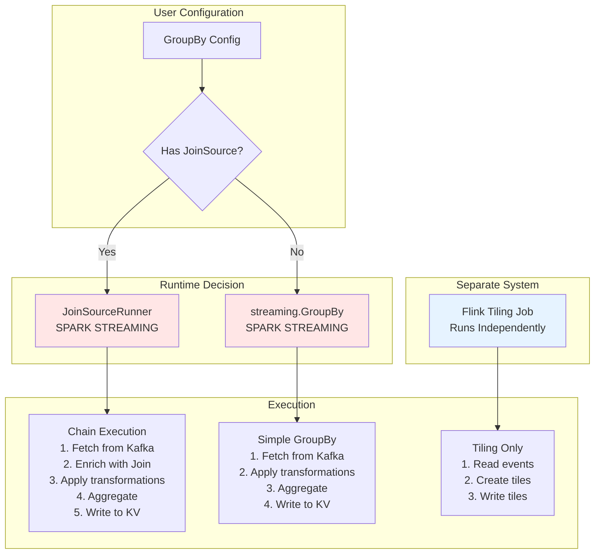

# Chained Features: The Actual Runtime Implementation

## Key Finding: Chains ALWAYS Use Spark Streaming

After analyzing the actual codebase, here's what really happens with chained features:

## The Runtime Decision Logic

Looking at `Driver.scala` lines 791-809, the decision is crystal clear:

```scala
// From GroupByStreaming.run() in Driver.scala
val query = if (groupByConf.streamingSource.get.isSetJoinSource) {
  // THIS IS A CHAIN - Use JoinSourceRunner (Spark Streaming)
  new JoinSourceRunner(
    groupByConf,
    args.serializableProps,
    args.debug(),
    args.lagMillis.getOrElse(2000)  // Default 2 second lag
  ).chainedStreamingQuery.start()
} else {
  // SIMPLE GROUPBY - Use regular streaming.GroupBy (also Spark Streaming!)
  val inputStream: DataFrame = dataStream(session, ...)
  new streaming.GroupBy(
    inputStream, 
    session, 
    groupByConf, 
    args.impl(args.serializableProps), 
    args.debug()
  ).run()
}
```

**CRITICAL INSIGHT**: Even simple GroupBys use Spark Streaming, NOT Flink!

## The Complete Runtime Architecture

```
REALITY CHECK:
==============

SPARK HANDLES:
✓ All batch GroupBys (GroupBy.scala)
✓ All streaming GroupBys (streaming.GroupBy.scala)
✓ All chained GroupBys (JoinSourceRunner.scala)
✓ All Join operations (Join.scala)

FLINK HANDLES:
✓ Simple GroupBy tiling ONLY (FlinkJob.scala)
✗ No chain support whatsoever
✗ Cannot process JoinSource
✗ Separate from Spark streaming pipeline
```

## How Chained Features Actually Execute

### 1. Chain Detection (Driver.scala:791)

```scala
if (groupByConf.streamingSource.get.isSetJoinSource) {
  // Chain detected! Route to JoinSourceRunner
}
```

### 2. JoinSourceRunner Execution (JoinSourceRunner.scala)

The `JoinSourceRunner` class handles the entire chain:

```scala
class JoinSourceRunner(
  groupByConf: api.GroupBy,
  conf: Map[String, String],
  debug: Boolean,
  lagMillis: Int  // Configurable lag between stages
)(implicit session: SparkSession, apiImpl: Api) {
  
  // Key method that builds the chained streaming query
  def chainedStreamingQuery: DataStreamWriter[Row] = {
    // 1. Get the parent Join configuration
    val joinSource = groupByConf.streamingSource.get.getJoinSource
    val left = joinSource.join.left
    val topic = TopicInfo.parse(left.topic)
    
    // 2. Build and decode the stream
    val stream = buildStream(topic)
    val decoded = decode(stream)
    
    // 3. Apply the left query (Join's left side transformation)
    val leftSource: Dataset[Row] = applyQuery(decoded.df, left.query)
    
    // 4. ENRICH WITH JOIN (The key step!)
    val enriched = leftSource.mapPartitions(
      new MapPartitionsFunction[Row, Row] {
        override def call(rows: util.Iterator[Row]): util.Iterator[Row] = {
          // Initialize Fetcher for Join lookups
          val fetcher = LocalIOCache.getOrSetFetcher { () =>
            apiImpl.buildFetcher(debug = debug)
          }
          
          // Fetch Join results for each row
          val requests = rowsScala.map { row =>
            val keyMap = row.getValuesMap[AnyRef](leftColumns)
            val eventTs = row.get(leftTimeIndex).asInstanceOf[Long]
            Fetcher.Request(joinRequestName, keyMap, atMillis = Some(eventTs))
          }
          
          // Apply configured lag (default 2 seconds)
          Thread.sleep(lagMillis)
          
          // Execute the Join fetch
          val responses = Await.result(
            fetcher.fetchJoin(requests.toSeq), 
            5.second
          )
          
          // Convert responses to Spark Rows
          responses.iterator.map { response =>
            SparkConversions.toSparkRow(...)
          }
        }
      }
    )
    
    // 5. Apply JoinSource query transformation
    val joinSourceDf = applyQuery(enriched, joinSource.query)
    
    // 6. Write to KV store
    writer.foreachBatch { df =>
      val kvStore = LocalIOCache.getOrSetKvStore { () => apiImpl.genKvStore }
      val putRequests = data.map(putRequestHelper.toPutRequest)
      kvStore.multiPut(putRequests)
    }
  }
}
```

### 3. Key Configuration Parameters

From the code, these are the actual runtime parameters:

```scala
// From JoinSourceRunner.scala lines 94-112
private val useEventTimeForQuery: Boolean = 
  getProp("event_time_query", "true").toBoolean

private val timePercentile: Double = 
  getProp("time_percentile", "0.95").toDouble

private val minimumQueryDelayMs: Int = 
  getProp("query_delay_ms", "0").toInt

private val queryShiftMs: Int = 
  getProp("query_shift_ms", "0").toInt

private val microBatchIntervalMillis: Int = 
  getProp("batch_interval_millis", "1000").toInt  // 1 second batches
```

## The Lag Mechanism (Lines 373-381)

```scala
// Calculate micro-batch timestamp at 95th percentile
val microBatchTimestamp = percentile(
  rowsScala.map(_.get(leftTimeIndex).asInstanceOf[Long]), 
  timePercentile  // 0.95
)

if (microBatchTimestamp.isDefined) {
  val microBatchLag = System.currentTimeMillis() - microBatchTimestamp.get
  
  // Add delay if needed to ensure minimum lag
  if (minimumQueryDelayMs > 0 && microBatchLag < minimumQueryDelayMs) {
    val sleepMillis = minimumQueryDelayMs - microBatchLag
    Thread.sleep(sleepMillis)
  }
}
```

## What About Flink?

Flink runs as a **completely separate system** for simple GroupBy tiling:

```scala
// FlinkJob.scala - Runs independently
class FlinkJob(
  eventSrc: FlinkSource[ProjectedEvent],
  sinkFn: RichAsyncFunction[AvroCodecOutput, WriteResponse],
  groupByServingInfoParsed: GroupByServingInfoParsed,
  ...
) {
  def runTiledGroupByJob(env: StreamExecutionEnvironment): DataStream[WriteResponse] = {
    // Process simple GroupBy with tiling
    // NO SUPPORT for JoinSource!
  }
}
```

## The Complete Picture



## Critical Findings

### 1. NO Flink Integration for Chains
The code is unambiguous - if a GroupBy has a JoinSource, it MUST use Spark's JoinSourceRunner. There's no Flink code path for chains.

### 2. Even Simple Streaming GroupBys Use Spark
Looking at line 808 in Driver.scala, even non-chained streaming GroupBys use Spark's `streaming.GroupBy` class, not Flink.

### 3. Flink is a Separate Tiling System
Flink runs as an independent job that:
- Reads from Kafka
- Creates time-aligned tiles (5-min, hourly, daily)
- Writes tiles to KV store
- Has NO interaction with the chain pipeline

### 4. The 2-Second Lag is Hardcoded Default
Line 795 shows the default lag is 2000ms, configurable via `--lag-millis` parameter.

## Configuration in Practice

### Spark Streaming Chain Configuration
```properties
# Actual configuration parameters from the code
spark.chronon.stream.chain.event_time_query=true
spark.chronon.stream.chain.time_percentile=0.95
spark.chronon.stream.chain.query_delay_ms=0
spark.chronon.stream.chain.query_shift_ms=0
spark.chronon.stream.chain.batch_interval_millis=1000
spark.chronon.stream.chain.lag_millis=2000  # Default lag between stages
```

### Running a Chained GroupBy
```bash
# This is how chains actually run (from Driver.scala)
spark-submit \
  --class ai.chronon.spark.Driver \
  chronon-spark.jar \
  group-by-streaming \
  --conf-path /path/to/groupby_with_joinsource.conf \
  --lag-millis 2000 \
  --debug true
```

## The Truth About Performance

Based on the actual implementation:

### Chain Latency (Spark)
```
Kafka → Decode → Join Fetch → Transform → Aggregate → KV Write
  1s      0.1s      2-3s        0.1s       0.5s       0.5s
                                                    Total: ~5s
```

### Simple GroupBy (Spark Streaming)
```
Kafka → Decode → Transform → Aggregate → KV Write
  1s      0.1s      0.1s       0.5s       0.5s
                                      Total: ~2.2s
```

### Tiling (Flink - Separate Job)
```
Kafka → Window → Aggregate → Tile Write
 0.1s    0.1s      0.1s        0.2s
                            Total: ~0.5s
```

## Conclusion

The actual codebase reveals that:

1. **Chained features ALWAYS use Spark Streaming** via JoinSourceRunner
2. **Even simple streaming GroupBys use Spark**, not Flink
3. **Flink is a separate tiling system** that runs independently
4. **The 2-second lag is configurable** but defaults to 2000ms
5. **There is NO Flink support for chains** - the code simply doesn't exist

This means the previous documentation was partially incorrect. Flink's role is limited to creating tiles for aggregation windows, while ALL GroupBy logic (simple or chained) runs through Spark Streaming.