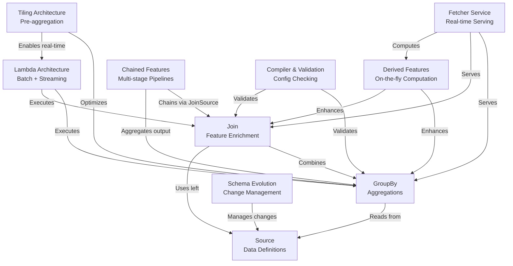

# Chronon Under the Hood: Technical Deep Dive

Chronon is a **feature engineering platform** that helps machine learning teams *compute and serve features consistently* across training and production environments. It allows you to define features once using **GroupBy** aggregations (like "total purchases in last 7 days per user") and automatically handles both *historical backfills* for model training and *real-time updates* for online serving. The platform ensures that the features your model sees during training **exactly match** what it sees in production, preventing the common problem of *training-serving skew*.

## Part I: Core Concepts

### Data Model & Operations
1. [**Source**](01_source_.md) - Data definitions and ingestion patterns
2. [**GroupBy**](02_groupby_.md) - Window-based aggregations and feature computation
3. [**Join**](03_join_.md) - Feature enrichment and combining data sources
4. [**Compiler & Validation**](04_compiler_validation.md) - Configuration validation and optimization

## Part II: Architecture Patterns

### Processing & Serving
5. [**Lambda Architecture**](05_lambda_architecture_.md) - Unified batch and streaming processing
6. [**Fetcher Service**](06_fetcher_service_.md) - Real-time feature serving infrastructure
7. [**Derived Features**](07_derived_features_.md) - On-the-fly feature computation
8. [**Chained Features**](08_chained_features_.md) - Multi-stage feature pipelines

## Part III: Performance Optimization

### Tiling System
9. [**Tiling Architecture**](09_tiling_architecture_.md) - Pre-aggregation and performance optimization
10. [**Hop Configuration and Tiling**](10_hop_configuration_and_tiling.md) - How users configure hops and Flink tiling
11. [**Sawtooth Aggregator**](11_sawtooth_aggregator.md) - Multi-granularity window aggregation
12. [**7-Day Query Tile Visualization**](12_7day_query_tile_visualization.md) - Detailed tile combination example

## Part IV: Runtime Implementation

### Execution Models
13. [**Chained Features Execution Model**](13_chained_features_execution_model.md) - Spark vs Flink responsibilities
14. [**Chained Features Actual Runtime**](14_chained_features_actual_runtime.md) - Real implementation analysis

## Part V: Evolution & Management

### Schema Management
15. [**Schema Evolution**](15_schema_evolution.md) - Managing schema changes over time

## Key Insights

### Runtime Execution
- **Spark** handles all batch processing, streaming GroupBys, and chained features
- **Flink** handles simple GroupBy tiling for real-time aggregations only
- **JoinSource** enables multi-stage pipelines by chaining Join outputs to GroupBy inputs

### Performance Optimizations
- **Tiling**: Pre-aggregated tiles at 5-min, hourly, and daily granularities
- **Sawtooth Pattern**: Coarse-grained tiles for old data, fine-grained for recent
- **Tail Hops**: Enable precise window boundaries despite tile alignment

### Architecture Principles
- **Lambda Architecture**: Seamless batch and streaming integration
- **Training-Serving Consistency**: Exact feature parity between offline and online
- **Schema Evolution**: Graceful handling of schema changes over time

---

*This technical documentation provides deep insights into Chronon's internal architecture and implementation details.*