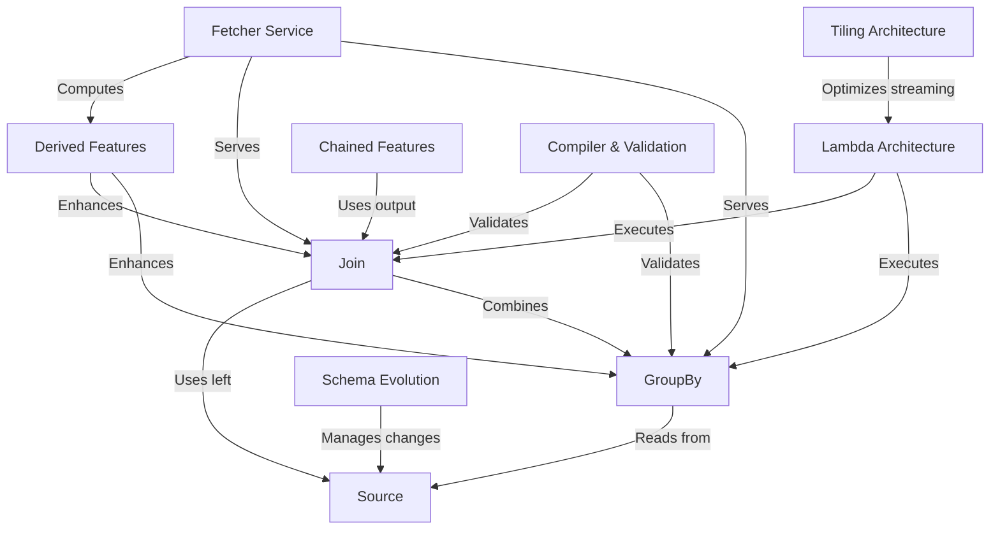

# Tutorial: chronon

Chronon is a **feature engineering platform** that helps machine learning teams *compute and serve features consistently* across training and production environments. It allows you to define features once using **GroupBy** aggregations (like "total purchases in last 7 days per user") and automatically handles both *historical backfills* for model training and *real-time updates* for online serving. The platform ensures that the features your model sees during training **exactly match** what it sees in production, preventing the common problem of *training-serving skew*.

**Source Repository:** [None](None)

## Chapters

1. [Source
](01_source_.md)
2. [GroupBy
](02_groupby_.md)
3. [Join
](03_join_.md)
4. [Compiler & Validation
](04_compiler___validation_.md)
5. [Lambda Architecture
](05_lambda_architecture_.md)
6. [Fetcher Service
](06_fetcher_service_.md)
7. [Derived Features
](07_derived_features_.md)
8. [Chained Features
](08_chained_features_.md)
9. [Tiling Architecture
](09_tiling_architecture_.md)
10. [Schema Evolution
](10_schema_evolution_.md)

---

Generated by [AI Codebase Knowledge Builder](https://github.com/The-Pocket/Tutorial-Codebase-Knowledge)